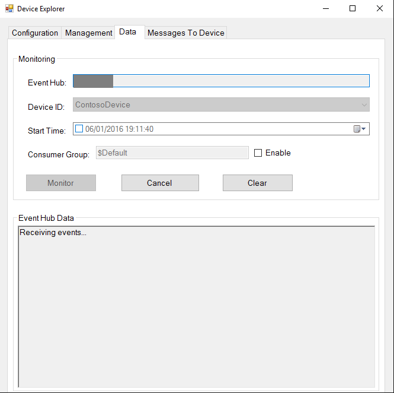
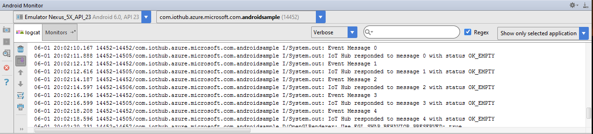
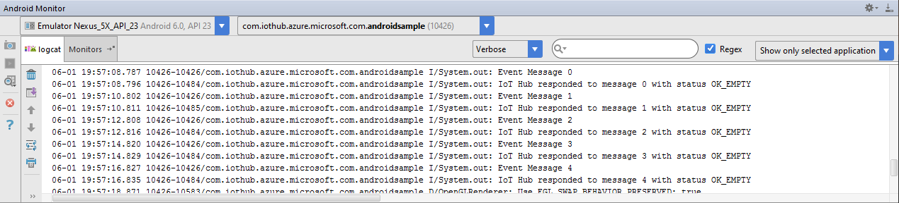
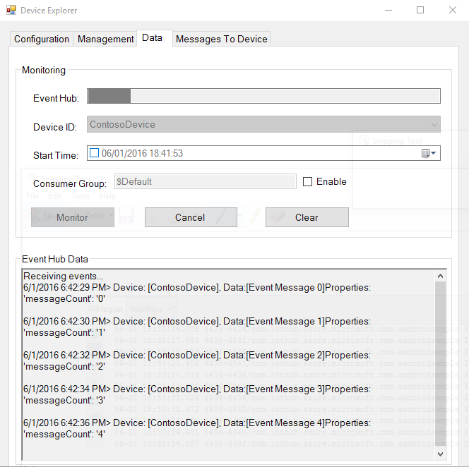
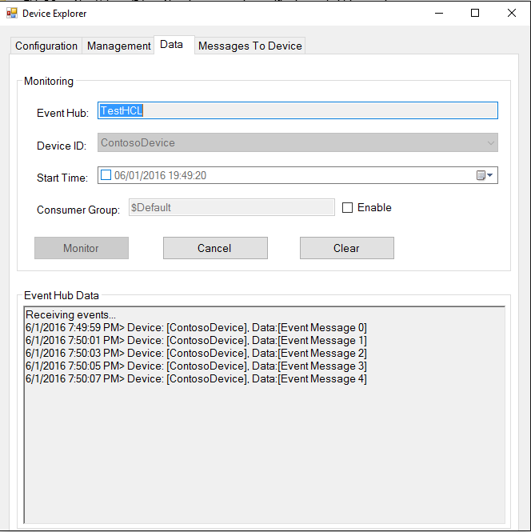
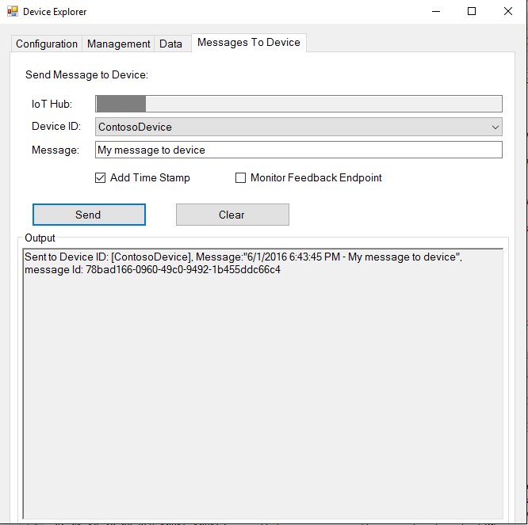
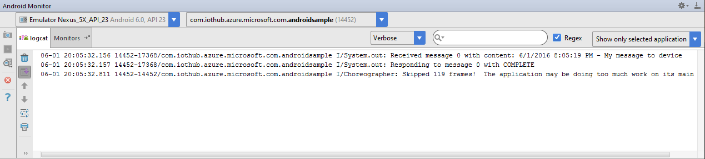
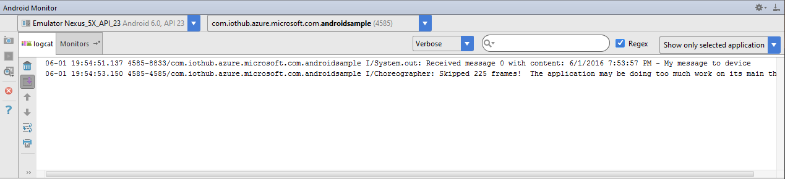

如何使用 Azure IoT SDK 认证运行 Android 的 IoT 设备
===
---

# 目录

-   [简介](#Introduction)
-   [步骤 1：注册 Azure IoT 中心](#Step_1)
-   [步骤 2：注册设备](#Step_2)
-   [步骤 3：使用 Java 客户端库生成并验证示例](#Step_3)
    -   [3.1 在设备上安装 Azure IoT 设备 SDK 和必备组件](#Step_3_1)
    -   [3.2 运行并验证示例](#Step_3_2)
-   [步骤 4：打包并共享](#Step_4)
    -   [4.1：打包生成日志和示例测试结果](#Step_4_1)
    -   [4.2 与 Azure IoT 认证团队共享](#Step_4_2)
    -   [4.3：后续步骤](#Step_4_3)
-   [步骤 5：故障排除](#Step_5)

# 简介

**关于本文档**

本文档向 IoT 硬件发布人员提供有关如何使用 Azure IoT Java SDK 认证已启用 IoT 的硬件的分步指南。 此过程由多个步骤组成，其中包括： 
-   配置 Azure IoT 中心 
-   注册 IoT 设备
-   在设备上生成并部署 Azure IoT SDK
-   打包并共享日志

**准备**

在执行以下任一步骤之前，请仔细阅读每个过程的每个步骤，确保全盘了解整个过程。

在开始过程前，应已准备好以下项目：

-   准备好一台装有 GitHub 并且可以访问 [azure-iot-sdk-java](https://github.com/Azure/azure-iot-sdk-java) GitHub 公共存储库的计算机。
-   需要认证的硬件。

# 步骤 1：注册 Azure IoT 中心

遵照[此处](https://account.windowsazure.com/signup?offer=ms-azr-0044p)的说明了解如何注册 Azure IoT 中心服务。

在注册过程中，将会收到连接字符串。 

-   **IoT 中心连接字符串**：下面显示了 IoT 中心连接字符串的示例：

         HostName=[YourIoTHubName];SharedAccessKeyName=[YourAccessKeyName];SharedAccessKey=[YourAccessKey]

# 步骤 2：注册设备

-   遵照[此处](<https://github.com/Azure/azure-iot-device-ecosystem/blob/master/manage_iot_hub.md>)所述的说明，了解如何预配设备并获取其凭据。

# 步骤 3：使用 Java 客户端库生成并验证示例

本部分逐步讲解如何在运行 Android OS 4.0.3 或更高版本的设备上生成、部署和验证 IoT 客户端 SDK。 我们将在设备上安装必备组件。 完成后，将生成并部署 IoT 客户端 SDK，然后验证使用 Azure IoT SDK 进行 IoT 认证所需的示例测试。

## 3.1 准备开发环境

-   从[此处](<http://www.oracle.com/technetwork/java/javase/downloads/index.html>)下载并安装最新的 JDK。

-   将 [Android Studio](<https://developer.android.com/studio/index.html> 下载到 Windows 计算机上，然后遵照安装说明操作。

- 使用 USB 电缆将设备插入开发计算机。 如果在 Windows 上开发，可能需要安装设备适用的 USB 驱动程序。 有关安装驱动程序的帮助，请参阅 [OEM USB 驱动程序](<https://developer.android.com/studio/run/oem-usb.html>)文档。
- 在设备上启用 USB 调试。 在 Android 4.0 和更高版本上，请转到“设置”>“开发人员选项”。

    ***注意***：在 Android 4.2 及更高版本上，“开发人员选项”默认为隐藏。*若要使其可见，请转到“设置”>“关于手机”，然后点击“软件版本号”七次。返回上一屏幕即可找到“开发人员选项”。*

## 3.2 生成示例

1.  启动 Android Studio 的新实例并从该位置打开 Android 项目：

        azure-iot-sdk-java/device/iot-device-samples/android-sample/        

2.  转到“MainActivity.java”，将 **[device connection string]** 占位符替换为在[步骤 2](#Step_2) 中创建的设备连接字符串，然后保存该文件。 

3. 转到“生成”菜单并选择“生成项目”，以生成项目。  

## 3.3 运行并验证示例

在本部分，我们将运行 Azure IoT 客户端 SDK 示例来验证设备与 Azure IoT 中心之间的通信。 我们要向 Azure IoT 中心服务发送消息，然后验证 IoT 中心是否成功接收数据。 此外，我们还会监视从 Azure IoT 中心发送到客户端的任何消息。

***注意：****请对本部分中执行的所有操作进行屏幕截图。* 在[步骤 4](#Step_4_2) 中需要使用这些屏幕截图。

### 3.2.1 运行示例：

#### 在设备上运行

- 选择一个项目文件，然后单击工具栏上的“运行”。
- 在显示的“选择设备”窗口中，选中“选择正在运行的设备”单选按钮，选择你的设备，然后单击“确定”。  
- Android Studio 将在连接的设备上安装并启动应用。

#### 在模拟器上运行

1.  通过“工具”菜单 >“Android”>“AVD Manager”启动“AVD Manager”。   
2.  在模拟器中启动虚拟设备。 如果列表中未显示任何设备，请创建一个设备。
3.  加载并运行设备后，请通过“运行”菜单 >“运行 ‘模块名称’”或者单击 **Shift + F10** **运行**应用。  
4.  在“选择部署目标”弹出窗口中选择虚拟设备。 
5.  随后将在模拟器中加载应用。

### 3.2.2 向 IoT 中心发送设备事件：

1.  如[步骤 2](#Step_2) 中所述启动 DeviceExplorer，并导航到“数据”选项卡。  从设备 ID 下拉列表中选择创建的设备名称，并单击“监视”按钮。 

    

2.  现在，DeviceExplorer 正在监视从选定设备发送到 IoT 中心的数据。

3.  在设备（或模拟器）上运行应用后，应用会立即开始向 IoT 中心发送消息。

4.  查看“Android Monitor”窗口。  检查确认消息中是否显示“正常”。 如果没有，则可能表示未正确复制设备中心连接信息。

    **如果使用 HTTP 协议：**  
    

    **如果使用 MQTT 协议：**  
    

6.  DeviceExplorer 应显示 IoT 中心已成功接收示例测试发送的数据。

    **如果使用 HTTP 协议：**  
    

    **如果使用 MQTT 协议：**  
    

### 3.2.3 从 IoT 中心接收消息

1.  若要验证是否可从 IoT 中心向设备发送消息，请转到 DeviceExplorer 中的“发送到设备的消息”选项卡。 

2.  使用设备 ID 下拉列表选择创建的设备。

3.  在“消息”字段中添加一些文本，然后单击“发送”。

    

4.  在设备或模拟器上加载的示例应用 UI 中单击“接收消息”按钮。 

5.  查看“Android Monitor”窗口。  应会看到收到的命令。

    **如果使用 HTTP 协议：**  
    

    **如果使用 MQTT 协议：**  
    

# 步骤 4：打包并共享

## 4.1：打包生成日志和示例测试结果

从设备打包以下项目：

1.  执行步骤 3.1.4 和 3.1.5 过程中在日志文件记录的生成日志和测试结果。

2.  前面“**向 IoT 中心发送设备事件**”部分中显示的所有屏幕截图。

3.  前面“**从 IoT 中心接收消息**”部分中的所有屏幕截图。

4.  向我们发送明确的说明，告知如何在硬件上运行此示例（具体强调客户所要执行的新步骤）。 
    
    有关说明形式的指导，请参考[此处](<https://github.com/Azure/azure-iot-device-ecosystem/tree/master/get_started>) GitHub 存储库中发布的示例。

## 4.2 与 Azure IoT 认证团队共享

1.  转到[合作伙伴仪表板](<https://catalog.azureiotsuite.com/devices>)。
2.  单击设备右上角的“上载”图标。

    

3.  此时将打开上载对话框。 单击“上载”按钮浏览文件。 

    

    可以上载同一个设备的多个文件。

4.  上传所有文件后，单击“提交审查”按钮。 

    ***注意：****提交文件供审查后，若要更改/删除文件，请联系 iotcert 团队。*
 

## 4.3：后续步骤

与我们共享文档后，我们将在接下来的 48 到 72 个工作小时内与你取得联系，以提供后续步骤。

# 步骤 5：疑难解答

如需故障排除的帮助，请通过 <iotcert@microsoft.com> 联系工程支持人员。
