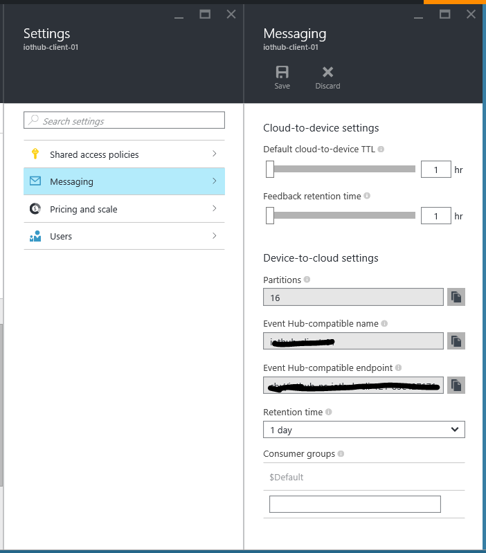
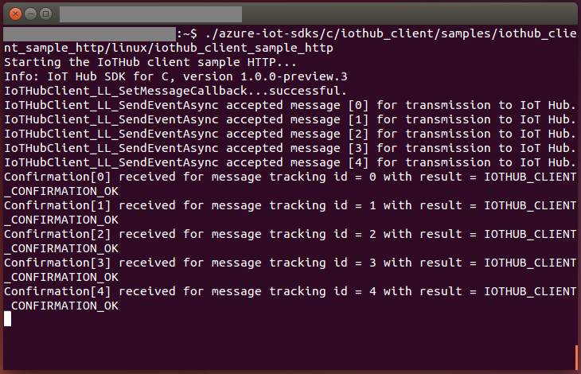
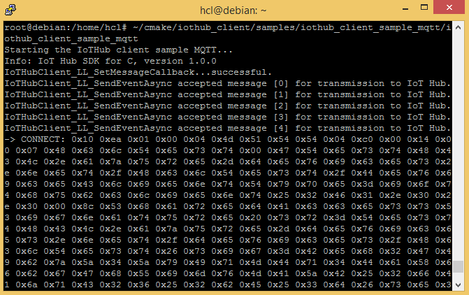
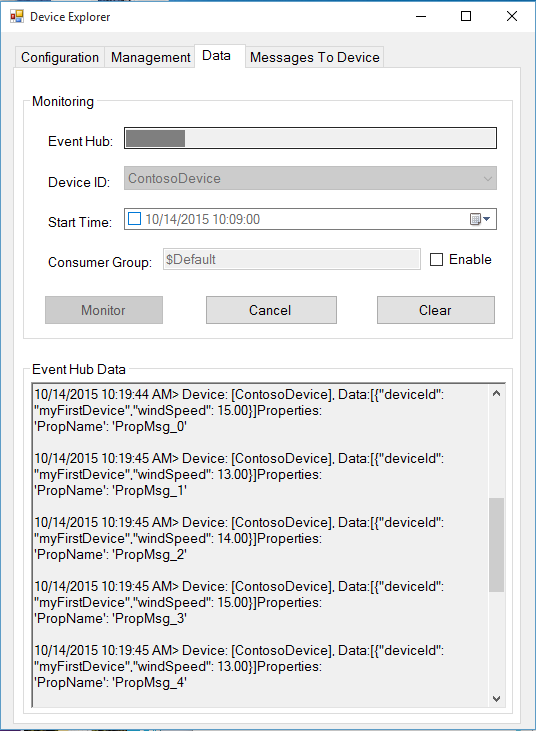
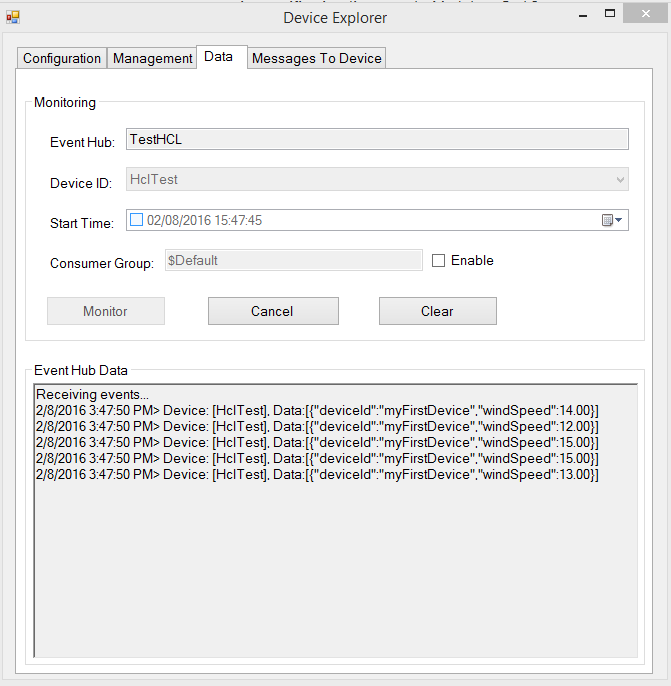
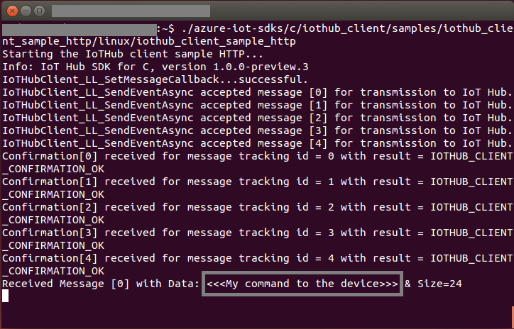
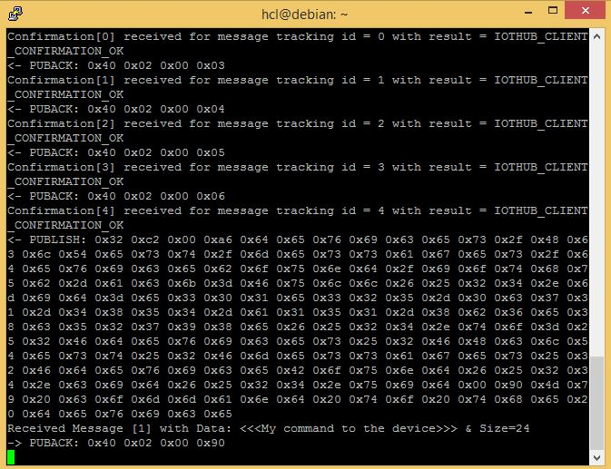

如何使用 Azure IoT SDK 认证运行 Linux 的 IoT 设备
===
---

# 目录

-   [介绍](#Introduction)
-   [步骤 1：配置 Azure IoT 中心](#Step-1-Configure)
-   [步骤 2：注册设备](#Step-2-Register)
-   [步骤 3：使用 C 客户端库生成并验证示例](#Step-3-Build)
    -   [3.1 在设备上加载 Azure IoT 代码和必备组件](#Step-3-1-Load)
    -   [3.2 生成示例](#Step-3-2-Build)
    -   [3.3 运行并验证示例](#Step-3-3-Run)
-   [步骤 4：打包并共享](#Step-4-Package_Share)
    -   [4.1 打包生成日志和示例测试结果](#Step-4-1-Package)
    -   [4.2 与工程支持人员共享包](#Step-4-2-Share)
    -   [4.3 后续步骤](#Step-4-3-Next)
-   [步骤 5：故障排除](#Step-5-Troubleshooting)
    -   [5.1 E2E 测试案例](#Step-5-1-E2E)

# 介绍

**关于本文档**

本文档向 IoT 硬件发布人员提供有关如何使用 Azure IoT SDK 认证已启用 IoT 的硬件的分步指南。 此过程由多个步骤组成，其中包括：
-   配置 Azure IoT 中心
-   注册 IoT 设备
-   在设备上生成并部署 Azure IoT SDK
-   打包并共享日志

**准备**

在执行以下任一步骤之前，请仔细阅读每个过程的每个步骤，确保全盘了解整个过程。

在开始过程前，应已准备好以下项目：

-   准备好一台装有 GitHub 并且可以访问 [azure-iot-sdks](https://github.com/Azure/azure-iot-sdks) GitHub 公共存储库的计算机。
-   配置 SSH 客户端（如 [PuTTY](http://www.putty.org/)），以便能够访问命令行。
-   用于认证的所需硬件。

***注意：****如果你尚未咨询 Microsoft 如何成为 Azure 认证的 IoT 合作伙伴，请先提交此[表单](<https://catalog.azureiotsuite.com/>)来提出请求，然后遵照本文中的说明。*

# 步骤 1：注册 Azure IoT 中心

遵照[此处](https://account.windowsazure.com/signup?offer=ms-azr-0044p)所述的说明了解如何注册 Azure IoT 中心服务。 在注册过程中，你将收到连接字符串。

-   **IoT 中心连接字符串**：IoT 中心的连接字符串示例如下：

         HostName=[YourIoTHubName];SharedAccessKeyName=[YourAccessKeyName];SharedAccessKey=[YourAccessKey]

# 步骤 2：注册设备

在本部分，将要使用 DeviceExplorer 注册设备。 DeviceExplorer 是与 Azure IoT 中心对接的 Windows 应用程序，可执行以下操作：

-   设备管理
    -   创建新设备
    -   列出现有设备，公开设备中心内存储的设备属性
    -   可更新设备密钥
    -   可删除设备
-   监视设备的事件
-   向设备发送消息

若要运行 DeviceExplorer 工具，请根据[步骤&1;](#Step-1-Configure) 中所述使用以下配置字符串：

-   IoT 中心连接字符串

**步骤：**
1.  单击[此处](<https://github.com/Azure/azure-iot-sdk-csharp/blob/master/tools/DeviceExplorer/doc/how_to_use_device_explorer.md>)下载并安装 DeviceExplorer。

2.  添加“配置”选项卡下面的连接信息，然后单击“更新”按钮。

3.  根据以下说明创建设备并将其注册到 IoT 中心。

    a.在“解决方案资源管理器”中，右键单击项目文件夹下的“引用”文件夹，然后单击“添加引用”。 单击“管理”选项卡。

    b. 注册的设备将显示在列表中。 如果你的设备未显示在列表中，请单击“刷新”按钮。 如果这是第一次注册设备，请不要检索任何信息。

    c. 单击“创建”按钮创建设备 ID 和密钥。

    d.单击“下一步”。 成功创建设备后，该设备将列在 DeviceExplorer 中。

    e.在“新建 MySQL 数据库”边栏选项卡中，接受法律条款，然后单击“确定”。 右键单击该设备，然后从上下文菜单中选择“复制所选设备的连接字符串”。

    f. 在记事本中保存此信息。 后面的步骤需要用到此信息。

***不是在电脑上运行 Windows？*** - 请遵照[此处](<https://github.com/Azure/azure-iot-sdks/blob/master/doc/manage_iot_hub.md>)的说明预配设备并获取其凭据。

# 步骤 3：使用 C 客户端库生成并验证示例

本部分逐步讲解如何在运行 Linux 操作系统的设备上生成、部署和验证 IoT 客户端 SDK。 我们将在设备上安装必备组件。 完成后，将生成并部署 IoT 客户端 SDK，然后验证使用 Azure IoT SDK 进行 IoT 认证所需的示例测试。

## 3.1 在设备上加载 Azure IoT 代码和必备组件

-   打开 PuTTY 会话并连接到设备。

-   在设备上的命令行中发出以下命令，安装必备组件包。 根据设备上运行的 OS 选择命令。

    **Debian 或 Ubuntu**

        sudo apt-get update

        sudo apt-get install -y curl uuid-dev libcurl4-openssl-dev build-essential cmake git

    **Fedora**

        sudo dnf check-update -y

        sudo dnf install uuid-devel libcurl-devel openssl-devel gcc-c++ make cmake git

    **其他任何 Linux OS**

        Use equivalent commands on the target OS

    ***注意：****此安装过程需要 cmake 2.8.12 或更高版本。* 
    
    *可以使用以下命令确认环境中当前安装的版本：*

        cmake --version

    *此库还需要 gcc 4.9 或更高版本。可以使用以下命令确认环境中当前安装的版本：*
    
        gcc --version 

    *有关如何在 Ubuntu 14.04 上升级 gcc 版本的信息，请参阅 <http://askubuntu.com/questions/466651/how-do-i-use-the-latest-gcc-4-9-on-ubuntu-14-04>。*
    
-   在 PuTTY 中发出以下命令，将 SDK 下载到开发板：

        git clone --recursive https://github.com/Azure/azure-iot-sdk-c.git

-   检查 ~/azure-iot-sdks 目录中现在是否生成了源代码的副本。

## 3.2 生成示例

-   有两个不同的示例，一个支持 AMQP 协议，另一个支持 HTTP 协议。 可以使用其中的任一协议在设备上验证示例。 根据选择的协议，在设备上运行以下命令。

    **对于 AMQP 协议：**

        nano azure-iot-sdk-c/iothub_client/samples/iothub_client_sample_amqp/iothub_client_sample_amqp.c

    **对于 HTTP 协议：**

        nano azure-iot-sdk-c/iothub_client/samples/iothub_client_sample_http/iothub_client_sample_http.c

    **对于 MQTT 协议：**

        nano azure-iot-sdk-c/iothub_client/samples/iothub_client_sample_mqtt/iothub_client_sample_mqtt.c

-   此时会启动基于控制台的文本编辑器。 向下滚动到连接信息。

-   找到 IoT 连接字符串的以下占位符：

        static const char* connectionString = "[device connection string]";

-   将上述占位符替换为设备连接字符串。 可根据[步骤 2](#Step-2-Register) 中所述，从 DeviceExplorer 获取这个已复制到记事本的连接字符串。

-   按 Ctrl+O 保存更改，当 nano 提示是否保存到同一文件时，按 ENTER 即可。

-   按 Ctrl+X 退出 nano。

-   设置环境变量。

-   打开 **IOT_DEVICE_PARAMS.TXT** 进行编辑。

        nano azure-iot-sdk-c/tools/iot_hub_e2e_tests_params/iot_device_params.txt

-   按如下所述设置该文件中列出的所有变量的值。

    -   **IOTHUB_CONNECTION_STRING：**在[步骤 1](#Step-1-Configure) 中收到的 IoT 中心连接字符串

    -   **IOTHUB_EVENTHUB_CONNECTION_STRING：**事件中心的连接字符串。 该连接字符串的格式应为：
    
            Endpoint=[Event Hub-compatible endpoint];SharedAccessKeyName=[IOTHUB_POLICY_NAME];SharedAccessKey=[IOTHUB_POLICY_KEY]
        
    -   **IOTHUB_EVENTHUB_CONSUMER_GROUP：**将值设置为 **$Default**
    -   **IOTHUB_PARTITION_COUNT：**Azure 门户中的分区计数，如下图所示。

        

-   在设备上运行以下命令设置环境变量：

        cd ./azure-iot-sdk-c/tools/iot_hub_e2e_tests_params/
        chmod +x setiotdeviceparametersfore2etests.sh
        sudo ./setiotdeviceparametersfore2etests.sh

-   重新启动 Linux 计算机。

-   使用以下命令生成 SDK。 如果在生成期间遇到任何问题，请遵循故障排除[步骤 5](#Step-5-Troubleshooting)。

        sudo ./azure-iot-sdks/c/build_all/linux/build.sh --run-e2e-tests | tee LogFile.txt

    ***注意：****应将上述命令中的 LogFile.txt 替换为要将生成输出写入到的文件名。*
    
    *build.sh 在“~/azure-iot-sdks/c/”下创建名为“cmake”的文件夹。“cmake”中保存了整个软件的所有编译结果。*

## 3.3 运行并验证示例

在本部分，我们将运行 Azure IoT 客户端 SDK 示例来验证设备与 Azure IoT 中心之间的通信。 我们要向 Azure IoT 中心服务发送消息，然后验证 IoT 中心是否成功接收数据。 此外，还要监视从 Azure IoT 中心发送到客户端的所有消息。

**注意：**请为本部分中执行的所有操作创建屏幕截图。 [步骤 4](#Step-4-2-Share) 中需要用到这些屏幕截图

### 3.3.1 向 IoT 中心发送设备事件：

1.  如[步骤 2](#Step-2-Register) 中所述启动 DeviceExplorer，然后导航到“数据”选项卡。 从设备 ID 下拉列表中选择创建的设备名称，然后单击“监视”按钮。

    

2.  现在，DeviceExplorer 正在监视从选定设备发送到 IoT 中心的数据。

3.  发出以下命令运行该示例。

    **如果使用 AMQP 协议：**运行示例 *iothub\_client\_sample\_amqp*

        ~/azure-iot-sdk-c/cmake/iotsdk_linux/iothub_client/samples/iothub_client_sample_amqp/iothub_client_sample_amqp

    **如果使用 HTTP 协议：**运行示例 *iothub\_client\_sample\_http*

        ~/azure-iot-sdk-c/cmake/iotsdk_linux/iothub_client/samples/iothub_client_sample_http/iothub_client_sample_http

    **如果使用 MQTT 协议：**运行示例 *iothub\_client\_sample\_mqtt*

        ~/azure-iot-sdk-c/cmake/iotsdk_linux/iothub_client/samples/iothub_client_sample_mqtt/iothub_client_sample_mqtt

4.  检查确认消息中是否显示“正常”。 如果没有，则可能表示未正确复制设备中心连接信息。

    **如果使用 AMQP 协议：**
    

    **如果使用 HTTP 协议：**
    

    **如果使用 MQTT 协议：**
    

5.  DeviceExplorer 应显示 IoT 中心已成功接收示例测试发送的数据。

    **如果使用 AMQP 协议：**
    
    

    **如果使用 HTTP 协议：**
    
    

    **如果使用 MQTT 协议：**
    
    

### 3.3.2 从 IoT 中心接收消息

1.  若要验证是否可从 IoT 中心向设备发送消息，请转到 DeviceExplorer 中的“发送到设备的消息”选项卡。

2.  使用设备 ID 下拉列表选择创建的设备。

3.  在“消息”字段中添加一些文本，然后单击“发送”。

    

4.  应会在客户端示例的控制台窗口中看到收到的命令。

    **如果使用 AMQP 协议：**
    

    **如果使用 HTTP 协议：**
    

    **如果使用 MQTT 协议：**
    

# 步骤 4：打包并共享

## 4.1 打包生成日志和示例测试结果

从设备打包以下项目：

1.  生成运行过程中在日志文件记录的生成日志和 E2E 测试结果。

2.  前面“**向 IoT 中心发送设备事件**”部分中显示的所有屏幕截图。

3.  前面“**从 IoT 中心接收消息**”部分中的所有屏幕截图。

4.  向我们发送明确的说明，告知如何在硬件上运行此示例（具体强调客户所要执行的新步骤）。 请使用[此处](<https://github.com/Azure/azure-iot-sdks/blob/master/doc/iotcertification/templates/template-linux-c.md>)提供的模板创建特定于设备的说明。
    
    有关说明形式的指导，请参考[此处](<https://github.com/Azure/azure-iot-sdks/tree/master/doc/get_started>) GitHub 存储库中发布的示例。

## 4.2 与 Microsoft Azure IoT 团队共享包

1.  转到“合作伙伴仪表板”。
2.  单击设备右上角的“上载”图标。

    

3.  此时将打开上载对话框。 单击“上载”按钮浏览文件。

    

    可以上载同一个设备的多个文件。

4.  上载所有文件后，单击“提交审查”按钮。

    ***注意：****提交文件供审查后，若要更改/删除文件，请与 iotcert 团队联系。*
 

## 4.3 后续步骤

与我们共享文档后，我们将在 48 到 72 个小时（营业时间）内与你取得联系，到时会告知后续步骤。

# 步骤 5：故障排除

## 5.1 E2E 测试案例

确保已执行以下任务：

-   **iot_device_params.txt** 应包含正确的值。 请仔细检查以下各项：

    -   **IOTHUB_EVENTHUB_CONNECTION_STRING** 应采用以下格式
    
            Endpoint=[Event Hub-compatible endpoint];SharedAccessKeyName=[IOTHUB_POLICY_NAME];SharedAccessKey=[IOTHUB_POLICY_KEY]

    -   **IOTHUB_PARTITION_COUNT** 应按 Azure 门户中所示包含匹配值。
    
-   已使用脚本文件 **setiotdeviceparametersfore2etests.sh** 设置环境变量。

-   执行上述脚本后已重新启动计算机/设备。

-   若要确认是否正确设置了环境变量，请执行以下命令并检查值。

        set | grep IOT

如果在运行 E2E 测试案例时仍旧遇到问题，请与我们共享以下项目：

-   iot_device_params.txt
-   `set | grep IOT` 命令的结果
-   生成日志

如需故障排除的帮助，请通过 <iotcert@microsoft.com> 联系工程支持部门。
