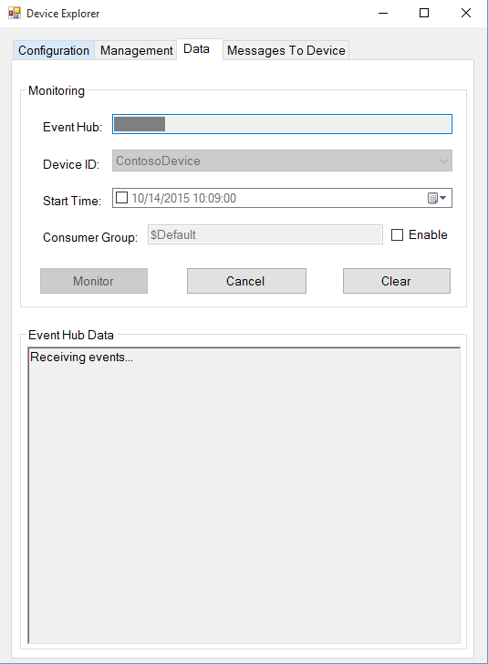
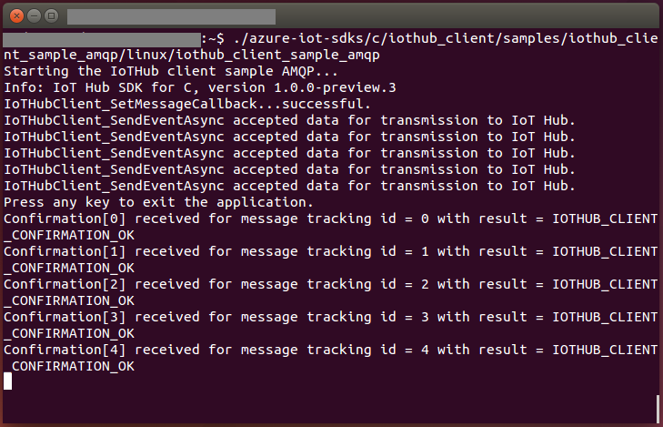
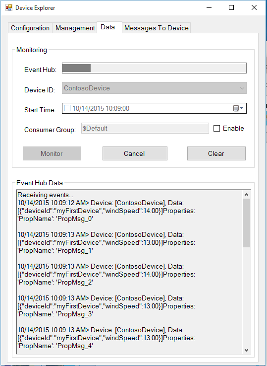
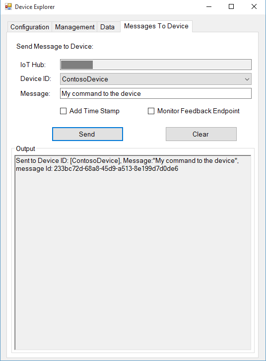
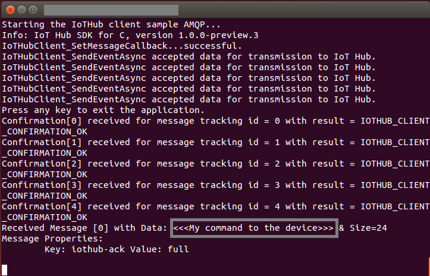

如何使用 Azure IoT SDK 认证运行 Linux 的 IoT 设备
===
---

# 目录

-   [介绍](#Introduction)
-   [步骤 1：配置 Azure IoT 中心](#Step-1-Configure)
-   [步骤 2：注册设备](#Step-2-Register)
-   [步骤 3：使用 C 客户端库生成并验证示例](#Step-3-Build)
    -   [3.1：在设备上加载 Azure IoT 代码和必备组件](#Step-3-1-Load)
    -   [3.2：生成示例](#Step-3-2-Build)
    -   [3.3：运行并验证示例](#Step-3-3-Run)
-   [步骤 4：打包和共享](#Step-4-Package_Share)
    -   [4.1：打包生成日志和示例测试结果](#Step-4-1-Package)
    -   [4.2：与工程支持人员共享包](#Step-4-2-Share)
    -   [4.3：后续步骤](#Step-4-3-Next)
-   [步骤 5：故障排除](#Step-5-Troubleshooting)

# 介绍

**关于本文档**

本文档向 IoT 硬件发行商逐步说明如何使用 Azure IoT SDK 来认证支持 IoT 的硬件。 此过程由多个步骤构成，具体包括：

-   配置 Azure IoT 中心
-   注册 IoT 设备
-   在设备上生成和部署 Azure IoT SDK
-   打包和共享日志

**准备**

在执行以下任何步骤之前，请先仔细阅读每个过程的每个步骤，确保对整个过程有全面的了解。

在开始过程前，应已准备好以下项目：

-   一台装有 GitHub 的计算机，并且能够访问 [azure-iot-sdk-c](https://github.com/Azure/azure-iot-sdk-c) GitHub 公共存储库。
-   用于访问命令行的 SSH 客户端，例如 [PuTTY](http://www.putty.org/)。
-   需要认证的硬件。

***注意：***如果尚未联系 Microsoft 来申请成为“Azure IoT 认证”合作伙伴，请先提交此[表单](<https://catalog.azureiotsuite.com/>)请求此身份，然后遵照本文中的说明操作。

# 步骤 1：注册 Azure IoT 中心

遵照[此处](https://docs.microsoft.com/en-us/azure/iot-hub/iot-hub-csharp-csharp-getstarted#create-an-iot-hub)所述的说明[注册](https://account.windowsazure.com/signup?offer=ms-azr-0044p) Azure IoT 中心服务。 在注册过程中，将会收到连接字符串。

-   **IoT 中心连接字符串**：下面显示了 IoT 中心连接字符串的示例：

         HostName=[YourIoTHubName];SharedAccessKeyName=[YourAccessKeyName];SharedAccessKey=[YourAccessKey]

# 步骤 2：注册设备

在本部分，我们将使用 DeviceExplorer 注册设备。 DeviceExplorer 是与 Azure IoT 中心对接的 Windows 应用程序，可执行以下操作：

-   设备管理
    -   创建新设备
    -   列出现有设备并公开设备中心存储的设备属性
    -   提供更新设备密钥的功能
    -   提供删除设备的功能
-   监视设备的事件
-   将消息发送到设备

若要运行 DeviceExplorer 工具，请使用[步骤 1](#Step-1-Configure) 中所述的以下配置字符串：

-   IoT 中心连接字符串

**步骤：**
1.  单击[此处](<https://github.com/Azure/azure-iot-sdk-csharp/blob/master/tools/DeviceExplorer/doc/how_to_use_device_explorer.md>)下载并安装 DeviceExplorer。

2.  在“配置”选项卡下添加连接信息，并单击“更新”按钮。

3.  使用以下说明创建设备并将其注册到 IoT 中心。

    a. 单击“管理”选项卡。

    b. 列表中会显示已注册的设备。 如果该设备未显示在列表中，请单击“刷新”按钮。 如果这是第一次执行此操作，则不应检索任何信息。

    c. 单击“创建”按钮创建设备 ID 和密钥。

    d. 成功创建后，设备会列在 DeviceExplorer 中。

    e. 右键单击该设备，并从上下文菜单中选择“复制所选设备的连接字符串”。

    f. 在记事本中保存此信息。 后面的步骤需要用到此信息。

***不是在电脑上运行 Windows？*** - 请遵照[此处](<https://github.com/Azure/azure-iot-device-ecosystem/blob/master/manage_iot_hub.md>)的说明预配设备并获取其凭据。

# 步骤 3：使用 C 客户端库生成并验证示例

本部分逐步讲解如何在运行 Linux 操作系统的设备上生成、部署和验证 IoT 客户端 SDK。 我们将在设备上安装所需的必备组件。 完成后，将会生成并部署 IoT 客户端 SDK，并使用 Azure IoT SDK 来验证 IoT 认证所需的示例测试。

## 3.1：在设备上加载 Azure IoT 代码和必备组件

-   打开 PuTTY 会话并连接到设备。

-   通过设备上的命令行发出以下命令，安装必备的包。 根据设备上运行的 OS 选择命令。

    **Debian 或 Ubuntu**

        sudo apt-get update

        sudo apt-get install -y curl uuid-dev libcurl4-openssl-dev build-essential cmake git

    **Fedora**

        sudo dnf check-update -y

        sudo dnf install uuid-devel libcurl-devel openssl-devel gcc-c++ make cmake git

    **其他任何 Linux OS**

        Use equivalent commands on the target OS

    ***注意：***此安装过程需要 cmake 2.8.12 或更高版本。 
    
    可使用以下命令来验证环境中当前安装的版本：

        cmake --version

    此库还需要 gcc 4.9 或更高版本。可使用以下命令来验证环境中当前安装的版本：
    
        gcc --version 

    有关如何升级 Ubuntu 14.04 上的 gcc 版本的信息，请参阅 <http://askubuntu.com/questions/466651/how-do-i-use-the-latest-gcc-4-9-on-ubuntu-14-04>。
    
-   在 PuTTY 中发出以下命令，将 SDK 下载到开发板：

        git clone --recursive https://github.com/Azure/azure-iot-sdk-c.git

-   检查 ~/azure-iot-sdk-c 目录下现在是否包含源代码的副本。

## 3.2：生成示例

有两个示例：一个用于向 IoT 中心发送消息，另一个用于从 IoT 中心接收消息。 这两个示例支持不同的协议。 在生成示例之前，可以使用所选的协议对示例示例进行修改。 默认情况下，将会针对 AMQP 协议生成示例。  在生成之前，遵照以下说明编辑示例： 
    
### 3.2.1：向 IoT 中心示例发送遥测数据：

1.  在文本编辑器中打开遥测示例文件

        nano azure-iot-sdk-c/iothub_client/samples/iothub_ll_telemetry_sample/iothub_ll_telemetry_sample.c     

2. 找到 IoT 连接字符串的以下占位符：

        static const char* connectionString = "[device connection string]";

3. 将上述占位符替换为设备连接字符串。 可根据[步骤 2](#Step-2-Register) 中所述，从 DeviceExplorer 获取已复制到记事本中的此字符串。
    
4. 找到以下占位符以编辑协议：

        // The protocol you wish to use should be uncommented
        //
        #define SAMPLE_HTTP
        //#define SAMPLE_MQTT
        //#define SAMPLE_MQTT_OVER_WEBSOCKETS
        //#define SAMPLE_AMQP
        //#define SAMPLE_AMQP_OVER_WEBSOCKETS
    
5. 取消注释要测试的协议，并注释其他协议。 若要测试多个协议，请对每个协议重复上述步骤。 

6. 按 Ctrl+O 保存更改，当 nano 提示是否保存为同一文件时，请按 ENTER。

7. 按 Ctrl+X 退出 nano。

### 3.2.1：将消息从 IoT 中心发送到设备示例：

1.  在文本编辑器中打开遥测示例文件

        nano azure-iot-sdk-c/iothub_client/samples/iothub_ll_c2d_sample/iothub_ll_c2d_sample.c
        
2.  遵循上述步骤 1-7 编辑此示例。

### 3.2.1：生成示例：

1.  使用以下命令生成 SDK。 如果在生成期间遇到任何问题，请遵循故障排除[步骤 5](#Step-5-Troubleshooting)。

        sudo ./azure-iot-sdk-c/build_all/linux/build.sh | tee LogFile.txt
    
    ***注意：***应将上述命令中的 LogFile.txt 替换为要将生成输出写入到的文件名。
    
    build.sh 在“~/azure-iot-sdk-c/”下创建名为“cmake”的文件夹。“cmake”中包含整个软件的所有编译结果。

## 3.3：运行并验证示例

在本部分，我们将运行 Azure IoT 客户端 SDK 示例来验证设备与 Azure IoT 中心之间的通信。 我们要向 Azure IoT 中心服务发送消息，并验证 IoT 中心是否已成功接收数据。 此外，我们还会监视从 Azure IoT 中心发送到客户端的任何消息。

**注意：**请对本部分中执行的所有操作截图。 在[步骤 4](#Step-4-2-Share) 中需要使用这些屏幕截图。

### 3.3.1：向 IOT 中心发送设备事件：

1.  如[步骤 2](#Step-2-Register) 中所述启动 DeviceExplorer，并导航到“数据”选项卡。从设备 ID 下拉列表中选择创建的设备名称，并单击“监视”按钮。

    

2.  DeviceExplorer 现在正在监视从所选设备发送到 IoT 中心的数据。

3.  发出以下命令运行示例。    

        azure-iot-sdk-c/cmake/iotsdk_linux/iothub_client/samples/iothub_ll_telemetry_sample/iothub_ll_telemetry_sample

4.  检查确认消息中是否显示了“OK”。 如果没有，则可能是错误地复制了设备中心连接信息。

        

5.  DeviceExplorer 应显示 IoT 中心已成功接收示例测试发送的数据。

        

### 3.3.2：从 IoT 中心接收消息

1.  发出以下命令运行示例。

        azure-iot-sdk-c/cmake/iotsdk_linux/iothub_client/samples/iothub_ll_c2d_sample/iothub_ll_c2d_sample
        
2. 若要验证是否可将消息从 IoT 中心发送到设备，请转到 DeviceExplorer 中的“发送到设备的消息”选项卡。

3.  使用“设备 ID”下拉列表选择创建的设备。

4.  在“消息”字段中添加一些文本，并单击“发送”。

    

5.  应会看到客户端示例控制台窗口中收到的命令。

    
    

# 步骤 4：打包和共享

## 4.1：打包生成日志和示例测试结果

打包设备中的以下项目：

1.  在生成运行期间记录在日志文件中的生成日志。

2.  前面“向 IoT 中心发送设备事件”部分中显示的所有屏幕截图。

3.  前面“从 IoT 中心接收消息”部分中显示的所有屏幕截图。

4.  请向我们发送明确的说明，描述如何使用你的硬件运行此示例（明确强调客户要执行的新步骤）。 请使用[此处](<https://github.com/Azure/azure-iot-device-ecosystem/blob/master/iotcertification/templates/template-linux-c.md>)提供的模板创建设备特定的说明。
    
    有关说明的大致形式的指导，请参阅[此](<https://github.com/Azure/azure-iot-device-ecosystem/tree/master/get_started>) GitHub 存储库中发布的示例。

## 4.2：与 Microsoft Azure IoT 团队成员共享包

1.  转到[合作伙伴仪表板](<https://catalog.azureiotsuite.com/devices>)。
2.  单击设备右上角的“上传”图标。

    

3.  此时会打开上传对话框。 单击“上传”按钮浏览文件。

    

    可以上传同一设备的多个文件。

4.  上传所有文件后，单击“提交审查”按钮。

    ***注意：***提交文件供审查后，若要更改/删除文件，请联系 iotcert 团队。
 

## 4.3：后续步骤

与我们共享文档后，我们将在接下来的 48 到 72 个工作小时内与你取得联系，以提供后续步骤。

# 步骤 5：故障排除

如需故障排除的帮助，请通过 <iotcert@microsoft.com> 联系工程支持人员。