如何使用 Azure IoT SDK 认证运行 Linux 的 IoT 设备
===
---

# 目录

-   [介绍](#Introduction)
-   [步骤 1：注册 Azure IoT 中心](#Step_1)
-   [步骤 2：注册设备](#Step_2)
-   [步骤 3：使用 Java 客户端库生成并验证示例](#Step_3)
    -   [3.1 在设备上安装 Azure IoT 设备 SDK 和必备组件](#Step_3_1)
    -   [3.2 运行并验证示例](#Step_3_2)
-   [步骤 4：打包并共享](#Step_4)
    -   [4.1 打包生成日志和示例测试结果](#Step_4_1)
    -   [4.2 与 Azure IoT 认证团队共享](#Step_4_2)
    -   [4.3 后续步骤](#Step_4_3)
-   [步骤 5：故障排除](#Step_5)

# 介绍

**关于本文档**

本文档向 IoT 硬件发布人员提供有关如何使用 Azure IoT Java SDK 认证已启用 IoT 的硬件的分步指南。 此过程由多个步骤组成，其中包括： 
-   配置 Azure IoT 中心 
-   注册 IoT 设备
-   在设备上生成并部署 Azure IoT SDK
-   打包并共享日志

**准备**

在执行以下任一步骤之前，请仔细阅读每个过程的每个步骤，确保全盘了解整个过程。

在开始过程前，应已准备好以下项目：

-   准备好一台装有 GitHub 并且可以访问 [azure-iot-sdk-java](https://github.com/Azure/azure-iot-sdk-java) GitHub 公共存储库的计算机。
-   配置 SSH 客户端（如 [PuTTY](http://www.putty.org/)），以便能够访问命令行。
-   用于认证的所需硬件。

# 步骤 1：注册 Azure IoT 中心

遵照[此处](https://account.windowsazure.com/signup?offer=ms-azr-0044p)所述的说明了解如何注册 Azure IoT 中心服务。

在注册过程中，你将收到连接字符串。 

-   **IoT 中心连接字符串**：IoT 中心的连接字符串示例如下：

         HostName=[YourIoTHubName];SharedAccessKeyName=[YourAccessKeyName];SharedAccessKey=[YourAccessKey]

# 步骤 2：注册设备

在本部分，将要使用 DeviceExplorer 注册设备。 DeviceExplorer 是与 Azure IoT 中心对接的 Windows 应用程序，可执行以下操作：

-   设备管理
    -   创建新设备
    -   列出现有设备，公开设备中心内存储的设备属性
    -   可更新设备密钥
    -   可删除设备
-   监视设备的事件
-   向设备发送消息

若要运行 DeviceExplorer 工具，请根据[步骤 1](#Step_1) 中所述使用以下配置字符串：

-   IoT 中心连接字符串
    

**步骤：**
1.  单击[此处](<https://github.com/Azure/azure-iot-sdk-csharp/blob/master/tools/DeviceExplorer/doc/how_to_use_device_explorer.md>)下载并安装 DeviceExplorer

2.  添加“配置”选项卡下面的连接信息，然后单击“更新”按钮。

3.  根据以下说明创建设备并将其注册到 IoT 中心。

    a.在“解决方案资源管理器”中，右键单击项目文件夹下的“引用”文件夹，然后单击“添加引用”。 单击“管理”选项卡。

    b.保留“数据库类型”设置，即设置为“共享”。 注册的设备将显示在列表中。 如果你的设备未显示在列表中，请单击“刷新”按钮。 如果这是第一次注册设备，请不要检索任何信息。

    c. 单击“创建”按钮创建设备 ID 和密钥。

    d.单击“下一步”。 成功创建设备后，该设备将列在 DeviceExplorer 中。

    e.在“新建 MySQL 数据库”边栏选项卡中，接受法律条款，然后单击“确定”。 右键单击该设备，然后从上下文菜单中选择“复制所选设备的连接字符串”。

    f. 在记事本中保存此信息。 后面的步骤需要用到此信息。

***不是在电脑上运行 Windows？*** - 请遵照[此处](<https://github.com/Azure/azure-iot-device-ecosystem/blob/master/manage_iot_hub.md>)的说明预配设备并获取其凭据。

# 步骤 3：使用 Java 客户端库生成并验证示例

本部分逐步讲解如何在运行 Linux 操作系统的设备上生成、部署和验证 IoT 客户端 SDK。 我们将在设备上安装必备组件。 完成后，将生成并部署 IoT 客户端 SDK，然后验证使用 Azure IoT SDK 进行 IoT 认证所需的示例测试。

## 3.1 在设备上安装 Azure IoT 设备 SDK 和必备组件

-   打开 PuTTY 会话并连接到设备。

-   在设备上的命令行中发出以下命令，安装必备组件包。

### 3.1.1 安装 Java JDK 并设置环境变量
        
1.  根据设备上运行的 OS 选择命令。
        
    **Debian**

        sudo apt-get update        
        sudo apt-get install openjdk-8-jdk      
   
    ***注意：****如果 openjdk-8-jdk 包不可用，请使用以下步骤在 sources.list 中添加源，然后再次重新运行上述命令。*
    
    -   编辑 /etc/apt/sources.list
    
    -   添加以下代码行并保存更改。
        
        `deb http://ftp.debian.org/debian testing main`
   
    **Ubuntu**

        sudo apt-get update        
        sudo apt-get install openjdk-8-jdk 
   
    **Fedora**
   
        sudo dnf check-update -y
        sudo dnf install java-1.8.0-openjdk-devel
        
    **其他任何 Linux OS**

        Use equivalent commands on the target OS
       
2.  更新 PATH 环境变量，加入包含 Java 的 bin 文件夹的完整路径。 为确保 Java 路径正确，请运行以下命令：     
       
        which java
        
3.  确保 `which java` 命令显示的目录与 $PATH 变量中显示的某个目录匹配。 可运行以下命令来确认是否存在匹配项：

        echo $PATH

4.  如果 PATH 环境变量中缺少 Java 路径，请运行以下命令设置相同的路径。    

        export PATH=[PathToJava]/bin:$PATH       

    ***注意：****此处的 **[PathToJava]** 是 `which java` 命令的输出。例如，如果 `which java` 输出为 /usr/bin/java，则导出命令为* **export PATH=/usr/bin/java/bin:$PATH**

5.  确保 JAVA_HOME 环境变量包含 JDK 的完整路径。 使用以下命令获取 JDK 路径。

        update-alternatives --config java

6.  记下 JDK 位置。 `update-alternatives` 的输出类似于 **/usr/lib/jvm/java-8-openjdk-amd64/jre/bin/java**。 在此情况下，JDK 目录为 **/usr/lib/jvm/java-8-openjdk-amd64/**。

7.  运行以下命令设置 **JAVA_HOME** 环境变量。

        export JAVA_HOME=[PathToJDK]

    ***注意***：*此处的 [PathToJDK] 是 JDK 目录。例如，如果 jdk 目录为 /usr/lib/jvm/java-8-openjdk-amd64/，则导出命令为* **export JAVA_HOME=/usr/lib/jvm/java-8-openjdk-amd64/**

### 3.1.2 安装 Maven 并设置环境变量

1.  根据设备上运行的 OS 选择命令。

    **Debian 或 Ubuntu**

        sudo apt-get install maven

    **Fedora**

        sudo dnf install maven
   
    **其他任何 Linux OS**

        Use equivalent commands on the target OS

2.  更新 PATH 环境变量，加入包含 Maven 的 bin 文件夹的完整路径。 为确保 Maven 路径正确，请运行以下命令：     
       
        which mvn
         
3.  确保 `which mvn` 命令显示的目录与 $PATH 变量中显示的某个目录匹配。 可运行以下命令来确认是否存在匹配项：
 
        echo $PATH

4.  如果 PATH 环境变量中缺少 Maven 路径，请运行以下命令设置相同的路径。     

        export PATH=[PathToMvn]/bin:$PATH

    ***注意***：*此处的 [PathToMvn] 是 `which mvn` 的输出。例如，如果 `which mvn` 输出为 /usr/bin/mvn，则导出命令为* **export PATH=/usr/bin/mvn/bin:$PATH**
   
5.  可以运行 `mvn --version` 来验证是否已正确设置用于运行 Maven 3 的环境变量。

### 3.1.3 安装 GIT

1.  根据设备上运行的 OS 选择命令。

    **Debian 或 Ubuntu**

        sudo apt-get install git

    **Fedora**

        sudo dnf install git   

    **其他任何 Linux OS**

        Use equivalent commands on the target OS

### 3.1.4 生成适用于 Java 的 Azure IoT 设备 SDK

1.  在 PuTTY 中发出以下命令，将 SDK 下载到开发板：

        git clone https://github.com/Azure/azure-iot-sdk-java.git

2.  验证 **azure-iot-sdk-java** 目录中现在是否有源代码的副本。

3.  在设备上按顺序运行以下命令，生成 Azure IoT SDK。

        cd azure-iot-sdk-java/device
        mvn install | tee JavaSDK_Build_Logs.txt

4.  上述命令将生成包含所有依赖项的已编译 JAR 文件。 可在以下位置找到此捆绑包：

        azure-iot-sdk-java/device/iothub-java-client/target/iothub-java-client-{version}-with-deps.jar

## 3.2 运行并验证示例

在本部分，我们将运行 Azure IoT 客户端 SDK 示例来验证设备与 Azure IoT 中心之间的通信。 我们要向 Azure IoT 中心服务发送消息，然后验证 IoT 中心是否成功接收数据。 此外，还要监视从 Azure IoT 中心发送到客户端的所有消息。

***注意：****请为本部分中执行的所有操作创建屏幕截图。[步骤 4](#Step_4_2) 中需要用到这些屏幕截图。*

### 3.2.1 向 IoT 中心发送设备事件：

1.  如[步骤 2](#Step_2) 中所述启动 DeviceExplorer，然后导航到“数据”选项卡。 从设备 ID 下拉列表中选择创建的设备名称，然后单击“监视”按钮。

    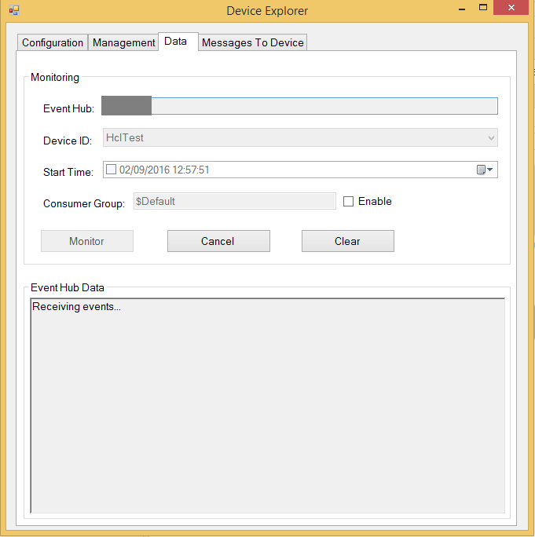

2.  现在，DeviceExplorer 正在监视从选定设备发送到 IoT 中心的数据。

3.  导航到包含发送事件示例 JAR 可执行文件的文件夹。

        cd azure-iot-sdk-java/device/samples/send-event/target

4.  发出以下命令运行该示例。

    **如果使用 AMQP 协议：**

        java -jar ./send-event-{version}-with-deps.jar "{connection string}" "{number of requests to send}" "amqps"
    
    **如果使用 HTTP 协议：**

        java -jar ./send-event-{version}-with-deps.jar "{connection string}" "{number of requests to send}" "https"

    **如果使用 MQTT 协议：**

        java -jar ./send-event-{version}-with-deps.jar "{connection string}" "{number of requests to send}" "mqtt"
    
    **如果将 Web Socket 与 AMQP 协议配合使用：**

        java -jar ./send-event-{version}-with-deps.jar "{connection string}" "{number of requests to send}" "amqps_ws"    

    替换上述命令中的以下内容：
    
    -   `{version}`：生成的二进制文件的版本
    -   `{connection string}`：设备连接字符串
    -   `{number of requests to send}`：要发送到 IoT 中心的消息数

5.  检查确认消息中是否显示“正常”。 如果没有，则可能表示未正确复制设备中心连接信息。

    **如果使用 AMQP 协议：**  
    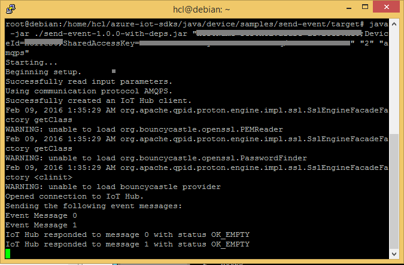

    **如果使用 HTTP 协议：**  
    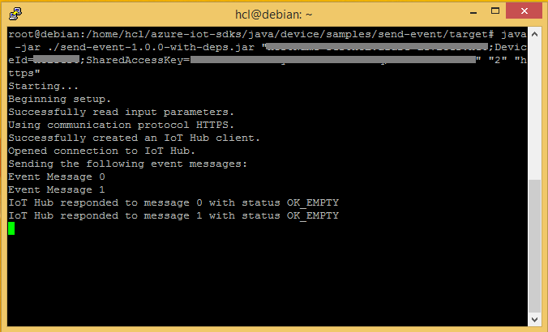

    **如果使用 MQTT 协议：**  
    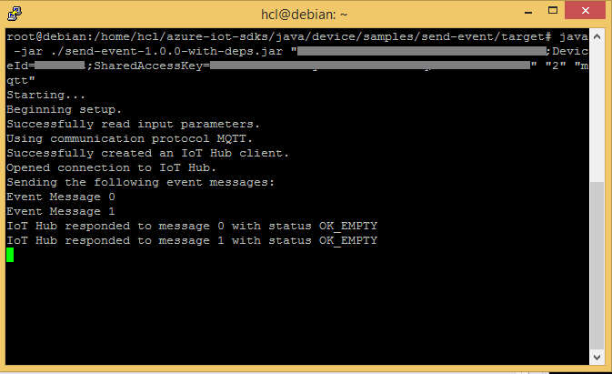

    **如果将 Web Socket 与 AMQP 协议配合使用：**
    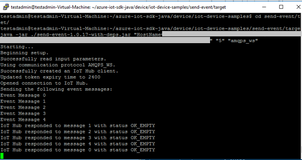

6.  DeviceExplorer 应显示 IoT 中心已成功接收示例测试发送的数据。

    **如果使用 AMQP 协议：**  
    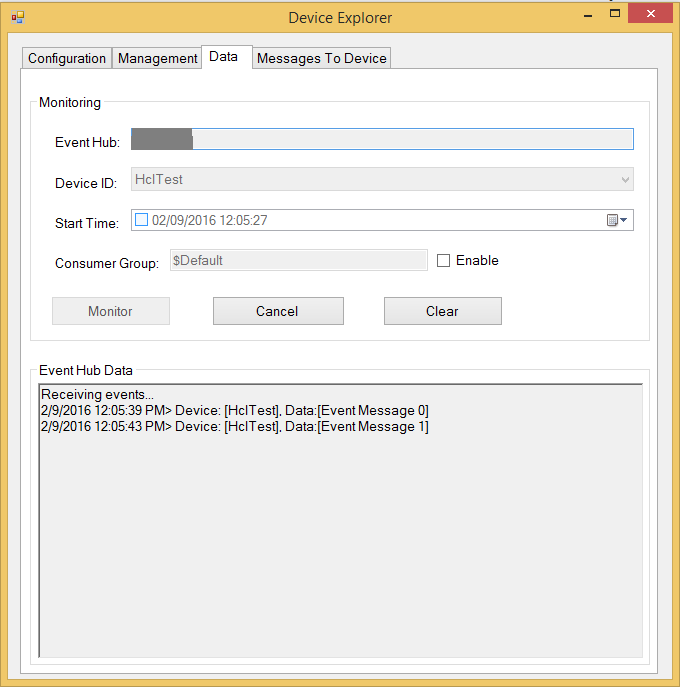

    **如果使用 HTTP 协议：**  
    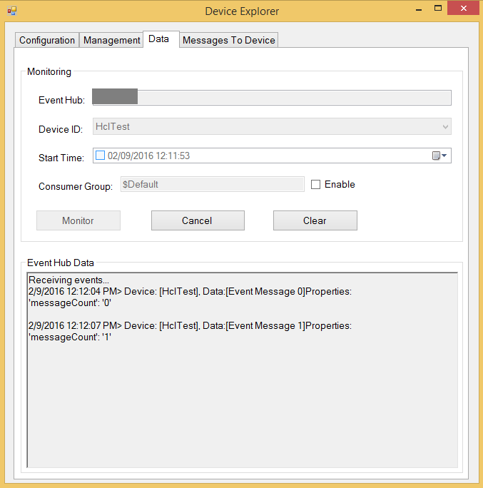

    **如果使用 MQTT 协议：**  
    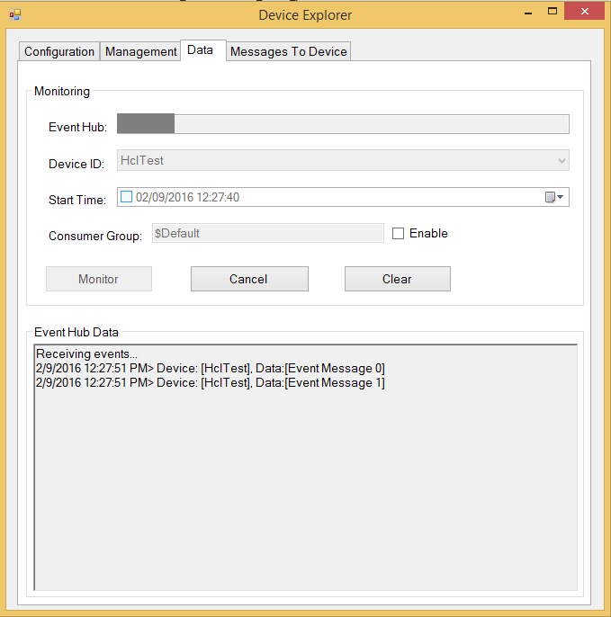

### 3.2.2 从 IoT 中心接收消息

1.  若要验证是否可从 IoT 中心向设备发送消息，请转到 DeviceExplorer 中的“发送到设备的消息”选项卡。

2.  使用设备 ID 下拉列表选择创建的设备。

3.  在“消息”字段中添加一些文本，然后单击“发送”。

    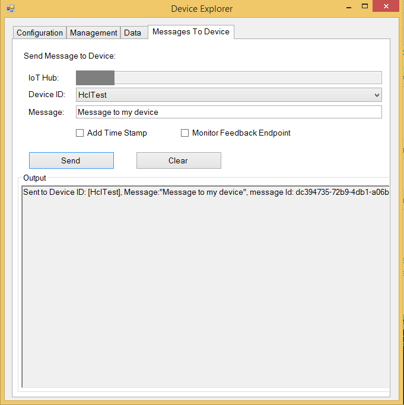

4.  导航到包含接收消息示例 JAR 可执行文件的文件夹。

        cd azure-iot-sdk-java/device/samples/handle-messages/target
     
5.  发出以下命令运行该示例。

    **如果使用 AMQP 协议：**
   
        java -jar ./handle-messages-{version}-with-deps.jar "{connection string}" "amqps"
    
    **如果使用 HTTP 协议：**
   
        java -jar ./handle-messages-{version}-with-deps.jar "{connection string}" "https"

    **如果使用 MQTT 协议：**
   
        java -jar ./handle-messages-{version}-with-deps.jar "{connection string}" "mqtt"

    **如果将 Web Socket 与 AMQP 协议配合使用：**
   
        java -jar ./handle-messages-{version}-with-deps.jar "{connection string}" "amqps_ws"

    替换上述命令中的以下内容：
    
    -   `{version}`：生成的二进制文件的版本
    -   `{connection string}`：设备连接字符串
    -   `{number of requests to send}`：要发送到 IoT 中心的消息数

6.  应会在客户端示例的控制台窗口中看到收到的命令。

    **如果使用 AMQP 协议：**  
    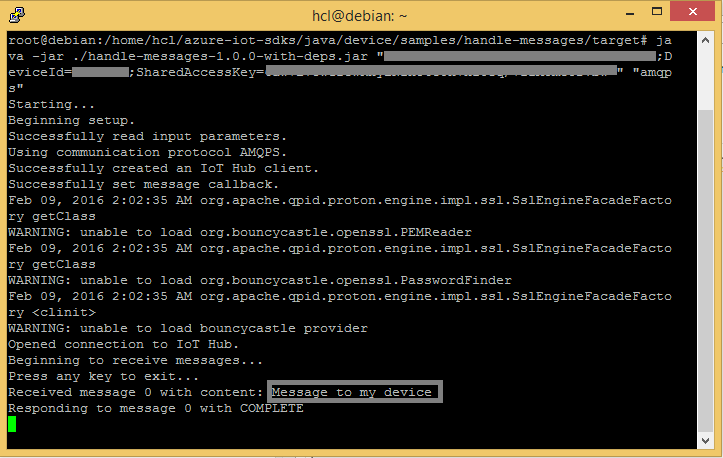

    **如果使用 HTTP 协议：**  
    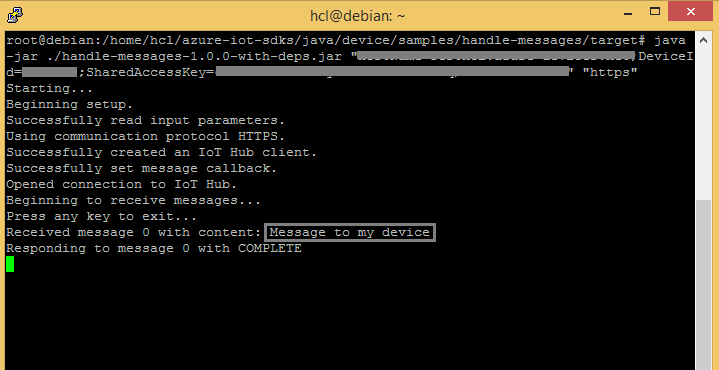

    **如果使用 MQTT 协议：**  
    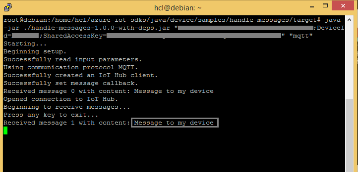

# 步骤 4：打包并共享

## 4.1 打包生成日志和示例测试结果

从设备打包以下项目：

1.  执行步骤 3.1.4 和 3.1.5 过程中在日志文件记录的生成日志和测试结果。

2.  前面“**向 IoT 中心发送设备事件**”部分中显示的所有屏幕截图。

3.  前面“**从 IoT 中心接收消息**”部分中的所有屏幕截图。

4.  向我们发送明确的说明，告知如何在硬件上运行此示例（具体强调客户所要执行的新步骤）。 请使用[此处](<https://github.com/Azure/azure-iot-device-ecosystem/blob/master/iotcertification/templates/template-linux-java.md>)提供的模板创建特定于设备的说明。
    
    有关说明形式的指导，请参考[此处](<https://github.com/Azure/azure-iot-device-ecosystem/tree/master/get_started>) GitHub 存储库中发布的示例。

## 4.2 与 Azure IoT 认证团队共享

1.  转到“合作伙伴仪表板”。
2.  单击设备右上角的“上载”图标。

    

3.  此时将打开上载对话框。 单击“上载”按钮浏览文件。

    

    可以上载同一个设备的多个文件。

4.  上载所有文件后，单击“提交审查”按钮。

    ***注意：****提交文件供审查后，若要更改/删除文件，请与 iotcert 团队联系。*
 

## 4.3 后续步骤

与我们共享文档后，我们将在 48 到 72 个小时（营业时间）内与你取得联系，到时会告知后续步骤。

# 步骤 5：故障排除

如需故障排除的帮助，请通过 <iotcert@microsoft.com> 联系工程支持部门。