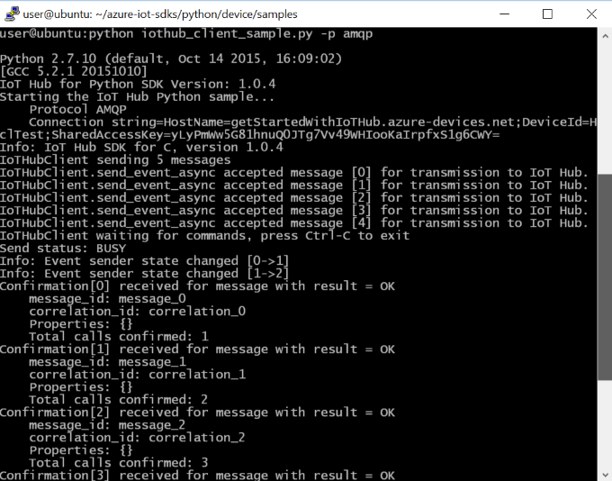
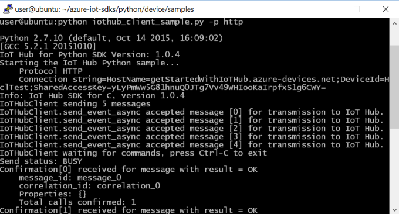
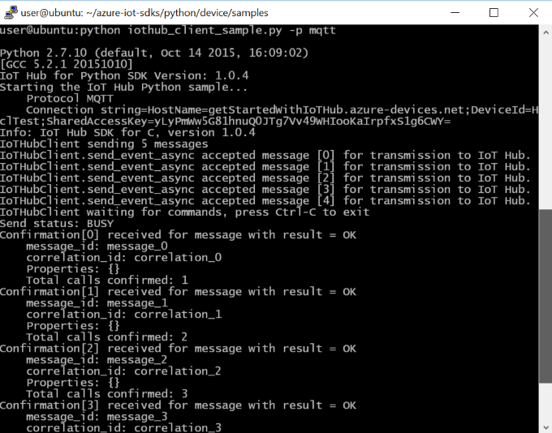
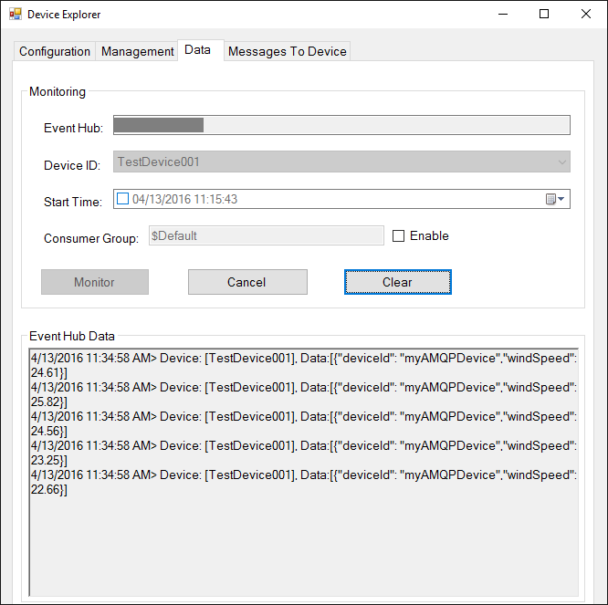
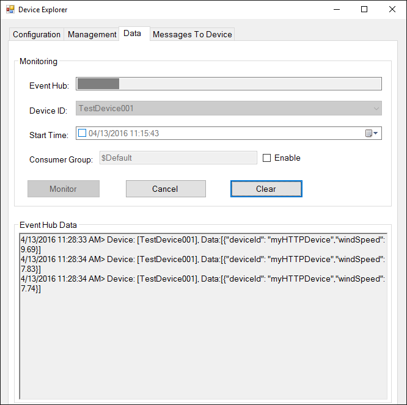
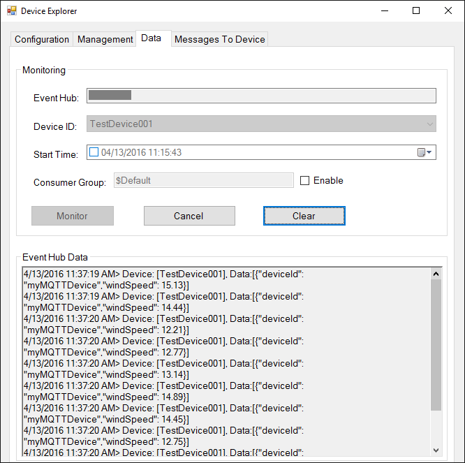
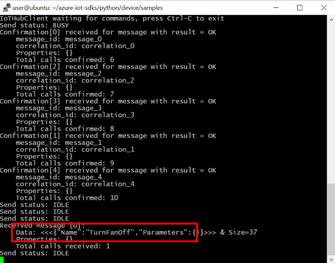
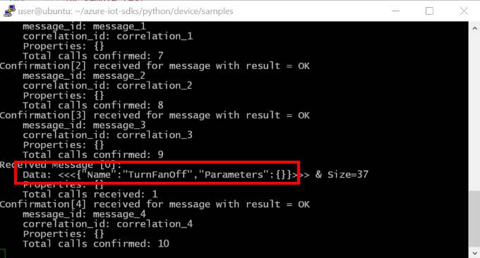
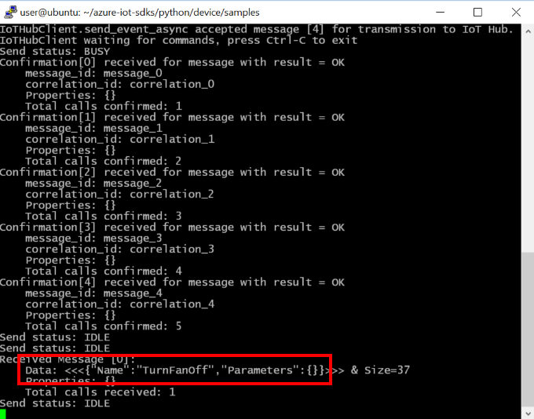

如何使用 Azure IoT SDK 认证运行 Linux 的 IoT 设备
===
---

# 目录

-   [介绍](#Introduction)
-   [步骤 1：配置 Azure IoT 中心](#Step-1-Configure)
-   [步骤 2：注册设备](#Step-2-Register)
-   [步骤 3：使用 Python 客户端库生成并验证示例](#Step-3-Build)
    -   [3.1 在设备上加载 Azure IoT 代码和必备组件](#Step-3-1-Load)
    -   [3.2 生成示例](#Step-3-2-Build)
    -   [3.3 运行并验证示例](#Step-3-3-Run)
-   [步骤 4：打包并共享](#Step-4-Package_Share)
    -   [4.1 打包生成日志和示例测试结果](#Step-4-1-Package)
    -   [4.2 与工程支持人员共享包](#Step-4-2-Share)
    -   [4.3 后续步骤](#Step-4-3-Next)
-   [步骤 5：故障排除](#Step-5-Troubleshooting)

# 介绍

**关于本文档**

本文档向 IoT 硬件发布人员提供有关如何使用 Azure IoT SDK 认证已启用 IoT 的硬件的分步指南。 此过程由多个步骤组成，其中包括：
-   配置 Azure IoT 中心
-   注册 IoT 设备
-   在设备上生成并部署 Azure IoT SDK
-   打包并共享日志

**准备**

在执行以下任一步骤之前，请仔细阅读每个过程的每个步骤，确保全盘了解整个过程。

在开始过程前，应已准备好以下项目：

-   准备好一台装有 GitHub 并且可以访问 [azure-iot-sdks](https://github.com/Azure/azure-iot-sdks) GitHub 专用存储库的计算机。
-   配置 SSH 客户端（如 [PuTTY](http://www.putty.org/)），以便能够访问命令行。
-   用于认证的所需硬件。

***注意：****如果你尚未咨询 Microsoft 如何成为 Azure 认证的 IoT 合作伙伴，请先提交此[表单](<https://iotcert.cloudapp.net/>)来提出请求，然后遵照本文中的说明。*

# 步骤 1：注册 Azure IoT 中心

遵照[此处](https://account.windowsazure.com/signup?offer=ms-azr-0044p)所述的说明了解如何注册 Azure IoT 中心服务。 在注册过程中，你将收到连接字符串。

-   **IoT 中心连接字符串**：IoT 中心的连接字符串示例如下：

         HostName=[YourIoTHubName];SharedAccessKeyName=[YourAccessKeyName];SharedAccessKey=[YourAccessKey]

# 步骤 2：注册设备

-   遵照[此处](<https://github.com/Azure/azure-iot-sdks/blob/master/doc/manage_iot_hub.md>)所述的说明，了解如何预配设备并获取其凭据。

# 步骤 3：使用 Python 库生成并验证示例

本部分逐步讲解如何在运行 Linux 操作系统的设备上生成、部署和验证 IoT 客户端 SDK。 我们将在设备上安装必备组件。 完成后，将生成并部署 IoT 客户端 SDK，然后验证使用 Azure IoT SDK 进行 IoT 认证所需的示例测试。

## 3.1 在设备上加载 Azure IoT 代码和必备组件

-   打开 PuTTY 会话并连接到设备。

-   在设备上的命令行中发出以下命令，安装必备组件包。 根据设备上运行的 OS 选择命令。

    **Debian 或 Ubuntu**

        sudo apt-get update

        sudo apt-get install -y curl libcurl4-openssl-dev build-essential cmake git python2.7-dev libboost-python-dev

    **Fedora**

        sudo dnf check-update -y

        sudo dnf install libcurl-devel openssl-devel gcc-c++ make cmake git python2.7-dev libboost-python-dev

    **其他任何 Linux OS**

        Use equivalent commands on the target OS

    ***注意：****此安装过程需要 cmake 2.8.12 或更高版本。* 
    
    *可以使用以下命令确认环境中当前安装的版本：*

        cmake --version

    *此库还需要 gcc 4.9 或更高版本。可以使用以下命令确认环境中当前安装的版本：*
    
        gcc --version 

    *有关如何在 Ubuntu 14.04 上升级 gcc 版本的信息，请参阅 <http://askubuntu.com/questions/466651/how-do-i-use-the-latest-gcc-4-9-on-ubuntu-14-04>。*

    *此库还需要 Python 版本 2.7.x。可以使用以下命令确认环境中当前安装的版本：*
    
          python --version

-   在 PuTTY 中发出以下命令，将 SDK 下载到开发板：

        git clone --recursive https://github.com/Azure/azure-iot-sdks.git

-   检查 ~/azure-iot-sdks 目录中现在是否生成了源代码的副本。

## 3.2 生成示例

-   运行以下命令生成 SDK：

        cd python/build_all/linux
        sudo ./build.sh | tee LogFile.txt

    ***注意：****应将上述命令中的 LogFile.txt 替换为要将生成输出写入到的文件名。*

-   成功生成后，`iothub_client.so` Python 扩展模块将复制到 **python/device/samples** 文件夹。

## 3.3 运行并验证示例

在本部分，我们将运行 Azure IoT 客户端 SDK 示例来验证设备与 Azure IoT 中心之间的通信。 我们要向 Azure IoT 中心服务发送消息，然后验证 IoT 中心是否成功接收数据。 此外，还要监视从 Azure IoT 中心发送到客户端的所有消息。

-   执行以下命令导航到 samples 文件夹：

        cd azure-iot-sdks/python/device/samples/

-   在设备上运行以下命令：

        nano iothub_client_sample.py

-   此时会启动基于控制台的文本编辑器。 向下滚动到连接信息。

-   找到设备连接字符串的以下占位符：

        connectionString = "[device connection string]"

-   将上述占位符替换为在[步骤 2](#Step-2-Register) 中获取的设备连接字符串。

-   按 Ctrl+O 保存更改，当 nano 提示是否保存到同一文件时，按 ENTER 即可。

-   按 Ctrl+X 退出 nano。

**注意：**请为本部分中执行的所有操作创建屏幕截图。 [步骤 4](#Step-4-2-Share) 中需要用到这些屏幕截图

### 3.3.1 向 IoT 中心发送设备事件：

-   使用以下命令运行示例应用程序：

    **对于 AMQP 协议：**

        python iothub_client_sample.py -p amqp

    **对于 HTTP 协议：**

        python iothub_client_sample.py -p http

    **对于 MQTT 协议：**

        python iothub_client_sample.py -p mqtt

-   请参阅[管理 IoT 中心](<https://github.com/Azure/azure-iot-sdks/blob/master/doc/manage_iot_hub.md>)，了解如何监视 IoT 中心从应用程序接收的消息。

-   检查确认消息中是否显示“正常”。 如果没有，则可能表示未正确复制设备连接字符串。

    **如果使用 AMQP 协议：**
    
    

    **如果使用 HTTP 协议：**
    
    

    **如果使用 MQTT 协议：**
    
    

-   DeviceExplorer 应显示 IoT 中心已成功接收示例测试发送的数据。

    **如果使用 AMQP 协议：**
    
    

    **如果使用 HTTP 协议：**
    
    

    **如果使用 MQTT 协议：**
    
    

### 3.3.2 从 IoT 中心接收消息

-   请参阅[管理 IoT 中心](<https://github.com/Azure/azure-iot-sdks/blob/master/doc/manage_iot_hub.md>)，了解如何将云到设备的消息发送到应用程序。

-   应会在客户端示例的控制台窗口中看到收到的命令。

    **如果使用 AMQP 协议：**
    
    

    **如果使用 HTTP 协议：**
    
    

    **如果使用 MQTT 协议：**
    
    

# 步骤 4：打包并共享

## 4.1 打包生成日志和示例测试结果

从设备打包以下项目：

1.  生成运行过程中在日志文件记录的生成日志和 E2E 测试结果。

2.  前面“**向 IoT 中心发送设备事件**”部分中显示的所有屏幕截图。

3.  前面“**从 IoT 中心接收消息**”部分中的所有屏幕截图。

4.  向我们发送明确的说明，告知如何在硬件上运行此示例（具体强调客户所要执行的新步骤）。 请使用[此处](<https://github.com/Azure/azure-iot-device-ecosystem/blob/master/iotcertification/templates/template-linux-python.md>)提供的模板创建特定于设备的说明。
    
    有关说明形式的指导，请参考[此处](<https://github.com/Azure/azure-iot-device-ecosystem/tree/master/get_started>) GitHub 存储库中发布的示例。

## 4.2 与 Microsoft Azure IoT 团队共享包

1.  转到“合作伙伴仪表板”。
2.  单击设备右上角的“上载”图标。

    

3.  此时将打开上载对话框。 单击“上载”按钮浏览文件。

    

    可以上载同一个设备的多个文件。

4.  上载所有文件后，单击“提交审查”按钮。

    ***注意：****提交文件供审查后，若要更改/删除文件，请与 iotcert 团队联系。*
 

## 4.3 后续步骤

与我们共享文档后，我们将在 48 到 72 个小时（营业时间）内与你取得联系，到时会告知后续步骤。

# 步骤 5：故障排除

如需故障排除的帮助，请通过 <iotcert@microsoft.com> 联系工程支持部门。
