如何使用 Azure IoT SDK 认证运行 Mbed OS 的 IoT 设备
===
---

# 目录

-   [简介](#Introduction)
-   [步骤 1：配置 Azure IoT 中心](#Step-1-Configure)
-   [步骤 2：注册设备](#Step-2-Register)
-   [步骤 3：使用 C 客户端库生成并验证示例](#Step-3-Build)
    -   [3.1 连接设备](#Step-3-1-Load)
    -   [3.2 生成示例](#Step-3-2-Build)
    -   [3.3：运行并验证示例](#Step-3-3-Run)
-   [步骤 4：打包并共享](#Step-4-Package_Share)
    -   [4.1：打包生成日志和示例测试结果](#Step-4-1-Package)
    -   [4.2 与工程支持人员共享包](#Step-4-2-Share)
    -   [4.3：后续步骤](#Step-4-3-Next)
-   [步骤 5：故障排除](#Step-5-Troubleshooting)

# 简介

**关于本文档**

本文档向 IoT 硬件发布人员提供有关如何使用 Azure IoT SDK 认证已启用 IoT 的硬件的分步指南。 此过程由多个步骤组成，其中包括：
-   配置 Azure IoT 中心
-   注册 IoT 设备
-   在设备上生成并部署 Azure IoT SDK
-   打包并共享日志

**准备**

在执行以下任一步骤之前，请仔细阅读每个过程的每个步骤，确保全盘了解整个过程。

在开始过程前，应已准备好以下项目：

-   准备好一台装有 GitHub 并且可以访问 [azure-iot-sdk-c](https://github.com/Azure/azure-iot-sdk-c) GitHub 专用存储库的计算机
-   配置 SSH 客户端（如 [PuTTY](http://www.putty.org/)），以便能够访问命令行
-   用于认证的所需硬件

***注意：****如果尚未联系 Microsoft 来申请成为“Azure IoT 认证”合作伙伴，请先提交此[表单](<https://iotcert.cloudapp.net/>)请求此身份，然后遵照本文中的说明操作。*

# 步骤 1：注册 Azure IoT 中心

遵照[此处](https://account.windowsazure.com/signup?offer=ms-azr-0044p)所述的说明了解如何注册 Azure IoT 中心服务。在注册过程中，你将收到连接字符串。

-   **IoT 中心连接字符串**：下面显示了 IoT 中心连接字符串的示例：

         HostName=[YourIoTHubName];CredentialType=SharedAccessSignature;CredentialScope=[ContosoIotHub];SharedAccessKeyName=[YourAccessKeyName];SharedAccessKey=[YourAccessKey]

# 步骤 2：注册设备

在本部分，我们将使用 DeviceExplorer 注册设备。 DeviceExplorer 是与 Azure IoT 中心对接的 Windows 应用程序，可执行以下操作：

-   设备管理
    -   创建新设备
    -   列出现有设备，公开设备中心内存储的设备属性
    -   可更新设备密钥
    -   可删除设备
-   监视设备的事件
-   向设备发送消息

若要运行 DeviceExplorer 工具，请根据[步骤 1](#Step-1-Configure) 中所述使用以下配置字符串：

-   IoT 中心连接字符串

1.  单击[此处](<https://github.com/Azure/azure-iot-sdk-csharp/blob/master/tools/DeviceExplorer/doc/how_to_use_device_explorer.md>)下载并安装 DeviceExplorer。

2.  添加“配置”选项卡下面的连接信息，然后单击“更新”按钮。  

3.  根据以下说明创建设备并将其注册到 IoT 中心。

    a.在“解决方案资源管理器”中，右键单击项目文件夹下的“引用”文件夹，然后单击“添加引用”。 单击“管理”选项卡。 

    b.保留“数据库类型”设置，即设置为“共享”。 注册的设备将显示在列表中。 如果你的设备未显示在列表中，请单击“刷新”按钮。  如果这是第一次注册设备，请不要检索任何信息。

    c. 单击“创建”按钮创建设备 ID 和密钥。 

    d.单击“下一步”。 成功创建设备后，该设备将列在 DeviceExplorer 中。

    e.在“新建 MySQL 数据库”边栏选项卡中，接受法律条款，然后单击“确定”。 右键单击该设备，然后从上下文菜单中选择“复制所选设备的连接字符串”。 

    f. 在记事本中保存此信息。 后面的步骤需要用到此信息。

***不是在电脑上运行 Windows？*** - 请遵照[此处](<https://github.com/Azure/azure-iot-device-ecosystem/blob/master/manage_iot_hub.md>)的说明预配设备并获取其凭据。

# 步骤 3：使用 C 客户端库生成并验证示例

本部分逐步讲解如何在运行 mbed 操作系统的设备上生成、部署和验证 IoT 客户端 SDK。 我们将在设备上安装必备组件。  完成后，将生成并部署 IoT 客户端 SDK，然后验证使用 Azure IoT SDK 进行 IoT 认证所需的示例测试。

## 3.1 连接设备

1.  使用以太网电缆将开发板连接到网络。 由于示例依赖于 Internet 访问，因此必须执行此步骤。

2.  使用 micro-USB 电缆将设备插入计算机。

3.  安装[此处](http://developer.mbed.org/handbook/Windows-serial-configuration#1-download-the-mbed-windows-serial-port)提供的 Windows 串行端口驱动程序。

4.  安装[此处](http://www.7-zip.org)提供的 7-Zip 软件。

## 3.2 生成示例

1. 将 [GitHub  SDK](https://github.com/Azure/azure-iot-sdk-c.git) 存储库克隆到计算机。

2.  浏览到文件夹

        /azure-iot-sdk-c/iothub_client/samples/iothub_client_sample_amqp/mbed

3.  运行 **mkmbedzip.bat** 文件。 这会在同一文件夹中生成 **iothub\_client\_sample\_amqp.zip** 文件。

      ***注意：****zip 文件上传到编译器网页后，浏览器会将该 zip 文件保持打开状态。在浏览器打开的情况下尝试创建另一个 zip 文件将会失败。*

4.  在 Web 浏览器中，转到 [mbed 开发人员站点](https://developer.mbed.org/)。 如果你尚未注册，则会看到一个用于创建新帐户（它是免费的）的选项。 否则，使用你的帐户凭据登录。

5.  单击页面右上角的“编译器”。 
    随后将会转到“工作区管理”界面。 

6.  确保所用的硬件平台显示在窗口右上角。 如果没有，请单击右上角的“未选择设备”按钮选择硬件平台。 

7.  在“工作区管理”菜单中，选择“新建”&minus;&gt;“新建程序”。 

    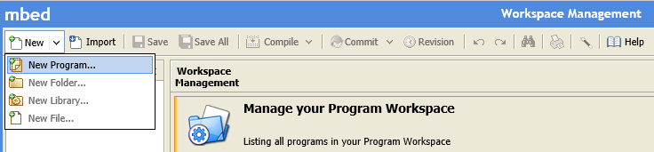

8.  此时将显示“创建新程序”对话框。  平台字段中应已预先填充所选的硬件平台。

9.  将“模板”字段设置为“空程序”。   在“程序名称”字段中使用所需的任何程序名称，然后单击“确定”。 

       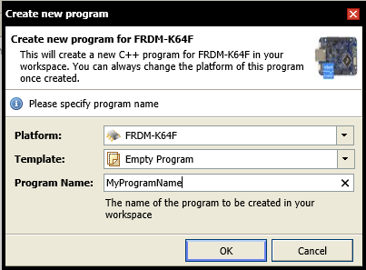

10.  在主菜单上单击“**导入**”。 随后将会打开“导入向导”。 

       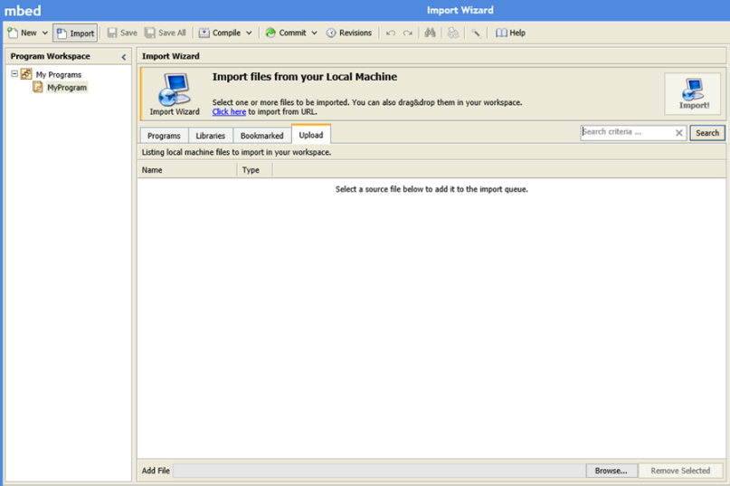

11.  在导入向导中转到“上载”选项卡，然后单击页面底部的“浏览...”按钮。  

12.  浏览到（使用 mkmbedzip.bat）创建 zip 文件的目录并双击它。 随后将返回到“导入向导”页，zip 文件名已显示在“名称”列中。

13.  在导入向导的右上角单击“导入!”  按钮。 此时将显示“导入库”对话框。 

14.  确保目标路径与创建的项目名称匹配，然后单击“导入”。 

  ***注意：****目标路径与从主菜单中选择“导入”之前，最后一次选择的程序名称匹配。*

15.  打开 **iothub\_client\_sample\_amqp.c** 文件，将 \[Iothub connection string\] 替换为设备连接字符串。 可根据[步骤 2](#Step-2-Register) 中所述，从 DeviceExplorer 获取此连接字符串。

16.  在“程序工作区”窗格中突出显示你的项目，然后再次单击“导入”菜单项。 

17.  在窗口顶部，单击“单击此处”链接从某个 URL 导入库。  此时将显示“导入库”对话框。 

       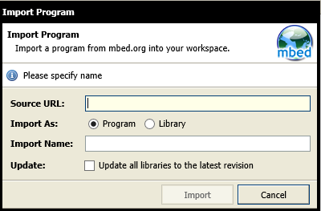

18.  在“源 URL”字段中输入以下 URL。

          http://developer.mbed.org/users/donatien/code/NTPClient/

19.  完成后，单击“导入”。 

       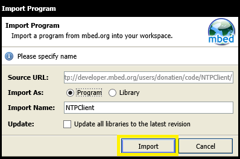

20.  重复步骤 16 和 17，在“源 URL”字段中输入以下 URL。 完成后，单击“导入”： 

         https://developer.mbed.org/users/wolfSSL/code/wolfSSL/
         http://developer.mbed.org/users/mbed_official/code/EthernetInterface/
         http://developer.mbed.org/users/mbed_official/code/mbed-rtos/
         http://mbed.org/users/mbed_official/code/mbed/

21.  重复步骤 16 和 17 导入 azure-uamqp-c 库，然后在“源 URL”字段中输入以下 URL。 完成后，单击“导入”： 

         https://developer.mbed.org/users/AzureIoTClient/code/azure_uamqp_c/

22.  在主菜单中单击“编译”生成程序。  如果生成成功，将会生成包含项目名称的 .bin 文件。 在计算机上保存此文件， 因为后面的步骤将要用到。
    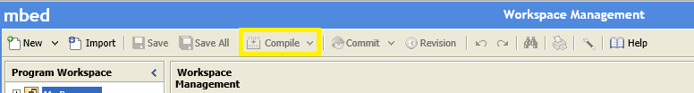

  ***注意：****可以安全地忽略任何警告，但是如果此生成产生错误，请在更正它们之后再继续进行。*

## 3.3 运行并验证示例

在本部分，我们将运行 Azure IoT 客户端 SDK 示例来验证设备与 Azure IoT 中心之间的通信。 我们要向 Azure IoT 中心服务发送消息，然后验证 IoT 中心是否成功接收数据。 此外，我们还会监视从 Azure IoT 中心发送到客户端的任何消息。

***注意：****请对本部分中执行的所有操作进行屏幕截图。* 在[步骤 4](#Step-4-2-Share) 中需要使用这些屏幕截图。

### 3.3.1 向 IoT 中心发送设备事件

1.  如[步骤 2](#Step-2-Register) 中所述启动 DeviceExplorer，并导航到“数据”选项卡。  从设备 ID 下拉列表中选择创建的设备名称，并单击“监视”按钮。 

     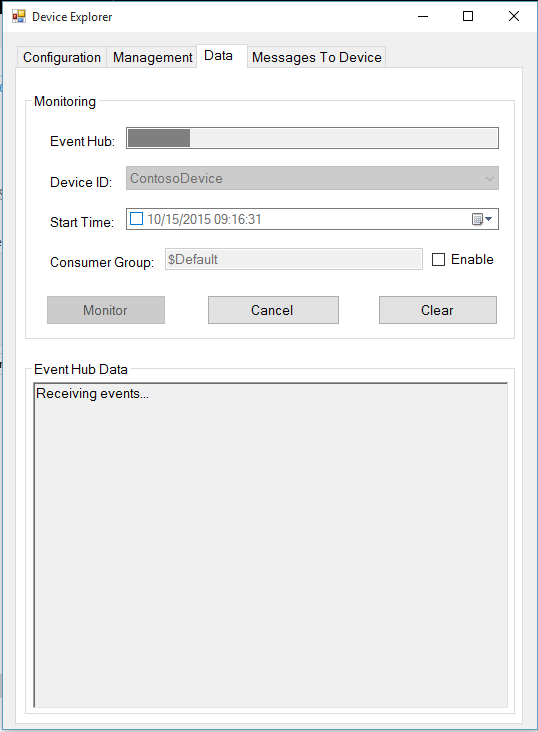

2.  现在，DeviceExplorer 正在监视从选定设备发送到 IoT 中心的数据。

3.  将最后一个步骤生成的 .bin 文件复制到设备。

    ***注意：****将 .bin 文件保存到设备会重置当前与设备建立的终端会话。重新连接设备时，请再次手动重置终端，或启动新的终端。这样，mbed 设备便会重置并开始执行程序。*

4.  使用 PuTTY 等 SSH 终端程序连接到设备。 可以通过检查 Windows 设备管理器来确定设备使用的串行端口。

    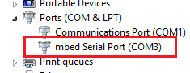

5.  在 PuTTY 中，单击“**串行**”连接类型。 设备很有可能以 115200 的速率进行连接，因此请在“速度”框中输入该值。
    然后单击“打开”。

    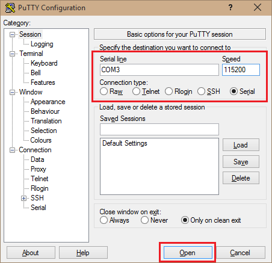

6.  iothub\_client\_sample\_amqp 程序开始执行。

    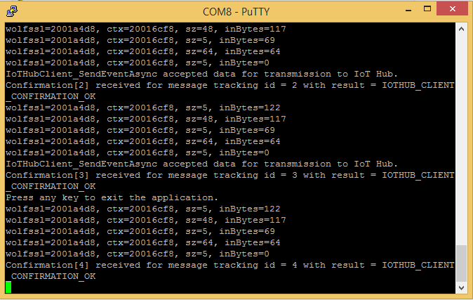

    检查确认消息中是否显示“正常”。 如果没有，则可能是错误地复制了设备中心连接信息。

      ***注意：****如果程序不启动，请手动重置开发板。*

7. 应会看到 DeviceExplorer 的数据选项卡中收到的事件。

     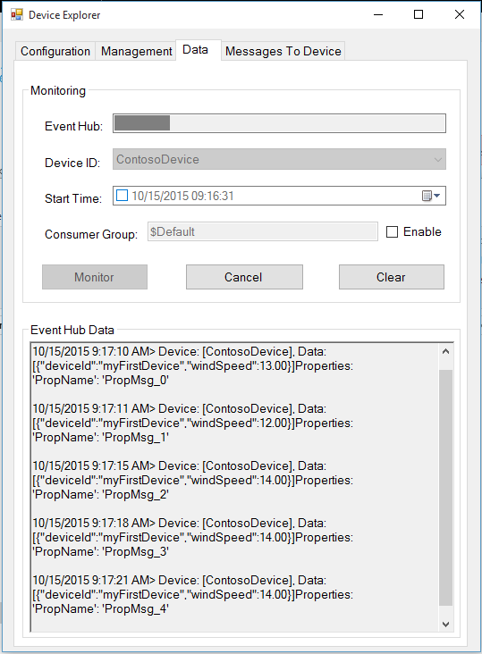

### 3.3.2 从 IoT 中心接收消息

1.  若要验证是否可从 IoT 中心向设备发送消息，请转到 DeviceExplorer 中的“发送到设备的消息”选项卡。 

2.  使用设备 ID 下拉列表选择创建的设备。

3.  在“消息”字段中添加一些文本，然后单击“发送”。

    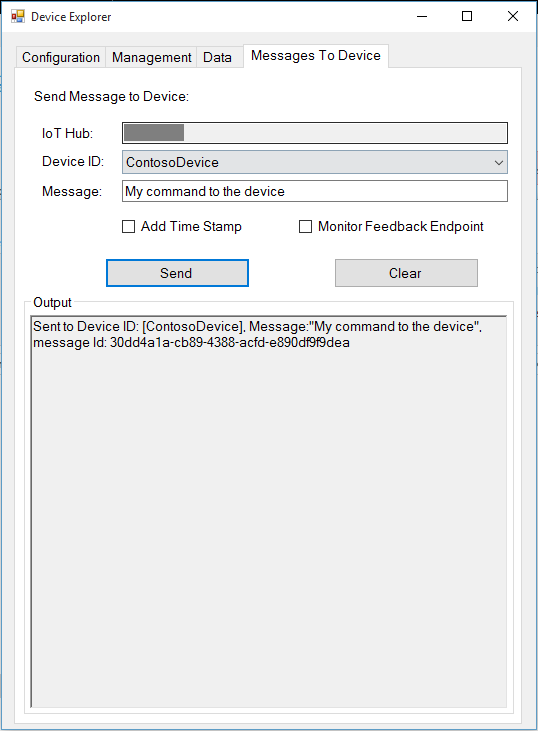

4.  终端窗口中应会显示收到的消息。

    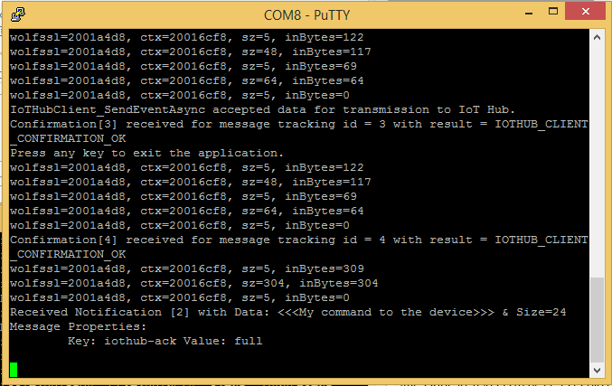

# 步骤 4：打包并共享

## 4.1：打包生成日志和示例测试结果

从设备打包以下项目：

1.  在 [mbed 开发人员站点](https://developer.mbed.org/)上编译时生成的生成结果屏幕截图。
2.  前面“**向 IoT 中心发送设备事件**”部分中显示的所有屏幕截图。
2.  前面“**从 IoT 中心接收消息**”部分中显示的所有屏幕截图。
3.  向我们发送明确的说明，告知如何在硬件上运行此示例（具体强调客户所要执行的新步骤）。 有关说明形式的指导，请参考[此处](<https://github.com/Azure/azure-iot-device-ecosystem/tree/master/get_started>) github 存储库中发布的示例

## 4.2 与工程支持人员共享包

1.  转到[合作伙伴仪表板](<https://catalog.azureiotsuite.com/devices>)。
2.  单击设备右上角的“上载”图标。

    

3.  此时将打开上载对话框。 单击“上载”按钮浏览文件。 

    

    可以上载同一个设备的多个文件。

4.  上传所有文件后，单击“提交审查”按钮。 

    ***注意：****提交文件供审查后，若要更改/删除文件，请联系 iotcert 团队。*
 

## 4.3：后续步骤

与我们共享文档后，我们将在接下来的 48 到 72 个工作小时内与你取得联系，以提供后续步骤。

# 步骤 5：疑难解答

如需故障排除的帮助，请通过 <iotcert@microsoft.com> 联系工程支持人员。
