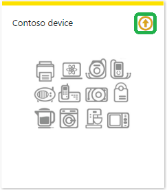

<a name="how-to-certify-iot-devices-running-openwrt-on-arduino-with-azure-iot-sdk"></a><span data-ttu-id="4cdd5-101">如何使用 Azure IoT SDK 认证运行 Openwrt on Arduino 的 IoT 设备</span><span class="sxs-lookup"><span data-stu-id="4cdd5-101">How to certify IoT devices running Openwrt on Arduino with Azure IoT SDK</span></span>
===
---

# <a name="table-of-contents"></a><span data-ttu-id="4cdd5-102">目录</span><span class="sxs-lookup"><span data-stu-id="4cdd5-102">Table of Contents</span></span>

-   [<span data-ttu-id="4cdd5-103">介绍</span><span class="sxs-lookup"><span data-stu-id="4cdd5-103">Introduction</span></span>](#Introduction)
-   [<span data-ttu-id="4cdd5-104">步骤 1：先决条件</span><span class="sxs-lookup"><span data-stu-id="4cdd5-104">Step 1: Prerequisites</span></span>](#Step-1-Prerequisites)
-   [<span data-ttu-id="4cdd5-105">步骤 2：注册设备</span><span class="sxs-lookup"><span data-stu-id="4cdd5-105">Step 2: Register your Device</span></span>](#Step-2-PrepareDevice)
-   [<span data-ttu-id="4cdd5-106">步骤 3：生成并运行示例</span><span class="sxs-lookup"><span data-stu-id="4cdd5-106">Step 3: Build and Run the Sample</span></span>](#Step-3-Build)
    -   [<span data-ttu-id="4cdd5-107">3.1：设置开发环境</span><span class="sxs-lookup"><span data-stu-id="4cdd5-107">3.1 Setup the development environment</span></span>](#Step-3-1-setup-dev)
    -   [<span data-ttu-id="4cdd5-108">3.2：生成示例</span><span class="sxs-lookup"><span data-stu-id="4cdd5-108">3.2 Build the sample</span></span>](#build)
    -   [<span data-ttu-id="4cdd5-109">3.3：部署示例</span><span class="sxs-lookup"><span data-stu-id="4cdd5-109">3.3 Deploy the sample</span></span>](#deploy)
    -   [<span data-ttu-id="4cdd5-110">3.4：确保已安装证书</span><span class="sxs-lookup"><span data-stu-id="4cdd5-110">3.4 Make sure the certificates are installed</span></span>](#certificate)
    -   [<span data-ttu-id="4cdd5-111">3.5：运行示例</span><span class="sxs-lookup"><span data-stu-id="4cdd5-111">3.5 Run the sample</span></span>](#run-the-sample)
-   [<span data-ttu-id="4cdd5-112">步骤 4：打包和共享</span><span class="sxs-lookup"><span data-stu-id="4cdd5-112">Step 4: Package and Share</span></span>](#Step-4-Package_Share)
    -   [<span data-ttu-id="4cdd5-113">4.1：打包生成日志和示例测试结果</span><span class="sxs-lookup"><span data-stu-id="4cdd5-113">4.1 Package build logs and sample test results</span></span>](#Step-4-1-Package)
    -   [<span data-ttu-id="4cdd5-114">4.2：与工程支持人员共享包</span><span class="sxs-lookup"><span data-stu-id="4cdd5-114">4.2 Share package with Engineering Support</span></span>](#Step-4-2-Share)
    -   [<span data-ttu-id="4cdd5-115">4.3：后续步骤</span><span class="sxs-lookup"><span data-stu-id="4cdd5-115">4.3 Next steps</span></span>](#Step-4-3-Next)
-   [<span data-ttu-id="4cdd5-116">步骤 5：故障排除</span><span class="sxs-lookup"><span data-stu-id="4cdd5-116">Step 5: Troubleshooting</span></span>](#Step-5-Troubleshooting)
    -   [<span data-ttu-id="4cdd5-117">5.1：E2E 测试用例</span><span class="sxs-lookup"><span data-stu-id="4cdd5-117">5.1 E2E Test Cases</span></span>](#Step-5-1-E2E)

<a name="Introduction"></a>
# <a name="introduction"></a><span data-ttu-id="4cdd5-118">介绍</span><span class="sxs-lookup"><span data-stu-id="4cdd5-118">Introduction</span></span>

<span data-ttu-id="4cdd5-119">**关于本文档**</span><span class="sxs-lookup"><span data-stu-id="4cdd5-119">**About this document**</span></span>

<span data-ttu-id="4cdd5-120">以下文档介绍了将 Arduino 系统连接到 Azure IoT 中心的过程。此过程由多个步骤构成，具体包括：</span><span class="sxs-lookup"><span data-stu-id="4cdd5-120">The following document describes the process of connecting an Arduino system to Azure IoT Hub.This multi-step process includes:</span></span>
-  <span data-ttu-id="4cdd5-121">配置 Azure IoT 中心</span><span class="sxs-lookup"><span data-stu-id="4cdd5-121">Configuring Azure IoT Hub</span></span>
-  <span data-ttu-id="4cdd5-122">注册 IoT 设备</span><span class="sxs-lookup"><span data-stu-id="4cdd5-122">Registering your IoT device</span></span>
-  <span data-ttu-id="4cdd5-123">在设备上生成和部署 Azure IoT SDK</span><span class="sxs-lookup"><span data-stu-id="4cdd5-123">Build and deploy Azure IoT SDK on device</span></span>
-  <span data-ttu-id="4cdd5-124">打包和共享日志</span><span class="sxs-lookup"><span data-stu-id="4cdd5-124">Packaging and sharing the logs</span></span>

<span data-ttu-id="4cdd5-125">**准备**</span><span class="sxs-lookup"><span data-stu-id="4cdd5-125">**Prepare**</span></span>

<span data-ttu-id="4cdd5-126">在执行以下任何步骤之前，请先仔细阅读每个过程的每个步骤，确保对整个过程有全面的了解。</span><span class="sxs-lookup"><span data-stu-id="4cdd5-126">Before executing any of the steps below, read through each process, step by step to ensure end to end understanding.</span></span>

<span data-ttu-id="4cdd5-127">在开始过程前，应已准备好以下项目：</span><span class="sxs-lookup"><span data-stu-id="4cdd5-127">You should have the following items ready before beginning the process:</span></span>

-   <span data-ttu-id="4cdd5-128">一台装有 GitHub 的计算机，并且能够访问 [azure-iot-sdk-c](https://github.com/Azure/azure-iot-sdk-c) GitHub 公共存储库。</span><span class="sxs-lookup"><span data-stu-id="4cdd5-128">Computer with GitHub installed and access to the [azure-iot-sdk-c](https://github.com/Azure/azure-iot-sdk-c) GitHub public repository.</span></span>
-   <span data-ttu-id="4cdd5-129">用于访问命令行的 SSH 客户端，例如 [PuTTY](http://www.putty.org/)。</span><span class="sxs-lookup"><span data-stu-id="4cdd5-129">SSH client, such as [PuTTY](http://www.putty.org/), so you can access the command line.</span></span>
-   <span data-ttu-id="4cdd5-130">需要认证的硬件。</span><span class="sxs-lookup"><span data-stu-id="4cdd5-130">Required hardware to certify.</span></span>

<span data-ttu-id="4cdd5-131">***注意：*** 如果尚未联系 Microsoft 来申请成为“Azure IoT 认证”合作伙伴，请先提交此[表单](<https://catalog.azureiotsuite.com/>)请求此身份，然后遵照本文中的说明操作。</span><span class="sxs-lookup"><span data-stu-id="4cdd5-131">***Note:*** *If you haven't contacted Microsoft about being an Azure Certified for IoT partner, please submit this [form](<https://catalog.azureiotsuite.com/>) first to request it and then follow these instructions.*</span></span>


<a name="Step-1-Prerequisites"></a>
# <a name="step-1-prerequisites"></a><span data-ttu-id="4cdd5-132">步骤 1：先决条件</span><span class="sxs-lookup"><span data-stu-id="4cdd5-132">Step 1: Prerequisites</span></span>

<span data-ttu-id="4cdd5-133">在开始过程前，应已准备好以下项目：</span><span class="sxs-lookup"><span data-stu-id="4cdd5-133">You should have the following items ready before beginning the process:</span></span>
  - <span data-ttu-id="4cdd5-134">装有 Git 客户端的计算机，以便可以访问 GitHub 上的 azure-iot-sdks 代码。</span><span class="sxs-lookup"><span data-stu-id="4cdd5-134">Computer with a Git client installed so that you can access the azure-iot-sdks code on GitHub.</span></span>
  - <span data-ttu-id="4cdd5-135">Arduino Yun 开发板。</span><span class="sxs-lookup"><span data-stu-id="4cdd5-135">Arduino Yun board.</span></span>
  - <span data-ttu-id="4cdd5-136">Ubuntu x86 计算机（用于交叉编译）</span><span class="sxs-lookup"><span data-stu-id="4cdd5-136">Ubuntu x86 machine (for cross compiling)</span></span> 
  - [<span data-ttu-id="4cdd5-137">设置 IoT 中心</span><span class="sxs-lookup"><span data-stu-id="4cdd5-137">Setup your IoT hub</span></span>](../setup_iothub.md) 
  - [<span data-ttu-id="4cdd5-138">预配设备并获取其凭据</span><span class="sxs-lookup"><span data-stu-id="4cdd5-138">Provision your device and get its credentials</span></span>](../manage_iot_hub.md)


<a name="Step-1-Configure"></a>
## <a name="step-11-configure-azure-iot-hub"></a><span data-ttu-id="4cdd5-139">步骤 1.1：配置 Azure IoT 中心</span><span class="sxs-lookup"><span data-stu-id="4cdd5-139">Step 1.1: Configure Azure IoT Hub</span></span>

<span data-ttu-id="4cdd5-140">遵照[此处](https://account.windowsazure.com/signup?offer=ms-azr-0044p)的说明了解如何注册 Azure IoT 中心服务和配置 Azure IoT 中心。</span><span class="sxs-lookup"><span data-stu-id="4cdd5-140">Follow the instructions [here](https://account.windowsazure.com/signup?offer=ms-azr-0044p) on how to sign up to the Azure IoT Hub service and configure Azure IoT Hub.</span></span> <span data-ttu-id="4cdd5-141">在注册过程中，将会收到连接字符串。</span><span class="sxs-lookup"><span data-stu-id="4cdd5-141">As part of the sign up process, you will receive the connection string.</span></span>

-   <span data-ttu-id="4cdd5-142">**IoT 中心连接字符串**：下面显示了 IoT 中心连接字符串的示例：</span><span class="sxs-lookup"><span data-stu-id="4cdd5-142">**IoT Hub Connection String**: An example of IoT Hub Connection String is as below:</span></span>

         HostName=[YourIoTHubName];SharedAccessKeyName=[YourAccessKeyName];SharedAccessKey=[YourAccessKey]

<a name="Step-2-Register"></a>
# <a name="step-2-register-device"></a><span data-ttu-id="4cdd5-143">步骤 2：注册设备</span><span class="sxs-lookup"><span data-stu-id="4cdd5-143">Step 2: Register Device</span></span>

<span data-ttu-id="4cdd5-144">在本部分，我们将使用 DeviceExplorer 注册设备。</span><span class="sxs-lookup"><span data-stu-id="4cdd5-144">In this section, you will register your device using DeviceExplorer.</span></span> <span data-ttu-id="4cdd5-145">DeviceExplorer 是与 Azure IoT 中心对接的 Windows 应用程序，可执行以下操作：</span><span class="sxs-lookup"><span data-stu-id="4cdd5-145">The DeviceExplorer is a Windows application that interfaces with Azure IoT Hub and can perform the following operations:</span></span>

-   <span data-ttu-id="4cdd5-146">设备管理</span><span class="sxs-lookup"><span data-stu-id="4cdd5-146">Device management</span></span>
    -   <span data-ttu-id="4cdd5-147">创建新设备</span><span class="sxs-lookup"><span data-stu-id="4cdd5-147">Create new devices</span></span>
    -   <span data-ttu-id="4cdd5-148">列出现有设备并公开设备中心存储的设备属性</span><span class="sxs-lookup"><span data-stu-id="4cdd5-148">List existing devices and expose device properties stored on Device Hub</span></span>
    -   <span data-ttu-id="4cdd5-149">提供更新设备密钥的功能</span><span class="sxs-lookup"><span data-stu-id="4cdd5-149">Provides ability to update device keys</span></span>
    -   <span data-ttu-id="4cdd5-150">提供删除设备的功能</span><span class="sxs-lookup"><span data-stu-id="4cdd5-150">Provides ability to delete a device</span></span>
-   <span data-ttu-id="4cdd5-151">监视设备的事件</span><span class="sxs-lookup"><span data-stu-id="4cdd5-151">Monitoring events from your device</span></span>
-   <span data-ttu-id="4cdd5-152">将消息发送到设备</span><span class="sxs-lookup"><span data-stu-id="4cdd5-152">Sending messages to your device</span></span>

<span data-ttu-id="4cdd5-153">若要运行 DeviceExplorer 工具，请使用[步骤 1](#Step-1-Configure) 中所述的以下配置字符串：</span><span class="sxs-lookup"><span data-stu-id="4cdd5-153">To run DeviceExplorer tool, use following configuration string as described in [Step1](#Step-1-Configure):</span></span>

-   <span data-ttu-id="4cdd5-154">IoT 中心连接字符串</span><span class="sxs-lookup"><span data-stu-id="4cdd5-154">IoT Hub Connection String</span></span>


<span data-ttu-id="4cdd5-155">**步骤：**</span><span class="sxs-lookup"><span data-stu-id="4cdd5-155">**Steps:**</span></span>
1.  <span data-ttu-id="4cdd5-156">单击[此处](<https://github.com/Azure/azure-iot-sdk-csharp/blob/master/tools/DeviceExplorer/doc/how_to_use_device_explorer.md>)下载并安装 DeviceExplorer。</span><span class="sxs-lookup"><span data-stu-id="4cdd5-156">Click [here](<https://github.com/Azure/azure-iot-sdk-csharp/blob/master/tools/DeviceExplorer/doc/how_to_use_device_explorer.md>) to download and install DeviceExplorer.</span></span>

2.  <span data-ttu-id="4cdd5-157">在“配置”选项卡下添加连接信息，并单击“更新”按钮。</span><span class="sxs-lookup"><span data-stu-id="4cdd5-157">Add connection information under the Configuration tab and click the **Update** button.</span></span>

3.  <span data-ttu-id="4cdd5-158">使用以下说明创建设备并将其注册到 IoT 中心。</span><span class="sxs-lookup"><span data-stu-id="4cdd5-158">Create and register the device with your IoT Hub using instructions as below.</span></span>

    <span data-ttu-id="4cdd5-159">a.</span><span class="sxs-lookup"><span data-stu-id="4cdd5-159">a.</span></span> <span data-ttu-id="4cdd5-160">单击“管理”选项卡。</span><span class="sxs-lookup"><span data-stu-id="4cdd5-160">Click the **Management** tab.</span></span>

    <span data-ttu-id="4cdd5-161">b.</span><span class="sxs-lookup"><span data-stu-id="4cdd5-161">b.</span></span> <span data-ttu-id="4cdd5-162">列表中会显示已注册的设备。</span><span class="sxs-lookup"><span data-stu-id="4cdd5-162">Your registered devices will be displayed in the list.</span></span> <span data-ttu-id="4cdd5-163">如果该设备未显示在列表中，请单击“刷新”按钮。</span><span class="sxs-lookup"><span data-stu-id="4cdd5-163">In case your device is not there in the list, click **Refresh** button.</span></span> <span data-ttu-id="4cdd5-164">如果这是第一次执行此操作，则不应检索任何信息。</span><span class="sxs-lookup"><span data-stu-id="4cdd5-164">If this is your first time, then you shouldn't retrieve anything.</span></span>

    <span data-ttu-id="4cdd5-165">c.</span><span class="sxs-lookup"><span data-stu-id="4cdd5-165">c.</span></span> <span data-ttu-id="4cdd5-166">单击“创建”按钮创建设备 ID 和密钥。</span><span class="sxs-lookup"><span data-stu-id="4cdd5-166">Click **Create** button to create a device ID and key.</span></span>

    <span data-ttu-id="4cdd5-167">d.</span><span class="sxs-lookup"><span data-stu-id="4cdd5-167">d.</span></span> <span data-ttu-id="4cdd5-168">成功创建后，设备会列在 DeviceExplorer 中。</span><span class="sxs-lookup"><span data-stu-id="4cdd5-168">Once created successfully, device will be listed in DeviceExplorer.</span></span>

    <span data-ttu-id="4cdd5-169">e.</span><span class="sxs-lookup"><span data-stu-id="4cdd5-169">e.</span></span> <span data-ttu-id="4cdd5-170">右键单击该设备，并从上下文菜单中选择“复制所选设备的连接字符串”。</span><span class="sxs-lookup"><span data-stu-id="4cdd5-170">Right click the device and from context menu select "**Copy connection string for selected device**".</span></span>

    <span data-ttu-id="4cdd5-171">f.</span><span class="sxs-lookup"><span data-stu-id="4cdd5-171">f.</span></span> <span data-ttu-id="4cdd5-172">在记事本中保存此信息。</span><span class="sxs-lookup"><span data-stu-id="4cdd5-172">Save this information in Notepad.</span></span> <span data-ttu-id="4cdd5-173">后面的步骤需要用到此信息。</span><span class="sxs-lookup"><span data-stu-id="4cdd5-173">You will need this information in later steps.</span></span>

<span data-ttu-id="4cdd5-174">***不是在电脑上运行 Windows？***</span><span class="sxs-lookup"><span data-stu-id="4cdd5-174">***Not running Windows on your PC?***</span></span> <span data-ttu-id="4cdd5-175">- 请遵照[此处](<https://github.com/Azure/azure-iot-device-ecosystem/blob/master/manage_iot_hub.md>)的说明预配设备并获取其凭据。</span><span class="sxs-lookup"><span data-stu-id="4cdd5-175">- Please follow the instructions [here](<https://github.com/Azure/azure-iot-device-ecosystem/blob/master/manage_iot_hub.md>) to provision your device and get its credentials.</span></span>

<a name="Step-3-Build"></a>
# <a name="step-3-build-and-validate-the-sample-using-c-client-libraries"></a><span data-ttu-id="4cdd5-176">步骤 3：使用 C 客户端库生成并验证示例</span><span class="sxs-lookup"><span data-stu-id="4cdd5-176">Step 3: Build and Validate the sample using C client libraries</span></span>

<span data-ttu-id="4cdd5-177">本部分逐步讲解如何为 Arduino 上的 Openwrt 平台生成、部署和验证 IoT 客户端 SDK。</span><span class="sxs-lookup"><span data-stu-id="4cdd5-177">This section walks you through building, deploying and validating the IoT Client SDK for Openwrt platform on Arduino.</span></span> <span data-ttu-id="4cdd5-178">我们将在设备上安装所需的必备组件。</span><span class="sxs-lookup"><span data-stu-id="4cdd5-178">You will install necessary prerequisites on your device.</span></span> <span data-ttu-id="4cdd5-179">完成后，将会生成并部署 IoT 客户端 SDK，并使用 Azure IoT SDK 来验证 IoT 认证所需的示例测试。</span><span class="sxs-lookup"><span data-stu-id="4cdd5-179">Once done, you will build and deploy the IoT Client SDK and validate the sample tests required for IoT certification with the Azure IoT SDK.</span></span>

<a name="Step-3-1-setup-dev"></a>
## <a name="31-setup-the-development-environment"></a><span data-ttu-id="4cdd5-180">3.1：设置开发环境</span><span class="sxs-lookup"><span data-stu-id="4cdd5-180">3.1 Setup the development environment</span></span>

-   <span data-ttu-id="4cdd5-181">打开 PuTTY 会话并连接到设备。</span><span class="sxs-lookup"><span data-stu-id="4cdd5-181">Open a PuTTY session and connect to the device.</span></span>

-   <span data-ttu-id="4cdd5-182">通过设备上的命令行发出以下命令，安装必备的包。</span><span class="sxs-lookup"><span data-stu-id="4cdd5-182">Install the prerequisite packages by issuing the following commands from the command line on the device.</span></span>

    <span data-ttu-id="4cdd5-183">在 root/sudo 下安装依赖项。</span><span class="sxs-lookup"><span data-stu-id="4cdd5-183">Install dependencies under root/sudo.</span></span> 

``` 
apt-get install curl libcurl4-openssl-dev uuid-dev uuid g++ make cmake git unzip openjdk-7-jre libssl-dev libncurses-dev subversion gawk
```

- <span data-ttu-id="4cdd5-184">将此存储库 ([azure-iot-sdk](https://github.com/Azure/azure-iot-sdks)) 克隆到所用的计算机。请务必使用以下命令执行递归克隆 (git clone --recursive <repo address>)。</span><span class="sxs-lookup"><span data-stu-id="4cdd5-184">Clone this repository ([azure-iot-sdks](https://github.com/Azure/azure-iot-sdks)) to the machine you are using, being sure to do a recursive clone (git clone --recursive <repo address>) using below command.</span></span>

        git clone --recursive https://github.com/Azure/azure-iot-sdk-c.git
- <span data-ttu-id="4cdd5-185">导航到存储库本地副本中的 **c/build_all/arduino** 文件夹。</span><span class="sxs-lookup"><span data-stu-id="4cdd5-185">Navigate to the folder **c/build_all/arduino** in your local copy of the repository.</span></span>
- <span data-ttu-id="4cdd5-186">运行 `./setup.sh` 脚本安装 OpenWRT SDK 和必备组件。</span><span class="sxs-lookup"><span data-stu-id="4cdd5-186">Run the `./setup.sh` script to install the OpenWRT SDK and prerequisites.</span></span> <span data-ttu-id="4cdd5-187">SDK 默认安装在 **~/openwrt/sdk** 中</span><span class="sxs-lookup"><span data-stu-id="4cdd5-187">By default, the SDK will be installed at **~/openwrt/sdk**</span></span>
- <span data-ttu-id="4cdd5-188">（可选）输入“Y”生成 Azure IoT SDK。</span><span class="sxs-lookup"><span data-stu-id="4cdd5-188">(Optional) Enter 'Y' to build the Azure IoT SDK.</span></span>


    <span data-ttu-id="4cdd5-189">***注意：*** 此安装过程需要 cmake 2.8.12 或更高版本。</span><span class="sxs-lookup"><span data-stu-id="4cdd5-189">***Note:*** *This setup process requires cmake version 2.8.12 or higher.*</span></span> 
    
    <span data-ttu-id="4cdd5-190">可使用以下命令来验证环境中当前安装的版本：</span><span class="sxs-lookup"><span data-stu-id="4cdd5-190">*You can verify the current version installed in your environment using the  following command:*</span></span>

        cmake --version

    <span data-ttu-id="4cdd5-191">此库还需要 gcc 4.9 或更高版本。可使用以下命令来验证环境中当前安装的版本：</span><span class="sxs-lookup"><span data-stu-id="4cdd5-191">*This library also requires gcc version 4.9 or higher. You can verify the current version installed in your environment using the following command:*</span></span>
    
        gcc --version    
    
-   <span data-ttu-id="4cdd5-192">检查 ~/azure-iot-sdk-c 目录下现在是否包含源代码的副本。</span><span class="sxs-lookup"><span data-stu-id="4cdd5-192">Verify that you now have a copy of the source code under the directory ~/azure-iot-sdk-c.</span></span>

<a name="build"/>
## <a name="32-build-the-sample"></a><span data-ttu-id="4cdd5-193">3.2：生成示例</span><span class="sxs-lookup"><span data-stu-id="4cdd5-193">3.2 Build the sample</span></span>

- <span data-ttu-id="4cdd5-194">在文本编辑器（例如 nano）中打开文件 **azure-iot-sdk-c/serializer/samples/simplesample_http/simplesample_http.c**</span><span class="sxs-lookup"><span data-stu-id="4cdd5-194">Open the file **azure-iot-sdk-c/serializer/samples/simplesample_http/simplesample_http.c** in a text editor (for example nano)</span></span>
- <span data-ttu-id="4cdd5-195">在该文件中找到以下代码：</span><span class="sxs-lookup"><span data-stu-id="4cdd5-195">Locate the following code in the file:</span></span>
```
static const char* connectionString = "[device connection string]";
```
- <span data-ttu-id="4cdd5-196">将“[device connection string]”替换为[前面](#Step-1-Configure)记下的设备连接字符串。</span><span class="sxs-lookup"><span data-stu-id="4cdd5-196">Replace "[device connection string]" with the device connection string you noted [earlier](#Step-1-Configure).</span></span> <span data-ttu-id="4cdd5-197">保存更改。</span><span class="sxs-lookup"><span data-stu-id="4cdd5-197">Save the changes.</span></span>
- <span data-ttu-id="4cdd5-198">运行 **azure-iot-sdk-c/build_all/arduino** 目录中的 `./build.sh` 脚本。</span><span class="sxs-lookup"><span data-stu-id="4cdd5-198">Run the `./build.sh` script in the **azure-iot-sdk-c/build_all/arduino** directory.</span></span>   

<a name="deploy"/>
## <a name="33-deploy-the-sample"></a><span data-ttu-id="4cdd5-199">3.3：部署示例</span><span class="sxs-lookup"><span data-stu-id="4cdd5-199">3.3 Deploy the sample</span></span>

- <span data-ttu-id="4cdd5-200">打开 shell 并导航到安装的 OpenWRT SDK 文件夹。</span><span class="sxs-lookup"><span data-stu-id="4cdd5-200">Open a shell and navigate to the installed OpenWRT SDK folder.</span></span> <span data-ttu-id="4cdd5-201">该文件夹默认为 **~/openwrt/sdk**。</span><span class="sxs-lookup"><span data-stu-id="4cdd5-201">By default, it is **~/openwrt/sdk**.</span></span>
- <span data-ttu-id="4cdd5-202">传输示例可执行文件。</span><span class="sxs-lookup"><span data-stu-id="4cdd5-202">Transfer the sample executable.</span></span>

<span data-ttu-id="4cdd5-203">OpenWRT Yun 映像：</span><span class="sxs-lookup"><span data-stu-id="4cdd5-203">OpenWRT Yun Image:</span></span>

```
scp ~/openwrt/sdk/build_dir/target-mips_r2_uClibc-0.9.33.2/azure-iot-sdks-1/serializer/samples/simplesample_http/simplesample_http root@arduino.local:/tmp
```

<span data-ttu-id="4cdd5-204">***注意：此处的 uClibc 版本可能与你安装的版本不同，因此可能需要相应地调整路径。***
<a name="certificate"/></span><span class="sxs-lookup"><span data-stu-id="4cdd5-204">***Note: The uClibc version might be different on your setup and you might need to adjust the path accordingly.***
<a name="certificate"/></span></span>
## <a name="34-make-sure-the-certificates-are-installed"></a><span data-ttu-id="4cdd5-205">3.4：确保已安装证书</span><span class="sxs-lookup"><span data-stu-id="4cdd5-205">3.4 Make sure the certificates are installed</span></span>

<span data-ttu-id="4cdd5-206">在 Arduino 设备上，安装如下所示的 ca-certificates 包：</span><span class="sxs-lookup"><span data-stu-id="4cdd5-206">On the Arduino device, install the ca-certificates package like below:</span></span>

```
wget https://downloads.openwrt.org/snapshots/trunk/ar71xx/generic/packages/base/ca-certificates_20160104_all.ipk --no-check-certificate
opkg install ca-certificates_20160104_all.ipk
```
<span data-ttu-id="4cdd5-207">执行此步骤时可能会收到错误消息（返回代码 127），但证书将会安装。</span><span class="sxs-lookup"><span data-stu-id="4cdd5-207">You might get an error message at this step(return code 127), but the certificates will be installed.</span></span>

<span data-ttu-id="4cdd5-208">***注意：发布更新的证书版本后，上述证书名称可能会发生变化。如果在下载证书文件时收到 404 错误，请仔细检查[此处](https://downloads.openwrt.org/snapshots/trunk/ar71xx/generic/packages/base)所述基本路径下的 CA 证书名称，并相应地更新证书路径。***</span><span class="sxs-lookup"><span data-stu-id="4cdd5-208">***Note: The certificate name mention above may change when newer version of certificate is released. If you get a 404 error while downloading the certificate file, please double check the CA certificate name under the base path [here](https://downloads.openwrt.org/snapshots/trunk/ar71xx/generic/packages/base) and update the certificate path accordingly.***</span></span>

<a name="run-the-sample"/>
## <a name="35-run-the-sample"></a><span data-ttu-id="4cdd5-209">3.5：运行示例</span><span class="sxs-lookup"><span data-stu-id="4cdd5-209">3.5 Run the sample</span></span>
<span data-ttu-id="4cdd5-210">在本部分，我们将运行 Azure IoT 客户端 SDK 示例来验证设备与 Azure IoT 中心之间的通信。</span><span class="sxs-lookup"><span data-stu-id="4cdd5-210">In this section you will run the Azure IoT client SDK samples to validate communication between your device and Azure IoT Hub.</span></span> <span data-ttu-id="4cdd5-211">我们要向 Azure IoT 中心服务发送消息，并验证 IoT 中心是否已成功接收数据。</span><span class="sxs-lookup"><span data-stu-id="4cdd5-211">You will send messages to the Azure IoT Hub service and validate that IoT Hub has successfully receive the data.</span></span> <span data-ttu-id="4cdd5-212">此外，我们还会监视从 Azure IoT 中心发送到客户端的任何消息。</span><span class="sxs-lookup"><span data-stu-id="4cdd5-212">You will also monitor any messages send from the Azure IoT Hub to client.</span></span>

<span data-ttu-id="4cdd5-213">**注意：** 请对本部分中执行的所有操作截图。</span><span class="sxs-lookup"><span data-stu-id="4cdd5-213">**Note:** Take screenshots of all the operations you will perform in this section.</span></span> <span data-ttu-id="4cdd5-214">在[步骤 4](#Step-4-2-Share) 中需要使用这些屏幕截图。</span><span class="sxs-lookup"><span data-stu-id="4cdd5-214">These will be needed in [Step 4](#Step-4-2-Share)</span></span>

- <span data-ttu-id="4cdd5-215">运行示例 **/tmp/simplesample_http**</span><span class="sxs-lookup"><span data-stu-id="4cdd5-215">Run the sample **/tmp/simplesample_http**</span></span>
- <span data-ttu-id="4cdd5-216">请参阅[管理 IoT 中心][lnk-manage-iothub]，了解用于监视设备向 IoT 中心发送的消息以及向设备发送命令的工具的信息。</span><span class="sxs-lookup"><span data-stu-id="4cdd5-216">See [Manage IoT Hub][lnk-manage-iothub] for information about the tools you can use to monitor the messages your device sends to your IoT hub and to send commands to your devices.</span></span>

<span data-ttu-id="4cdd5-217">***注意：若要从 iothub-explorer 或 DeviceExplorer 向设备发送命令，该命令应类似于 {"Name":"TurnFanOff","Parameters":{}}***</span><span class="sxs-lookup"><span data-stu-id="4cdd5-217">***Note: To send a command to the device from iothub-explorer or DeviceExplorer, the command should be like {"Name":"TurnFanOff","Parameters":{}}***</span></span>

<a name="Step-4-Package_Share"></a>
# <a name="step-4-package-and-share"></a><span data-ttu-id="4cdd5-218">步骤 4：打包和共享</span><span class="sxs-lookup"><span data-stu-id="4cdd5-218">Step 4: Package and Share</span></span>

<a name="Step-4-1-Package"></a>
## <a name="41-package-build-logs-and-sample-test-results"></a><span data-ttu-id="4cdd5-219">4.1：打包生成日志和示例测试结果</span><span class="sxs-lookup"><span data-stu-id="4cdd5-219">4.1 Package build logs and sample test results</span></span>

<span data-ttu-id="4cdd5-220">打包设备中的以下项目：</span><span class="sxs-lookup"><span data-stu-id="4cdd5-220">Package following artifacts from your device:</span></span>

1.  <span data-ttu-id="4cdd5-221">在生成运行期间记录在日志文件中的生成日志和 E2E 测试结果。</span><span class="sxs-lookup"><span data-stu-id="4cdd5-221">Build logs and E2E test results that were logged in the log files during build run.</span></span>

2.  <span data-ttu-id="4cdd5-222">在执行[步骤 3](#run-the-sample) 期间抓取的所有屏幕截图</span><span class="sxs-lookup"><span data-stu-id="4cdd5-222">All the screenshots that are taken during [Step 3](#run-the-sample)</span></span>

4.  <span data-ttu-id="4cdd5-223">请向我们发送明确的说明，描述如何使用你的硬件运行此示例（明确强调客户要执行的新步骤）。</span><span class="sxs-lookup"><span data-stu-id="4cdd5-223">Send us clear instructions of how to run this sample with your hardware (explicitly highlighting the new steps for customers).</span></span> <span data-ttu-id="4cdd5-224">请使用[此处](<https://github.com/Azure/azure-iot-device-ecosystem/blob/master/iotcertification/templates/template-linux-c.md>)提供的模板创建设备特定的说明。</span><span class="sxs-lookup"><span data-stu-id="4cdd5-224">Please use the template available [here](<https://github.com/Azure/azure-iot-device-ecosystem/blob/master/iotcertification/templates/template-linux-c.md>) to create your device-specific instructions.</span></span>
    
    <span data-ttu-id="4cdd5-225">有关说明的大致形式的指导，请参阅[此](<https://github.com/Azure/azure-iot-device-ecosystem/tree/master/get_started>) GitHub 存储库中发布的示例。</span><span class="sxs-lookup"><span data-stu-id="4cdd5-225">As a guideline on how the instructions should look please refer the examples published on GitHub repository [here](<https://github.com/Azure/azure-iot-device-ecosystem/tree/master/get_started>).</span></span>

<a name="Step-4-2-Share"></a>
## <a name="42-share-package-with-microsoft-azure-iot-team"></a><span data-ttu-id="4cdd5-226">4.2：与 Microsoft Azure IoT 团队成员共享包</span><span class="sxs-lookup"><span data-stu-id="4cdd5-226">4.2 Share package with Microsoft Azure IoT team</span></span>

1.  <span data-ttu-id="4cdd5-227">转到[合作伙伴仪表板](<https://catalog.azureiotsuite.com/devices>)。</span><span class="sxs-lookup"><span data-stu-id="4cdd5-227">Go to [Partner Dashboard](<https://catalog.azureiotsuite.com/devices>).</span></span>
2.  <span data-ttu-id="4cdd5-228">单击设备右上角的“上传”图标。</span><span class="sxs-lookup"><span data-stu-id="4cdd5-228">Click on Upload icon at top-right corner of your device.</span></span>

    

3.  <span data-ttu-id="4cdd5-230">此时会打开上传对话框。</span><span class="sxs-lookup"><span data-stu-id="4cdd5-230">This will open an upload dialog.</span></span> <span data-ttu-id="4cdd5-231">单击“上传”按钮浏览文件。</span><span class="sxs-lookup"><span data-stu-id="4cdd5-231">Browse your file(s) by clicking **Upload** button.</span></span>

    

    <span data-ttu-id="4cdd5-233">可以上传同一设备的多个文件。</span><span class="sxs-lookup"><span data-stu-id="4cdd5-233">You can upload multiple files for same device.</span></span>

4.  <span data-ttu-id="4cdd5-234">上传所有文件后，单击“提交审查”按钮。</span><span class="sxs-lookup"><span data-stu-id="4cdd5-234">Once you have uploaded all the files, click on **Submit for Review** button.</span></span>

    <span data-ttu-id="4cdd5-235">***注意：*** 提交文件供审查后，若要更改/删除文件，请联系 iotcert 团队。</span><span class="sxs-lookup"><span data-stu-id="4cdd5-235">***Note:*** *Please contact iotcert team to change/remove the files once you submit them for review.*</span></span>
 

<a name="Step-4-3-Next"></a>
## <a name="43-next-steps"></a><span data-ttu-id="4cdd5-236">4.3：后续步骤</span><span class="sxs-lookup"><span data-stu-id="4cdd5-236">4.3 Next steps</span></span>

<span data-ttu-id="4cdd5-237">与我们共享文档后，我们将在接下来的 48 到 72 个工作小时内与你取得联系，以提供后续步骤。</span><span class="sxs-lookup"><span data-stu-id="4cdd5-237">Once you shared the documents with us, we will contact you in the following 48 to 72 business hours with next steps.</span></span>

<a name="Step-5-Troubleshooting"></a>
# <a name="step-5-troubleshooting"></a><span data-ttu-id="4cdd5-238">步骤 5：故障排除</span><span class="sxs-lookup"><span data-stu-id="4cdd5-238">Step 5: Troubleshooting</span></span>

<span data-ttu-id="4cdd5-239">如需故障排除的帮助，请通过 <iotcert@microsoft.com> 联系工程支持人员。</span><span class="sxs-lookup"><span data-stu-id="4cdd5-239">Please contact engineering support on <iotcert@microsoft.com> for help with troubleshooting.</span></span>

[setup-devbox-linux]: https://github.com/Azure/azure-iot-sdk-c/blob/master/doc/devbox_setup.md
[setup-iothub]: ../setup_iothub.md
[lnk-manage-iothub]: ../manage_iot_hub.md