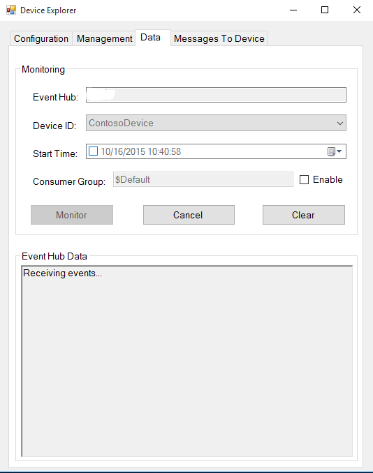
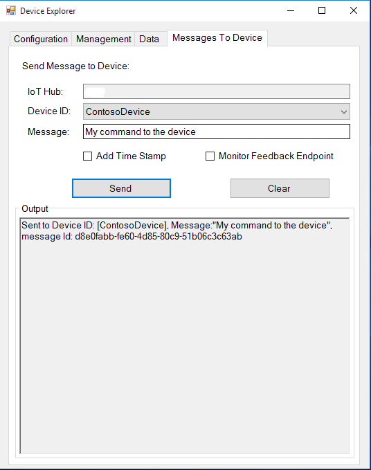

如何使用 Azure IoT SDK 认证不支持的平台上的 IoT 设备How to certify IoT devices on Non-Supported Platforms with Azure IoT SDK
===
---

# 目录Table of Contents

-   [介绍Introduction](#Introduction)
-   [步骤 1：注册 Azure IoT 中心Step 1: Sign Up To Azure IoT Hub](#Step_1)
-   [步骤 2：注册设备Step 2: Register Device](#Step_2)
-   [步骤 3：使用 C 客户端库生成并验证示例Step 3: Build and Validate the sample using C client libraries](#Step_3)
    -   [3.1 将 C 库移植到其他平台3.1 Port the C Libraries to Other Platforms](#Step_3_1)
    -   [3.2 运行并验证示例3.2 Run and Validate the Samples](#Step_3_2)
-   [步骤 4：打包并共享Step 4: Package and Share](#Step_4)
    -   [4.1 打包生成日志和示例测试结果4.1 Package build logs and sample test results](#Step_4_1)
    -   [4.2 与 Azure IoT 认证团队共享4.2 Share with the Azure IoT Certification team](#Step_4_2)
    -   [4.3 后续步骤4.3 Next steps](#Step_4_3)
-   [步骤 5：故障排除Step 5: Troubleshooting](#Step_5)

# 介绍Introduction

**关于本文档****About this document**

本文档向 IoT 硬件发布人员提供有关如何使用 Azure IoT C SDK 认证已启用 IoT 的硬件的分步指南。This document provides step by step guidance to IoT hardware publishers on how to certify an IoT enabled hardware with Azure IoT C SDK. 此过程由多个步骤组成，其中包括：This multi-step process includes: 
-   配置 Azure IoT 中心Configuring Azure IoT Hub 
-   注册 IoT 设备Registering your IoT device
-   在设备上生成并部署 Azure IoT SDKBuild and deploy Azure IoT SDK on device
-   打包并共享日志Packaging and sharing the logs

**准备****Prepare**

在执行以下任一步骤之前，请仔细阅读每个过程的每个步骤，确保全盘了解整个过程。Before executing any of the steps below, read through each process, step by step to ensure end to end understanding.

在开始过程前，应已准备好以下项目：You should have the following items ready before beginning the process:

-   准备好一台装有 GitHub 并且可以访问 [azure-iot-sdk-c](https://github.com/Azure/azure-iot-sdk-c) GitHub 公共存储库的计算机。Computer with GitHub installed and access to the [azure-iot-sdk-c](https://github.com/Azure/azure-iot-sdk-c) GitHub public repository.
-   配置 SSH 客户端（如 [PuTTY](http://www.putty.org/)），以便能够访问命令行。SSH client, such as [PuTTY](http://www.putty.org/), so you can access the command line.
-   用于认证的所需硬件。Required hardware to certify.

# 步骤 1：注册 Azure IoT 中心Step 1: Sign Up To Azure IoT Hub

遵照[此处](https://account.windowsazure.com/signup?offer=ms-azr-0044p)所述的说明了解如何注册 Azure IoT 中心服务。Follow the instructions [here](https://account.windowsazure.com/signup?offer=ms-azr-0044p) on how to sign up to the Azure IoT Hub service.

在注册过程中，你将收到连接字符串。As part of the sign up process, you will receive the connection string. 

-   **IoT 中心连接字符串**：IoT 中心的连接字符串示例如下：**IoT Hub Connection String**: An example of IoT Hub Connection String is as below:

         HostName=[YourIoTHubName];SharedAccessKeyName=[YourAccessKeyName];SharedAccessKey=[YourAccessKey]

# 步骤 2：注册设备Step 2: Register Device

在本部分，将要使用 DeviceExplorer 注册设备。In this section, you will register your device using DeviceExplorer. DeviceExplorer 是与 Azure IoT 中心对接的 Windows 应用程序，可执行以下操作：The DeviceExplorer is a Windows application that interfaces with Azure IoT Hub and can perform the following operations:

-   设备管理Device management
    -   创建新设备Create new devices
    -   列出现有设备，公开设备中心内存储的设备属性List existing devices and expose device properties stored on Device Hub
    -   可更新设备密钥Provides ability to update device keys
    -   可删除设备Provides ability to delete a device
-   监视设备的事件Monitoring events from your device
-   向设备发送消息Sending messages to your device

若要运行 DeviceExplorer 工具，请根据[步骤 1](#Step_1) 中所述使用以下配置字符串：To run DeviceExplorer tool, use following configuration string as described in [Step1](#Step_1):

-   IoT 中心连接字符串IoT Hub Connection String
    

**步骤：****Steps:**
1.  单击[此处](<https://github.com/Azure/azure-iot-sdk-csharp/blob/master/tools/DeviceExplorer/doc/how_to_use_device_explorer.md>)下载并安装 DeviceExplorer。Click [here](<https://github.com/Azure/azure-iot-sdk-csharp/blob/master/tools/DeviceExplorer/doc/how_to_use_device_explorer.md>) to download and install DeviceExplorer.

2.  添加“配置”选项卡下面的连接信息，然后单击“更新”按钮。Add connection information under the Configuration tab and click the **Update** button.

3.  根据以下说明创建设备并将其注册到 IoT 中心。Create and register the device with your IoT Hub using instructions as below.

    a.在“解决方案资源管理器”中，右键单击项目文件夹下的“引用”文件夹，然后单击“添加引用”。a. 单击“管理”选项卡。Click the **Management** tab.

    b.保留“数据库类型”设置，即设置为“共享”。b. 注册的设备将显示在列表中。Your registered devices will be visible in the list. 如果你的设备未显示在列表中，请单击“刷新”按钮。In case your device is not there in the list, click **Refresh** button. 如果这是第一次注册设备，请不要检索任何信息。If this is your first time, then you shouldn't retrieve anything.

    c.c. 单击“创建”按钮创建设备 ID 和密钥。Click **Create** button to create a device ID and key.

    d.单击“下一步”。d. 成功创建设备后，该设备将列在 DeviceExplorer 中。Once created successfully, device will be listed in DeviceExplorer.

    e.在“新建 MySQL 数据库”边栏选项卡中，接受法律条款，然后单击“确定”。e. 右键单击该设备，然后从上下文菜单中选择“复制所选设备的连接字符串”。Right click the device and from context menu select "**Copy connection string for selected device**".

    f.f. 在记事本中保存此信息。Save this information in Notepad. 后面的步骤需要用到此信息。You will need this information in later steps.

***不是在电脑上运行 Windows？******Not running Windows on your PC?*** - 请遵照[此处](<https://github.com/Azure/azure-iot-device-ecosystem/blob/master/manage_iot_hub.md>)的说明预配设备并获取其凭据。- Please follow the instructions [here](<https://github.com/Azure/azure-iot-device-ecosystem/blob/master/manage_iot_hub.md>) to provision your device and get its credentials.

# 步骤 3：使用 C 客户端库生成并验证示例Step 3: Build and Validate the sample using C client libraries

## 3.1 将 C 库移植到其他平台3.1 Port the C Libraries to Other Platforms

以下文档提供有关如何将 C 物联网 (IoT) 客户端库移植到不现成支持的平台的指南。Following document provide guidance on how to port the C Internet of Things (IoT) client library to platforms not supported out of the box. 该文档包含有关任何特定平台的具体信息。The document does cover the specifics of any particular platform.

<https://github.com/Azure/azure-c-shared-utility/blob/master/devdoc/porting_guide.md><https://github.com/Azure/azure-c-shared-utility/blob/master/devdoc/porting_guide.md>

## 3.2 运行并验证示例3.2 Run and Validate the Samples

在本部分，我们将运行 Azure IoT 客户端 SDK 示例来验证设备与 Azure IoT 中心之间的通信。In this section you will run the Azure IoT client SDK samples to validate communication between your device and Azure IoT Hub. 我们要向 Azure IoT 中心服务发送消息，然后验证 IoT 中心是否成功接收数据。You will send messages to the Azure IoT Hub service and validate that IoT Hub has successfully receive the data. 

***注意：****请为本部分中执行的所有操作创建屏幕截图。[步骤 4](#Step_4_2) 中需要用到这些屏幕截图。****Note:*** *Take screenshots of all the operations you will perform in this section. These will be needed in [Step 4](#Step_4_2).*

### 3.2.1 向 IoT 中心发送设备事件3.2.1 Send Device Events to IoT Hub

1.  如[步骤 2](#Step_2) 中所述启动 DeviceExplorer，然后导航到“数据”选项卡。从设备 ID 下拉列表中选择创建的设备名称，然后单击“监视”按钮。Launch the DeviceExplorer as explained in [Step 2](#Step_2) and navigate to **Data** tab. Select the device name you created from the drop-down list of device IDs and click **Monitor** button.

    

2.  现在，DeviceExplorer 正在监视从选定设备发送到 IoT 中心的数据。DeviceExplorer is now monitoring data sent from the selected device to the IoT Hub.

3.  使用移植客户端库之后创建的、用于将设备事件发送到 IoT 中心的简单示例。Use simple sample created after porting client libraries to send device events to IoT Hub.

### 3.2.2 从 IoT 中心接收消息3.2.2 Receive messages from IoT Hub

1.  若要验证是否可从 IoT 中心向设备发送消息，请转到 DeviceExplorer 中的“发送到设备的消息”选项卡。To verify that you can send messages from the IoT Hub to your device, go to the **Messages to Device** tab in DeviceExplorer.

2.  使用设备 ID 下拉列表选择创建的设备。Select the device you created using Device ID drop down.

3.  在“通知”字段中添加一些文本，然后单击“发送”。Add some text to the Notification field, then click Send.

    

4.  使用移植客户端库之后创建的、用于从 IoT 中心接收通知消息的示例。Use the sample you have created after porting client libraries to receive notification messages from IoT hub. 应会看到收到的命令。You should be able to see the command received.

# 步骤 4：打包并共享Step 4: Package and Share

## 4.1 打包生成日志和示例测试结果4.1 Package build logs and sample test results

从设备打包以下项目：Package the following artifacts from your device:

1.  来自平台的生成日志和测试结果。Build logs and test results from your platform.

2.  “**向 IoT 中心发送设备事件**”部分中所示的所有屏幕截图。All the screenshots that belong to "**Send Device Events to IoT Hub**" section.

3.  “**从 IoT 中心接收消息**”部分中所示的所有屏幕截图。All the screenshots that belong to "**Receive messages from IoT Hub**" section.

4.  创建一个文档，说明如何在硬件上运行示例（具体强调客户所要执行的新步骤）。Create a document that explains how to run the sample with your hardware (explicitly highlighting the new steps for customers). 有关说明形式的指导，请参考[此处](<https://github.com/neeraj-khanna/azure-iot-device-ecosystem/tree/master/get_started>) GitHub 存储库中发布的示例。As a guideline on how the instructions should look please refer the examples published on GitHub repository [here](<https://github.com/neeraj-khanna/azure-iot-device-ecosystem/tree/master/get_started>).

## 4.2 与 Azure IoT 认证团队共享4.2 Share with the Azure IoT Certification team

1.  转到“合作伙伴仪表板”。Go to [Partner Dashboard](<https://catalog.azureiotsuite.com/devices>).
2.  单击设备右上角的“上载”图标。Click on Upload icon at top-right corner of your device.

    

3.  此时将打开上载对话框。This will open an upload dialog. 单击“上载”按钮浏览文件。Browse your file(s) by clicking **Upload** button.

    

    可以上载同一个设备的多个文件。You can upload multiple files for same device.

4.  上载所有文件后，单击“提交审查”按钮。Once you have uploaded all the files, click on **Submit for Review** button.

    ***注意：****提交文件供审查后，若要更改/删除文件，请与 iotcert 团队联系。****Note:*** *Please contact iotcert team to change/remove the files once you submit them for review.*
 

## 4.3 后续步骤4.3 Next steps

与我们共享文档后，我们将在 48 到 72 个小时（营业时间）内与你取得联系，到时会告知后续步骤。Once you shared the documents with us, we will contact you in the following 48 to 72 business hours with next steps.

# 步骤 5：故障排除Step 5: Troubleshooting

如需故障排除的帮助，请通过 <iotcert@microsoft.com> 联系工程支持部门。Please contact engineering support on <iotcert@microsoft.com> for help with troubleshooting.
