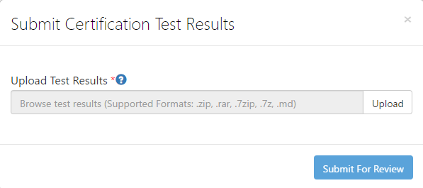

<a name="how-to-certify-ti-cc3200-device-with-azure-iot-sdk"></a>如何使用 Azure IoT SDK 认证 TI CC3200 设备
===
---

# <a name="table-of-contents"></a>目录

-   [介绍](#Introduction)
-   [步骤 1：注册 Azure IoT 中心](#Step_1)
-   [步骤 2：注册设备](#Step_2)
-   [步骤 3：使用 C 客户端库生成并验证示例](#Step_3)
    -   [3.1 安装必备组件](#Step_3_1)
    -   [3.2 生成 Azure IoT SDK](#Step_3_2)
    -   [3.3 运行并验证示例](#Step_3_3)
-   [步骤 4：打包并共享](#Step_4)
    -   [4.1 打包生成日志和示例测试结果](#Step_4_1)
    -   [4.2 与 Azure IoT 认证团队共享](#Step_4_2)
    -   [4.3 后续步骤](#Step_4_3)
-   [步骤 5：故障排除](#Step_5)

<a name="Introduction"></a>
# <a name="introduction"></a>介绍

**关于本文档**

本文档向 IoT 硬件发布人员提供有关如何使用 Azure IoT C SDK 认证已启用 IoT 的硬件的分步指南。 此过程由多个步骤组成，其中包括： 
-   配置 Azure IoT 中心 
-   注册 IoT 设备
-   在设备上生成并部署 Azure IoT SDK
-   打包并共享日志

**准备**

在执行以下任一步骤之前，请仔细阅读每个过程的每个步骤，确保全盘了解整个过程。

在开始过程前，应已准备好以下项目：

-   准备好一台装有 GitHub 并且可以访问 [azure-iot-sdk-c](https://github.com/Azure/azure-iot-sdk-c) GitHub 公共存储库的计算机。
-   配置 SSH 客户端（如 [PuTTY](http://www.putty.org/)），以便能够访问命令行。
-   所需的硬件：[CC3200 Launchpad](http://www.ti.com/tool/cc3200-launchxl)。

<a name="Step_1"></a>
# <a name="step-1-sign-up-to-azure-iot-hub"></a>步骤 1：注册 Azure IoT 中心

遵照[此处](https://account.windowsazure.com/signup?offer=ms-azr-0044p)所述的说明了解如何注册 Azure IoT 中心服务。

在注册过程中，你将收到连接字符串。 

-   **IoT 中心连接字符串**：IoT 中心的连接字符串示例如下：

         HostName=[YourIoTHubName];SharedAccessKeyName=[YourAccessKeyName];SharedAccessKey=[YourAccessKey]

<a name="Step_2"></a>
# <a name="step-2-register-device"></a>步骤 2：注册设备

在本部分，将要使用 DeviceExplorer 注册设备。 DeviceExplorer 是与 Azure IoT 中心对接的 Windows 应用程序，可执行以下操作：

-   设备管理
    -   创建新设备
    -   列出现有设备，公开设备中心内存储的设备属性
    -   可更新设备密钥
    -   可删除设备
-   监视设备的事件
-   向设备发送消息

若要运行 DeviceExplorer 工具，请根据[步骤 1](#Step_1) 中所述使用以下配置字符串：

-   IoT 中心连接字符串
    

**步骤：**
1.  单击[此处](<https://github.com/Azure/azure-iot-sdk-csharp/blob/master/tools/DeviceExplorer/doc/how_to_use_device_explorer.md>)下载并安装 DeviceExplorer。

2.  添加“配置”选项卡下面的连接信息，然后单击“更新”按钮。

3.  根据以下说明创建设备并将其注册到 IoT 中心。

    a.在“解决方案资源管理器”中，右键单击项目文件夹下的“引用”文件夹，然后单击“添加引用”。 单击“管理”选项卡。

    b.保留“数据库类型”设置，即设置为“共享”。 注册的设备将显示在列表中。 如果你的设备未显示在列表中，请单击“刷新”按钮。 如果这是第一次注册设备，请不要检索任何信息。

    c. 单击“创建”按钮创建设备 ID 和密钥。

    d.单击“下一步”。 成功创建设备后，该设备将列在 DeviceExplorer 中。

    e.在“新建 MySQL 数据库”边栏选项卡中，接受法律条款，然后单击“确定”。 右键单击该设备，然后从上下文菜单中选择“复制所选设备的连接字符串”。

    f. 在记事本中保存此信息。 后面的步骤需要用到此信息。

***不是在电脑上运行 Windows？*** - 请遵照[此处](<https://github.com/Azure/azure-iot-device-ecosystem/blob/master/manage_iot_hub.md>)的说明预配设备并获取其凭据。

<a name="Step_3"></a>
# <a name="step-3-build-and-validate-the-sample-using-c-client-libraries"></a>步骤 3：使用 C 客户端库生成并验证示例

<a name="Step_3_1"></a>
## <a name="31-install-prerequisites"></a>3.1 安装必备组件

尽管不一定非要这样做，但我们建议在同一个目录中安装 TI 提供的以下工具，并使用不包含任何空白字符的目录名称。

***注意：****本文档假设在 `C:\ti` 中安装所有组件。*

-   安装适用于 SimpleLink CC3200 的 [Uniflash Tool](http://www.ti.com/tool/Uniflash) 3.2 或更高版本

-   安装 [CC3200 SDK 1.1.0](http://www.ti.com/tool/cc3200sdk)

-   安装 [TI-RTOS SDK for SimpleLink](http://downloads.ti.com/dsps/dsps_public_sw/sdo_sb/targetcontent/tirtos/index.html) 2.14.01.20 或更高版本

-   安装 [NS 包](http://software-dl.ti.com/dsps/dsps_public_sw/sdo_sb/targetcontent/ns/ns_1_10_00_00_eng.zip)。 请注意，NS 包为预发行版。 其内容和下载位置随时可能更改。

-   安装 [TI ARM Compiler](http://software-dl.ti.com/ccs/esd/test/ti_cgt_tms470_5.2.5_windows_installer.exe) 5.2.2 或更高版本。

<a name="Step_3_2"></a>
## <a name="32-build-azure-iot-sdk"></a>3.2 生成 Azure IoT SDK

1.  编辑文件 `products.mak` (*azure-iot-sdk-c\build_all\tirtos*)。 
    更新以下变量的值：
    
    `XDCTOOLS_INSTALLATION_DIR`：Uniflash Tool 的安装位置。
    `TIRTOS_INSTALLATION_DIR`：TI-RTOS SDK 的安装位置。
    `CC3200SDK_INSTALLATION_DIR`：CC3200 SDK 的安装位置。
    `NS_INSTALLATION_DIR`：NS 包的安装位置。
    `ti.targets.arm.elf.M4`：TI ARM Compiler 的安装位置。

2. 打开 Windows 命令提示符。

3. 在 Windows 命令提示符中运行以下命令（请务必将路径替换为安装路径）。

  ```
  cd <AZURE_INSTALL_DIR>\azure-iot-sdk-c\build_all\tirtos
  C:\ti\xdctools_3_31_01_33_core\gmake.exe clean
  C:\ti\xdctools_3_31_01_33_core\gmake.exe all
  ```

<a name="Step_3_3"></a>
## <a name="33-run-and-validate-the-samples"></a>3.3 运行并验证示例

在本部分，我们将运行 Azure IoT 客户端 SDK 示例来验证设备与 Azure IoT 中心之间的通信。 我们要向 Azure IoT 中心服务发送消息，然后验证 IoT 中心是否成功接收数据。 

***注意：****请为本部分中执行的所有操作创建屏幕截图。[步骤 4](#Step_4_2) 中需要用到这些屏幕截图。*

<a name="Step_3_2_1"></a>
### <a name="331-build-the-sample-simplesamplehttp-application"></a>3.3.1 生成示例 simplesample_http 应用程序

1.  打开 `azure-iot-sdk-c\serializer\samples\simplesample_http` 目录中的 `simplesample_http.c` 文件。

2.  找到 IoT 连接字符串的以下占位符：
    
        static const char* connectionString = "[device connection string]";

3.  将上述占位符替换为设备连接字符串。 可根据“步骤 2”中所述，从 DeviceExplorer 获取这个已复制到记事本的连接字符串。

4.  打开 `azure-iot-sdk-c/serializer/samples/simplesample_http/tirtos/cc3200` 目录中的 `main.c` 文件。 

5.  找到以下日期时间注释：

        /* USER STEP: update to current date-time */

6.  更新当前日期时间值注释下面的当前日期时间宏。

    ```
    #define DAY     15
    #define MONTH   9
    #define YEAR    2015
    #define HOUR    6
    #define MINUTE  21
    #define SECOND  0
    ```

7. 打开 `azure-iot-sdk-c/serializer/samples/simplesample_http/tirtos/cc3200` 目录中的 `wificonfig.h` 文件。

8.  找到以下 USER STEP 注释：

        /* USER STEP: Update these macros */

9.  更新注释下面的 wifi 设置宏。

        #define SSID ""
        #define SECURITY_KEY ""

10. 将[适用于 Windows 的 elf2cc32 可执行文件](https://github.com/tisb-vikram/azure-iot-sdks/blob/7da24633b2c4af3bc779998e9950146f061a8a10/c/serializer/samples/simplesample_http/tirtos/cc3200/tools/elf2cc32.exe?raw=true)或[适用于 Linux 的 elf2cc32 可执行文件](https://github.com/tisb-vikram/azure-iot-sdks/blob/7da24633b2c4af3bc779998e9950146f061a8a10/c/serializer/samples/simplesample_http/tirtos/cc3200/tools/elf2cc32?raw=true)下载到文件夹 `azure-iot-sdk-c\serializer\samples\simplesample_http\tirtos\cc3200\tools`。 需要使用此工具将 **simplesample_http.out** 转换为 **simplesample_http.bin** 文件。

11. 执行以下命令生成示例：

    ```
    cd <AZURE_INSTALL_DIR>\azure-iot-sdk-c\serializer\samples\simplesample_http\tirtos\cc3200
    C:\ti\xdctools_3_31_01_33_core\gmake.exe clean
    C:\ti\xdctools_3_31_01_33_core\gmake.exe all
    ```

<a name="Step_3_3_2"></a>
### <a name="flash-the-sample-simplesamplehttp-and-the-root-certificate"></a>刷写示例 simplesample_http 和根证书

将`simplesample_http.bin` 文件刷写到 CC3200 Launchpad。

> 注意：必须将根 CA 证书“Baltimore CyberTrust Root”刷写到 CC3200 Launchpad 上的 `/cert/ms.der` 位置。 此位置将在 `tirtos/cc3200/main.c` 中引用，并由 SimpleLink TLS 堆栈使用。

可在 [CC3200 UniFlash wiki](http://processors.wiki.ti.com/index.php/CC31xx_%26_CC32xx_UniFlash) 中找到有关刷写工具的详细信息。 [GUI 界面](http://processors.wiki.ti.com/index.php/CC31xx_%26_CC32xx_UniFlash#GUI_Interface)部分逐步讲解了 UniFlash 工具的用法步骤。

将应用程序（.bin 文件）刷写到“系统文件”下面的 `/sys/mcuimg.bin`。 对于证书，请在路径 `/cert/ms.der` 中[添加一个新文件](http://processors.wiki.ti.com/index.php/CC31xx_%26_CC32xx_UniFlash#Adding_a_new_file_to_the_device)，并提供“Baltimore CyberTrust Root”证书（.der 格式）的路径。 ms.der 文件的路径为 <AZURE 安装目录>\azure-iot-sdk-c\certs\ms.der。

<a name="Step_3_3_3"></a>
### <a name="running-the-sample-simplesamplehttp"></a>运行示例 simplesample_http
1.  刷写示例后，请使用以下设置打开与相应 COM 端口建立的串行会话：

    ```
    Baudrate:     9600
    Data bits:       8
    Stop bits:       1
    Parity:       None
    Flow Control: None
    ```

2.  在 CC3200 Launchpad 上按重置按钮运行应用程序。 应用程序将列显如下所示的消息：

    ```
    Starting the simplesample_http example
    CC3200 has connected to AP and acquired an IP address.
    IP Address: XXX.XXX.XX.XXX
    IoTHubClient accepted the message for delivery
    Message Id: 1 Received.
    Result Call Back Called! Result is: IOTHUB_CLIENT_CONFIRMATION_OK
    ```

3.  可以使用 DeviceExplorer 监视应用程序发送的数据。 在运行应用程序之前，应在 DeviceExplorer 中的“数据”选项卡下面选择“监视”选项。 随后在运行应用程序时，“事件中心数据”窗口中会显示如下所示的消息。

```
9/17/2015 7:28:28 PM> Data:[{"Temperature":67, "Humidity":42}]
```

<a name="Step_4"></a>
# <a name="step-4-package-and-share"></a>步骤 4：打包并共享

<a name="Step_4_1"></a>
## <a name="41-package-build-logs-and-sample-test-results"></a>4.1 打包生成日志和示例测试结果

从设备打包以下项目：

1.  来自平台的生成日志和测试结果。

2.  “**运行示例 simplesample_http**”部分中所示的所有屏幕截图。

3.  创建一个文档，说明如何在硬件上运行示例（具体强调客户所要执行的新步骤）。 有关说明形式的指导，请参考[此处](<https://github.com/Azure/azure-iot-device-ecosystem/tree/master/get_started>) GitHub 存储库中发布的示例。

<a name="Step_4_2"></a>
## <a name="42-share-with-the-azure-iot-certification-team"></a>4.2 与 Azure IoT 认证团队共享

1.  转到“合作伙伴仪表板”。[](<https://catalog.azureiotsuite.com/devices>)
2.  单击设备右上角的“上载”图标。

    

3.  此时将打开上载对话框。 单击“上载”按钮浏览文件。

    

    可以上载同一个设备的多个文件。

4.  上载所有文件后，单击“提交审查”按钮。

    ***注意：****提交文件供审查后，若要更改/删除文件，请与 iotcert 团队联系。*
 

<a name="Step_4_3"></a>
## <a name="43-next-steps"></a>4.3 后续步骤

与我们共享文档后，我们将在 48 到 72 个小时（营业时间）内与你取得联系，到时会告知后续步骤。

<a name="Step_5"></a>
# <a name="step-5-troubleshooting"></a>步骤 5：故障排除

如需故障排除的帮助，请通过 <iotcert@microsoft.com> 联系工程支持部门。