如何使用 Azure IoT SDK 认证运行 Windows 10 的 IoT 设备 
===
---

# 目录

-   [介绍](#Introduction)
-   [步骤 1：注册 Azure IoT 中心](#Step_1:_Sign_Up)
-   [步骤 2：注册设备](#Step_2:_Register)
-   [步骤 3：使用 C# 客户端库生成并验证示例](#Step_3:_Build_and_Validate)
    -   [3.1：准备开发环境](#Step_3_1:_Development)
    -   [3.2：生成示例](#Step_3_2:_Build)
    -   [3.3：运行并验证示例](#Step_3_3:_Run)
-   [步骤 4：打包和共享](#Step_4:_Package_Share)
    -   [4.1：打包生成日志和示例测试结果](#Step_4_1:_Package)
    -   [4.2：与工程支持人员共享包](#Step_4_2:_Share)
    -   [4.3：后续步骤](#Step_4_3:_Next)
-   [步骤 5：故障排除](#Step_5:_Troubleshooting)

# 介绍

**关于本文档**

本文档向 IoT 硬件发行商逐步说明如何使用 Azure IoT SDK 来认证支持 IoT 的硬件。 此过程由多个步骤构成，具体包括：
-   配置 Azure IoT 中心 
-   注册 IoT 设备
-   在设备上生成和部署 Azure IoT SDK
-   打包和共享日志  

**准备**

在执行以下任何步骤之前，请先仔细阅读每个过程的每个步骤，确保对整个过程有全面的了解。

在开始过程前，应已准备好以下项目：

-   一台装有 GitHub 的计算机，并且能够访问 [azure-iot-sdk-csharp](https://github.com/Azure/azure-iot-sdk-csharp) GitHub 公共存储库。
-   安装 Visual Studio 2015 和工具。 可以安装任何版本的 Visual Studio，包括免费的社区版。

# 步骤 1：注册 Azure IoT 中心

遵照[此处](https://docs.microsoft.com/en-us/azure/iot-hub/iot-hub-csharp-csharp-getstarted#create-an-iot-hub)的说明了解如何注册 Azure IoT 中心服务。

在注册过程中，将会收到连接字符串。

-   **IoT 中心连接字符串**：下面显示了 IoT 中心连接字符串的示例：

        HostName=[YourIoTHubName];SharedAccessKeyName=[YourAccessKeyName];SharedAccessKey=[YourAccessKey]

# 步骤 2：注册设备

在本部分，我们将使用 DeviceExplorer 注册设备。 DeviceExplorer 是与 Azure IoT 中心对接的 Windows 应用程序，可执行以下操作：

-   设备管理
    -   创建新设备
    -   列出现有设备并公开设备中心存储的设备属性
    -   提供更新设备密钥的功能
    -   提供删除设备的功能
-   监视设备的事件
-   将消息发送到设备

若要运行 DeviceExplorer 工具，请使用[步骤 1](#Step_1:_Sign_Up) 中所述的以下配置字符串：

-   IoT 中心连接字符串

**步骤：**

1.  单击[此处](https://github.com/Azure/azure-iot-sdk-csharp/blob/master/tools/DeviceExplorer/readme.md)下载并安装 DeviceExplorer。

2.  在“配置”选项卡下添加连接信息，并单击“更新”按钮。

3.  使用以下说明创建设备并将其注册到 IoT 中心。

    a. 单击“管理”选项卡。    
    
    b. 列表中会显示已注册的设备。 如果该设备未显示在列表中，请单击“刷新”按钮。 如果这是第一次执行此操作，则不应检索任何信息。
       
    c. 单击“创建”按钮创建设备 ID 和密钥。 
    
    d. 成功创建后，设备会列在 DeviceExplorer 中。 
    
    e. 右键单击该设备，并从上下文菜单中选择“复制所选设备的连接字符串”。
    
    f. 在记事本中保存此信息。 后面的步骤需要用到此信息。

***不是在电脑上运行 Windows？*** - 请遵照[此处](<https://github.com/Azure/azure-iot-device-ecosystem/blob/master/manage_iot_hub.md>)的说明预配设备并获取其凭据。

# 步骤 3：使用 C# 客户端库生成并验证示例 

本部分逐步讲解如何在运行 Windows 10 操作系统的设备上生成、部署和验证 IoT 客户端 SDK。 我们将在设备上安装所需的必备组件。 完成后，将会生成并部署 IoT 客户端 SDK，并使用 Azure IoT SDK 来验证 IoT 认证所需的示例测试。

## 3.1：准备开发环境

- 从 https://dot.net 安装最新的 .NET Core
- 安装 .NET Framework 4.7 开发人员包：https://support.microsoft.com/en-us/help/3186612/the-net-framework-4-7-developer-pack-and-language-packs
- 安装 .NET Framework 4.5.1 开发人员包：https://www.microsoft.com/en-us/download/details.aspx?id=40772
- 在系统上以管理员身份启用 Powershell 脚本执行（一次性设置）。 有关详细信息，请参阅 http://go.microsoft.com/fwlink/?LinkID=135170。
    `Set-ExecutionPolicy -ExecutionPolicy RemoteSigned`

## 3.2：生成示例

1.  打开设备控制台（命令提示符或 PowerShell 窗口），并切换到本地 SDK 的 **azure-iot-sdk-csharp** 目录。

2.  在设备上以环境变量的形式添加 IoT 中心设备连接字符串：

        setx IOTHUB_DEVICE_CONN_STRING <yourDeviceConnectionString>

3.  运行以下命令生成 SDK：

        build.cmd -config Release

## 3.3：运行并验证示例
    
在本部分，我们将运行 Azure IoT 客户端 SDK 示例来验证设备与 Azure IoT 中心之间的通信。 我们要向 Azure IoT 中心服务发送消息，并验证 IoT 中心是否已成功接收数据。 此外，我们还会监视从 Azure IoT 中心发送到客户端的任何消息。

***注意：***请对本部分中执行的所有操作截图。在[步骤 4](#Step_4_2:_Share) 中需要使用这些屏幕截图。

### 3.3.1：向 IoT 中心发送设备事件

1.  如[步骤 2](#Step_2:_Register) 中所述启动 DeviceExplorer，并导航到“数据”选项卡。从设备 ID 下拉列表中选择创建的设备名称，并单击“监视”按钮。

    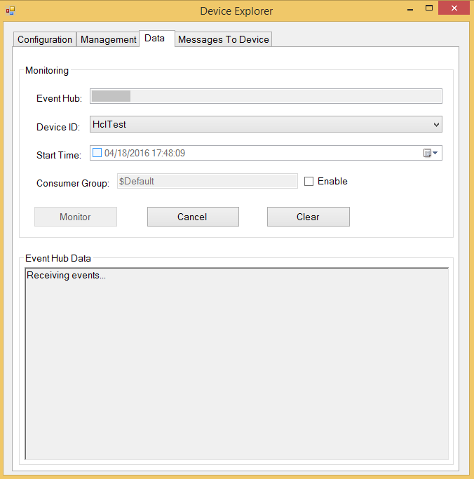

2.  DeviceExplorer 现在正在监视从所选设备发送到 IoT 中心的数据。
     

3.  在设备控制台中，使用以下命令运行示例：

    **如果使用 HTTP 协议：**

        cd iothub\device\samples\DeviceClientHttpSample\bin\Debug\netcoreapp2.0
        dotnet DeviceClientHttpSample.dll

    **如果使用 MQTT 协议：**

        cd iothub\device\samples\DeviceClientMqttSample\bin\Debug\netcoreapp2.0
        dotnet DeviceClientMqttSample.dll
        
    **如果使用 AMQP 协议：**

        cd iothub\device\samples\DeviceClientAmqpSample\bin\Debug\netcoreapp2.0
        dotnet DeviceClientAmqpSample.dll
   
4. 成功执行后，应会看到设备控制台中收到的事件。

    **如果使用 HTTP 协议：**

    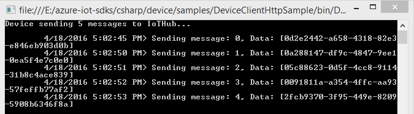

    **如果使用 MQTT 协议：**

    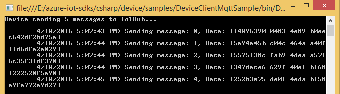

    **如果使用 AMQP 协议：**

    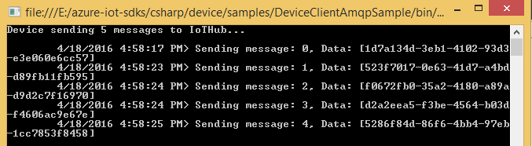

5. 应会看到 DeviceExplorer 的数据选项卡中收到的事件。

    **如果使用 HTTP 协议：**   

     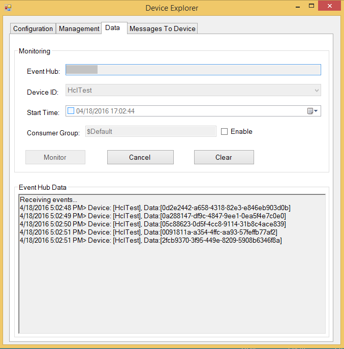

    **如果使用 MQTT 协议：**

     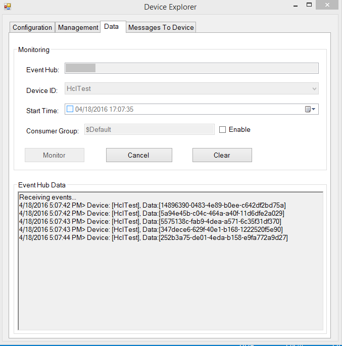

    **如果使用 AMQP 协议：**
    
     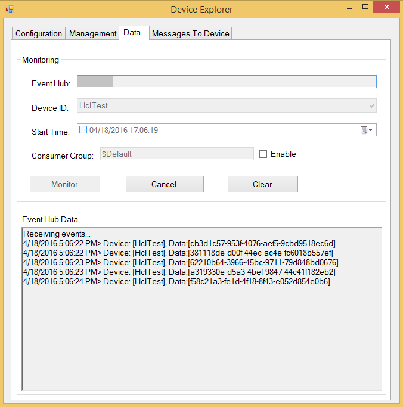

### 3.3.2：从 IoT 中心接收消息

1.  若要验证是否可将消息从 IoT 中心发送到设备，请转到 DeviceExplorer 中的“发送到设备的消息”选项卡。

2.  使用“设备 ID”下拉列表选择创建的设备。

3.  在“消息”字段中添加一些文本，并单击“发送”。

    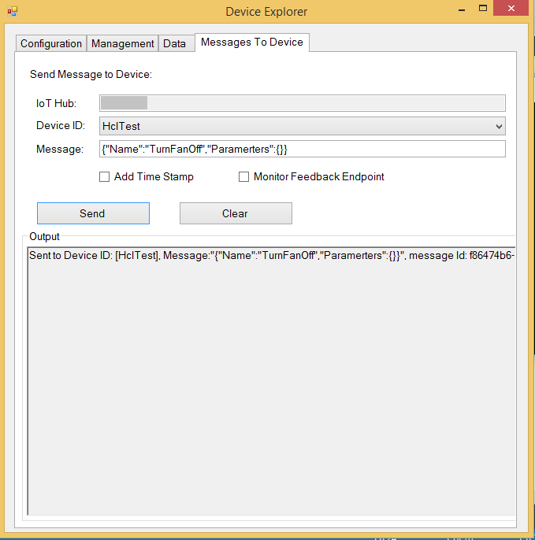

4. 应会看到设备控制台窗口中收到的消息。
    
    **如果使用 HTTP 协议：**

    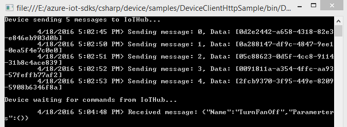

    **如果使用 MQTT 协议：**

    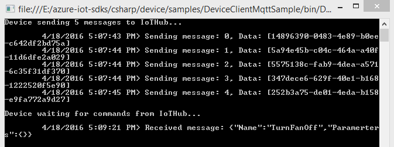

    **如果使用 AMQP 协议：**

    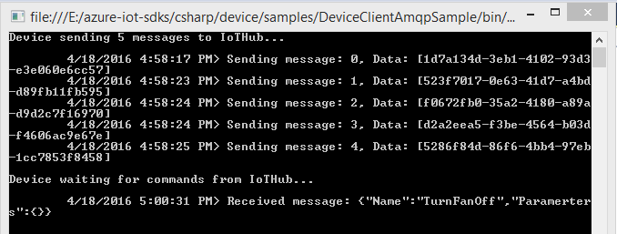
    

# 步骤 4：打包和共享

## 4.1：打包生成日志和示例测试结果
  
打包设备中的以下项目：

1.  第 3.2 部分所述的生成日志。
2.  前面“向 IoT 中心发送设备事件”部分中显示的所有屏幕截图。
3.  前面“从 IoT 中心接收消息”部分中显示的所有屏幕截图。
4.  请向我们发送明确的说明，描述如何使用你的硬件运行此示例（明确强调客户要执行的新步骤）。 请使用[此处](https://github.com/Azure/azure-iot-device-ecosystem/blob/master/iotcertification/templates/template-windows-csharp.md)提供的模板创建设备特定的说明。

    有关说明的大致形式的指导，请参阅[此](https://github.com/Azure/azure-iot-device-ecosystem/tree/master/get_started) github 存储库中发布的示例。

## 4.2：与 Azure IoT 认证团队共享包

1.  转到[合作伙伴仪表板](<https://catalog.azureiotsuite.com/devices>)。
2.  单击设备右上角的“上传”图标。

    

3.  此时会打开上传对话框。 单击“上传”按钮浏览文件。

    

    可以上传同一设备的多个文件。

4.  上传所有文件后，单击“提交审查”按钮。

    ***注意：***提交文件供审查后，若要更改/删除文件，请联系 iotcert 团队。
 

## 4.3：后续步骤

与我们共享文档后，我们将在接下来的 48 到 72 个工作小时内与你取得联系，以提供后续步骤。

# 步骤 5：故障排除

如需故障排除的帮助，请通过 <iotcert@microsoft.com> 联系工程支持人员。
