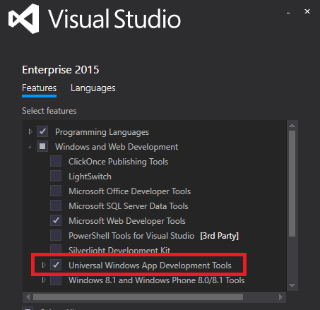
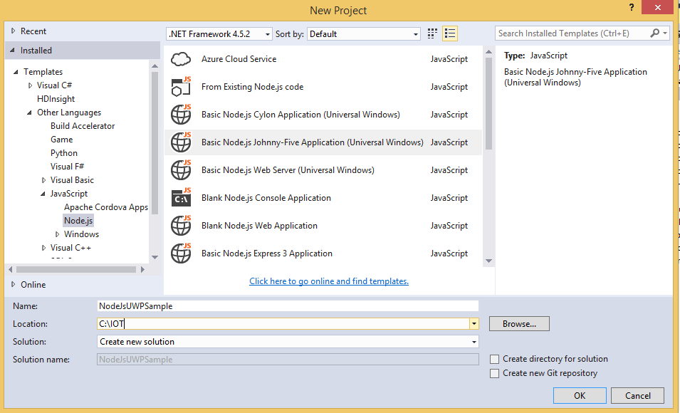
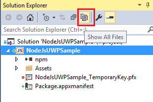
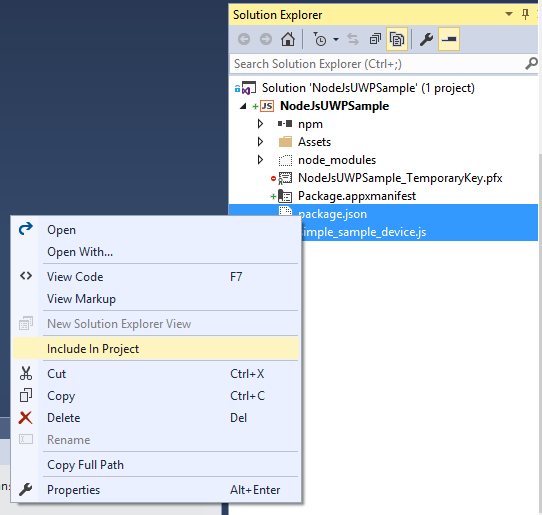
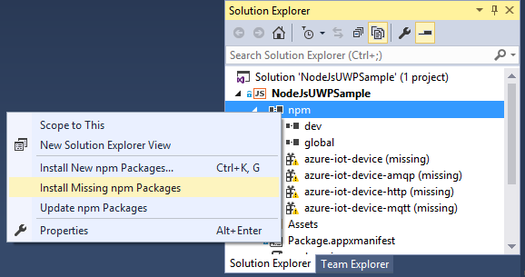
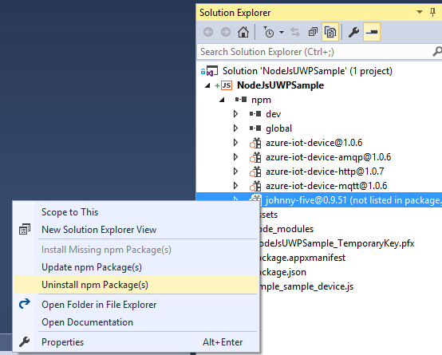
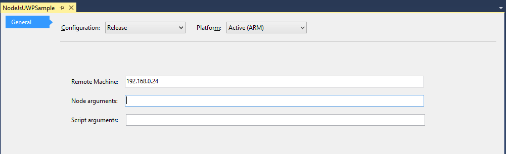
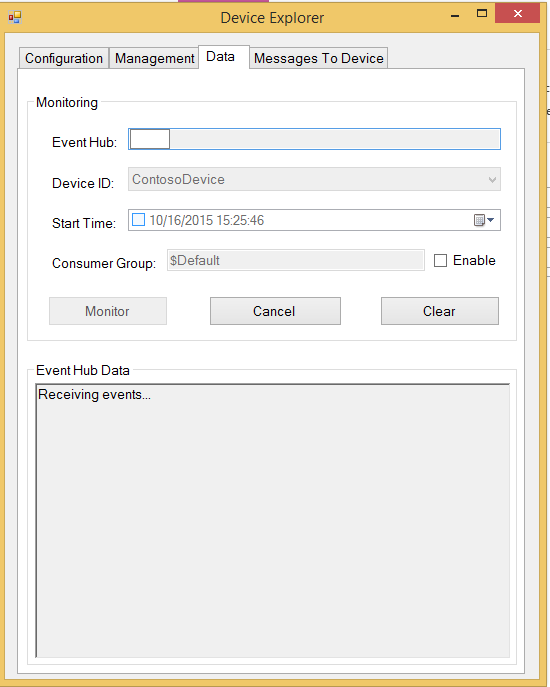
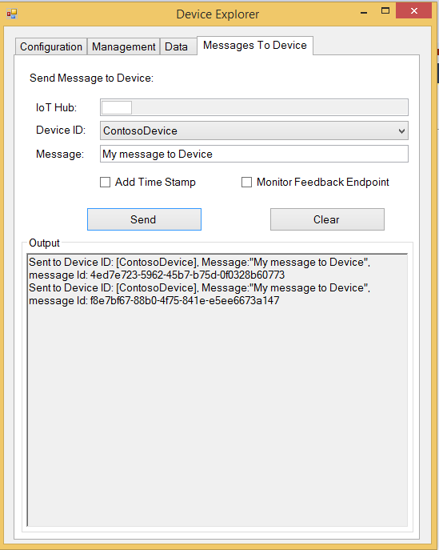

如何使用 Azure IoT SDK 认证运行 Windows 10 IoT core OS 的 IoT 设备 
===
---

**注意：*****我们不支持将 Windows 10 IoT 核心版与 NodeJS 配合使用。请联系 <iotcert@microsoft.com> 以进行进一步查询。***
# 目录

-   [介绍](#Introduction)
-   [步骤 1：注册 Azure IoT 中心](#Step_1:_Sign_Up)
-   [步骤 2：注册设备](#Step_2:_Register)
-   [步骤 3：使用 NodeJS 客户端库生成并验证示例](#Step_3:_Build_and_Validate)
    -   [3.1 连接设备](#Step_3_1:_Connect)
    -   [3.2 生成示例](#Step_3_2:_Build)
    -   [3.3：运行并验证示例](#Step_3_3:_Run)
-   [步骤 4：打包和共享](#Step_4:_Package_Share)
    -   [4.1：打包生成日志和示例测试结果](#Step_4_1:_Package)
    -   [4.2：与工程支持人员共享包](#Step_4_2:_Share)
    -   [4.3：后续步骤](#Step_4_3:_Next)
-   [步骤 5：故障排除](#Step_5:_Troubleshooting)

# 介绍

**关于本文档**

本文档向 IoT 硬件发行商逐步说明如何使用 Azure IoT SDK 来认证支持 IoT 的硬件。 此过程由多个步骤构成，具体包括：
-   配置 Azure IoT 中心 
-   注册 IoT 设备
-   在设备上生成和部署 Azure IoT SDK
-   打包并共享日志  

**准备**

在执行以下任一步骤之前，请仔细阅读每个过程的每个步骤，确保全盘了解整个过程。

在开始过程前，应已准备好以下项目：

-   准备好一台装有 Git 客户端、运行 **Windows 10** 并且可以访问 [azure-iot-sdk-node](https://github.com/Azure/azure-iot-sdk-node) GitHub 公共存储库的计算机。
-   安装 Visual Studio 2015 和工具。 可以安装任意版本的 Visual Studio，包括免费的 Community 版。

    请务必选择“通用 Windows 应用开发工具”，这是编写 Windows 10 应用时必须使用的组件：
    
    
- 从[此处](<https://www.visualstudio.com/features/node-js-vs>)安装最新的用于 Visual Studio 的 Node.js 工具 
-   从[此处](<https://github.com/ms-iot/ntvsiot/releases/tag/v1.5.1>)安装最新的用于 Windows IoT 的 Node.js 工具 

-   用于认证的、运行 Windows 10 IoT Core 的所需硬件。

     ***注意：****如果在安装 Windows 10 IoT 核心板时需要帮助，请访问 <https://www.windowsondevices.com> 或者通过 <iotcert@microsoft.com> 联系我们*

# 步骤 1：注册 Azure IoT 中心

遵照[此处](https://account.windowsazure.com/signup?offer=ms-azr-0044p)的说明了解如何注册 Azure IoT 中心服务。

在注册过程中，将会收到连接字符串。

-   **IoT 中心连接字符串**：下面显示了 IoT 中心连接字符串的示例：

        HostName=[YourIoTHubName];SharedAccessKeyName=[YourAccessKeyName];SharedAccessKey=[YourAccessKey]

# 步骤 2：注册设备

-   遵照[此处](<https://github.com/Azure/azure-iot-device-ecosystem/blob/master/manage_iot_hub.md>)所述的说明，了解如何预配设备并获取其凭据。

# 步骤 3：使用 Node.js 客户端库生成并验证示例 

本部分逐步讲解如何使用 Visual Studio 基于现有的 Node.js 客户端 SDK 创建 UWP Node.js 包装器。 完成后，将生成并部署 IoT 客户端 SDK，然后验证使用 Azure IoT SDK 进行 IoT 认证所需的示例测试。

## 3.1 连接设备

1.  使用以太网电缆将开发板连接到网络。 由于示例依赖于 Internet 访问，因此必须执行此步骤。

2.  使用 micro-USB 电缆或电源适配器为开发板供电。

## 3.2 生成示例

1.  启动 Visual Studio 2015 的新实例。

2. 创建新项目（“文件”|“新建项目...”）。 在“新建项目”对话框中导航到 Node.js，如下所示（在对话框的左窗格中，选择“模板”|“JavaScript”|“Node.js”）。 选择“基本 Node.js Johnny-Five 应用程序(通用 Windows)模板”（如下所示）。 输入项目的名称，例如 **NodeJsUWPSample**。 

    

3. 在解决方案资源管理器中选择 app.js 和 package.json 文件，然后单击右键并选择“删除”。

      
          
4. 将 [Azure IoT SDK](https://github.com/Azure/azure-iot-sdk-node.git) 存储库克隆到 Windows 10 计算机。 

5. 在文件资源管理器中，复制计算机上存储库 Node.js 示例下面的 **package.json** 和 **simple_sample_device.js** 文件。 例如，如果已将 **azure-iot-sdk-node** 存储库克隆到 C:\IOT 目录下，请转到 **(C:\azure-iot-sdk-node\device\samples\)**

    
          
6. 返回 Visual Studio，在解决方案资源管理器中右键单击项目，然后单击“在文件资源管理器中打开文件夹”。

   
    
7. 将前面复制的文件粘贴到此文件夹中。

    
    
8. 返回 Visual Studio，在解决方案资源管理器的顶部上下文菜单中单击“显示所有文件”。

    
    
9. 右键单击“package.json”和“simple_sample_device.js”文件并选择“包括在项目中”选项。

      
        
10. 右键单击“npm”节点，然后单击“安装缺少的 npm 包”安装解决方案所需的包。

    
    
11. 在解决方案资源管理器中展开“npm”节点，右键单击显示的但未列在该包中的所有包，然后单击“卸载 npm 程序包”。

    

12.  选择 **simple_sample_device.js** 文件，然后在 **simple_sample_device.js** 文件中找到以下代码：

        var connectionString = '[IoT device connection string]';

13.  将 `[IoT device connection string]` 替换为设备的连接字符串，然后**保存**更改。 如[步骤 2](#Step_2:_Register) 中所述，可从 DeviceExplorer 获取连接字符串。

14. 右键单击“simple_sample_device.js”文件，然后从上下文菜单中选择“设为 Node.JS 启动文件”。

15.  选择适当的体系结构（x86 或 ARM，具体取决于设备），将调试方法设置为“远程计算机”：

     
    
16.  若要在设备上部署二进制文件，请在“解决方案资源管理器”中右键单击 NodeJsUWPSample 项目，选择“属性”，然后导航到“常规”选项卡：

     

   键入设备的名称或 IP。

17.  生成解决方案。

## 3.3 运行并验证示例
    
在本部分，我们将运行 Azure IoT 客户端 SDK 示例来验证设备与 Azure IoT 中心之间的通信。 我们要向 Azure IoT 中心服务发送消息，并验证 IoT 中心是否已成功接收数据。 此外，我们还会监视从 Azure IoT 中心发送到客户端的任何消息。

***注意：*** 请对本部分中执行的所有操作截图。在[步骤 4](#Step_4_2:_Share) 中需要使用这些屏幕截图。

### 3.3.1：向 IoT 中心发送设备事件

1.  如[步骤 2](#Step_2:_Register) 中所述启动 DeviceExplorer，并导航到“数据”选项卡。从设备 ID 下拉列表中选择创建的设备名称，并单击“监视”按钮。

    

2.  现在，DeviceExplorer 正在监视从选定设备发送到 IoT 中心的数据。
     

3.  在 Visual Studio 的“解决方案资源管理器”中右键单击“NodeJsUWPSample”项目，然后单击“调试”&minus;&gt;“启动新实例”生成并运行示例。 

       
4. DeviceExplorer 的数据选项卡中应会显示收到的事件。

      

### 3.3.2 从 IoT 中心接收消息

1.  若要验证是否可将消息从 IoT 中心发送到设备，请转到 DeviceExplorer 中的“发送到设备的消息”选项卡。

2.  使用“设备 ID”下拉列表选择创建的设备。

3.  在“消息”字段中添加一些文本，并单击“发送”。

    

4.  Visual Studio 的“输出”窗口中应会显示收到的消息。
    

# 步骤 4：打包并共享

## 4.1：打包生成日志和示例测试结果
  
打包设备中的以下项目：

1.  第 3.2 部分所述的生成日志。
2.  前面“向 IoT 中心发送设备事件”部分中显示的所有屏幕截图。
3.  前面“从 IoT 中心接收消息”部分中显示的所有屏幕截图。
4.  请向我们发送明确的说明，描述如何使用你的硬件运行此示例（明确强调客户要执行的新步骤）。 请使用[此处](<https://github.com/Azure/azure-iot-device-ecosystem/blob/master/iotcertification/templates/template-windows-iotcore-nodejs.md>)提供的模板创建设备特定的说明。
    
    有关说明形式的指导，请参考[此处](<https://github.com/Azure/azure-iot-device-ecosystem/tree/master/get_started>) GitHub 存储库中发布的示例。

## 4.2 与 Azure IoT 认证团队共享包

1.  转到[合作伙伴仪表板](<https://catalog.azureiotsuite.com/devices>)。
2.  单击设备右上角的“上传”图标。

    

3.  此时会打开上传对话框。 单击“上传”按钮浏览文件。

    

    可以上传同一设备的多个文件。

4.  上传所有文件后，单击“提交审查”按钮。

    ***注意：*** 提交文件供审查后，若要更改/删除文件，请联系 iotcert 团队。
 

## 4.3：后续步骤

与我们共享文档后，我们将在接下来的 48 到 72 个工作小时内与你取得联系，以提供后续步骤。

# 步骤 5：故障排除

如需故障排除的帮助，请通过 <iotcert@microsoft.com> 联系工程支持人员。
