如何使用 Azure IoT SDK 认证运行 Windows 的 IoT 设备How to certify IoT devices running Windows with Azure IoT SDK
===
---

# 目录Table of Contents

-   [介绍Introduction](#Introduction)
-   [步骤 1：注册 Azure IoT 中心Step 1: Sign Up To Azure IoT Hub](#Step_1)
-   [步骤 2：注册设备Step 2: Register Device](#Step_2)
-   [步骤 3：使用 Java 客户端库生成并验证示例Step 3: Build and Validate the sample using Java client libraries](#Step_3)
    -   [3.1 在设备上安装 Azure IoT 设备 SDK 和必备组件3.1 Install Azure IoT Device SDK and prerequisites on device](#Step_3_1)
    -   [3.2 运行并验证示例3.2 Run and Validate the Samples](#Step_3_2)
    -   [3.3 验证设备配置3.3 Verify Device Configuration](#Step3_3)
-   [步骤 4：打包并共享Step 4: Package and Share](#Step_4)
    -   [4.1：打包生成日志和示例测试结果4.1 Package build logs and sample test results](#Step_4_1)
    -   [4.2 与 Azure IoT 认证团队共享4.2 Share with the Azure IoT Certification team](#Step_4_2)
    -   [4.3：后续步骤4.3 Next steps](#Step_4_3)
-   [步骤 5：故障排除Step 5: Troubleshooting](#Step_5)

# 介绍Introduction

**关于本文档****About this document**

本文档向 IoT 硬件发布人员提供有关如何使用 Azure IoT Java SDK 认证已启用 IoT 的硬件的分步指南。This document provides step by step guidance to IoT hardware publishers on how to certify an IoT enabled hardware with Azure IoT Java SDK. 此过程由多个步骤组成，其中包括：This multi-step process includes: 
-   配置 Azure IoT 中心Configuring Azure IoT Hub 
-   注册 IoT 设备Registering your IoT device
-   在设备上生成和部署 Azure IoT SDKBuild and deploy Azure IoT SDK on device
-   打包并共享日志Packaging and sharing the logs

**准备****Prepare**

在执行以下任一步骤之前，请仔细阅读每个过程的每个步骤，确保全盘了解整个过程。Before executing any of the steps below, read through each process, step by step to ensure end to end understanding.

在开始过程前，应已准备好以下项目：You should have the following items ready before beginning the process:

-   准备好一台装有 GitHub 并且可以访问 [azure-iot-sdk-java](https://github.com/Azure/azure-iot-sdk-java) GitHub 公共存储库的计算机。Computer with GitHub installed and access to the [azure-iot-sdk-java](https://github.com/Azure/azure-iot-sdk-java) GitHub public repository.
-   配置 SSH 客户端（如 [PuTTY](http://www.putty.org/)），以便能够访问命令行。SSH client, such as [PuTTY](http://www.putty.org/), so you can access the command line.
-   需要认证的硬件。Required hardware to certify.

# 步骤 1：注册 Azure IoT 中心Step 1: Sign Up To Azure IoT Hub

遵照[此处](https://account.windowsazure.com/signup?offer=ms-azr-0044p)的说明了解如何注册 Azure IoT 中心服务。Follow the instructions [here](https://account.windowsazure.com/signup?offer=ms-azr-0044p) on how to sign up to the Azure IoT Hub service.

在注册过程中，将会收到连接字符串。As part of the sign up process, you will receive the connection string. 

-   **IoT 中心连接字符串**：下面显示了 IoT 中心连接字符串的示例：**IoT Hub Connection String**: An example of IoT Hub Connection String is as below:

         HostName=[YourIoTHubName];SharedAccessKeyName=[YourAccessKeyName];SharedAccessKey=[YourAccessKey]

# 步骤 2：注册设备Step 2: Register Device

在本部分，我们将使用 DeviceExplorer 注册设备。In this section, you will register your device using DeviceExplorer. DeviceExplorer 是与 Azure IoT 中心对接的 Windows 应用程序，可执行以下操作：The DeviceExplorer is a Windows application that interfaces with Azure IoT Hub and can perform the following operations:

-   设备管理Device management
    -   创建新设备Create new devices
    -   列出现有设备并公开设备中心存储的设备属性List existing devices and expose device properties stored on Device Hub
    -   提供更新设备密钥的功能Provides ability to update device keys
    -   提供删除设备的功能Provides ability to delete a device
-   监视设备的事件Monitoring events from your device
-   将消息发送到设备Sending messages to your device

若要运行 DeviceExplorer 工具，请使用[步骤 1](#Step_1) 中所述的以下配置字符串：To run DeviceExplorer tool, use following configuration string as described in [Step1](#Step_1):

-   IoT 中心连接字符串IoT Hub Connection String
    

**步骤：****Steps:**
1.  单击[此处](<https://github.com/Azure/azure-iot-sdk-csharp/blob/master/tools/DeviceExplorer/doc/how_to_use_device_explorer.md>)下载并安装 DeviceExplorer。Click [here](<https://github.com/Azure/azure-iot-sdk-csharp/blob/master/tools/DeviceExplorer/doc/how_to_use_device_explorer.md>) to download and install DeviceExplorer.

2.  在“配置”选项卡下添加连接信息，并单击“更新”按钮。Add connection information under the Configuration tab and click the **Update** button.

3.  根据以下说明创建设备并将其注册到 IoT 中心。Create and register the device with your IoT Hub using instructions as below.

    a.在“解决方案资源管理器”中，右键单击项目文件夹下的“引用”文件夹，然后单击“添加引用”。a. 单击“管理”选项卡。Click the **Management** tab.

    b.保留“数据库类型”设置，即设置为“共享”。b. 注册的设备将显示在列表中。Your registered devices will be displayed in the list. 如果该设备未显示在列表中，请单击“刷新”按钮。In case your device is not there in the list, click **Refresh** button. 如果这是第一次注册设备，请不要检索任何信息。If this is your first time, then you shouldn't retrieve anything.

    c.c. 单击“创建”按钮创建设备 ID 和密钥。Click **Create** button to create a device ID and key.

    d.单击“下一步”。d. 成功创建设备后，该设备将列在 DeviceExplorer 中。Once created successfully, device will be listed in DeviceExplorer.

    e.在“新建 MySQL 数据库”边栏选项卡中，接受法律条款，然后单击“确定”。e. 右键单击该设备，然后从上下文菜单中选择“复制所选设备的连接字符串”。Right click the device and from context menu select "**Copy connection string for selected device**".

    f.f. 在记事本中保存此信息。Save this information in Notepad. 后面的步骤需要用到此信息。You will need this information in later steps.

***不是在电脑上运行 Windows？******Not running Windows on your PC?*** - 请遵照[此处](<https://github.com/Azure/azure-iot-device-ecosystem/blob/master/manage_iot_hub.md>)的说明预配设备并获取其凭据。- Please follow the instructions [here](<https://github.com/Azure/azure-iot-device-ecosystem/blob/master/manage_iot_hub.md>) to provision your device and get its credentials.

# 步骤 3：使用 Java 客户端库生成并验证示例Step 3: Build and Validate the sample using Java client libraries

本部分逐步讲解如何在运行 Windows 操作系统的设备上生成、部署和验证 IoT 客户端 SDK。This section walks you through building, deploying and validating the IoT Client SDK on your device running a Windows operating system. 我们将在设备上安装必备组件。You will install the necessary prerequisites on your device. 完成后，将生成并部署 IoT 客户端 SDK，然后验证使用 Azure IoT SDK 进行 IoT 认证所需的示例测试。Once done, you will build and deploy the IoT Client SDK, and validate the sample tests required for IoT certification with the Azure IoT SDK.

## 3.1 在设备上安装 Azure IoT 设备 SDK 和必备组件3.1 Install Azure IoT Device SDK and prerequisites on device

-   运行 SDK 需要 Java SE 1.8。To run the SDK you will need Java SE 1.8.

-   在设备上使用命令行安装必备组件包。Install the prerequisite packages using command line on the device.

### 3.1.1 安装 Java JDK 1.8 并设置环境变量3.1.1  Install Java JDK 1.8 and set up environment variables
        
1.  有关下载项和安装说明，请访问此处：<http://www.oracle.com/technetwork/java/javase/downloads/jdk8-downloads-2133151.html>For downloads and installation instructions go here: <http://www.oracle.com/technetwork/java/javase/downloads/jdk8-downloads-2133151.html>
       
2.  请确保 `PATH` 环境变量包含 jdk1.8.x\bin 目录的完整路径。Please make sure that the `PATH` environment variable includes the full path to the jdk1.8.x\bin directory. （示例：c:\Program Files\Java\jdk1.8.0_65）(Example: c:\Program Files\Java\jdk1.8.0_65)
        
3.  请确保 `JAVA_HOME` 环境变量包含 jdk1.8.x 目录的完整路径。Please make sure that the `JAVA_HOME` environment variable includes the full path to the jdk1.8.x directory. （示例：JAVA_HOME=c:\Program Files\Java\jdk1.8.0_65)(Example: JAVA_HOME=c:\Program Files\Java\jdk1.8.0_65)

4.  可以通过重新启动控制台并运行 `java -version`，来测试是否已正确设置 PATH 变量。You can test whether your PATH variable is set correctly by restarting your console and running `java -version`.

### 3.1.2 安装 Maven 并设置环境变量3.1.2  Install Maven and set up environment variables
建议使用 Maven 3 安装用于 Java 的 Azure IoT 设备 SDK。Using Maven 3 is the recommended way to install Azure IoT device SDK for Java.

1.  有关 Maven 3 的下载项和安装说明，请访问此处：<https://maven.apache.org/download.cgi>For downloads and installation instructions for maven 3 go here: <https://maven.apache.org/download.cgi>

2.  请确保 PATH 环境变量包含 apache-maven-3.x.x\bin 目录的完整路径。Please make sure that the PATH environment variable includes the full path to the apache-maven-3.x.x\bin directory. （示例：F:\Setups\apache-maven-3.3.3\bin)。(Example: F:\Setups\apache-maven-3.3.3\bin). Apache maven 3.x.x 目录是 Maven 3 的安装位置。The apache-maven-3.x.x directory is where Maven 3 is installed.

2.  可以通过重新启动控制台并运行 `mvn --version.`，来验证是否已正确设置用于运行 Maven 3 的环境变量You can verify that the environment variables necessary to run Maven 3 have been set correctly by restarting your console and running `mvn --version.`
  

### 3.1.3 安装 GIT3.1.3  Install GIT

-   有关下载项和安装说明，请访问此处：<http://git-scm.com/book/en/v2/Getting-Started-Installing-Git>For downloads and installation instructions go here: <http://git-scm.com/book/en/v2/Getting-Started-Installing-Git>

### 3.1.4 生成 Qpid JMS3.1.4  Build Qpid JMS

1.  将 Qpid JMS 的存储库克隆到本地目录。Clone the repository for Qpid JMS to your local directory.
    
        git clone https://github.com/avranju/qpid-jms.git

2.  按顺序执行以下命令以安装 Qpid JMS：Install Qpid JMS by executing following commands in sequence:

        cd qpid-jms
        mvn install
        cd ..

    \*\**注意：\*\*\*\*我们发现，如果使用最新版本的 JDK 8（编写本文档时，最新版本为 1.8.0_65）如上所示运行 `mvn install` 时，某些单元测试可能会失败。但是，在较低的版本中可以正常运行。如果发生这种情况，请使用以下命令跳过运行单元测试：****Note:*** *We have noticed that certain unit tests can fail when running  `mvn install` as given above with the latest version of JDK 8 (1.8.0_65 at the time this document was written). It works fine with older versions however. If this occurs please skip running unit tests using following command:*
    
        mvn install -DskipTests

### 3.1.5 生成适用于 Java 的 Azure IoT 设备 SDK3.1.5 Build the Azure IoT Device SDK for Java

1.  在 PuTTY 中发出以下命令，将 SDK 下载到开发板：Download the SDK to the board by issuing the following command in PuTTY:

        git clone https://github.com/Azure/azure-iot-sdk-java.git

2.  验证 **azure-iot-sdk-java** 目录中现在是否有源代码的副本。Verify that you now have a copy of the source code under the directory **azure-iot-sdk-java**.

3.  在设备上按顺序运行以下命令，生成 Azure IoT SDK。Run the following commands on device in sequence to build Azure IoT SDK.

        cd azure-iot-sdk-java/device
        mvn install

4.  上述命令将生成包含所有依赖项的已编译 JAR 文件。Above command will generate the compiled JAR files with all dependencies. 可在以下位置找到此捆绑包：This bundle can be found at:

        azure-iot-sdk-java/device/iothub-java-client/target/iothub-java-client-{version}-with-deps.jar

## 3.2 运行并验证示例3.2 Run and Validate the Samples

在本部分，我们将运行 Azure IoT 客户端 SDK 示例来验证设备与 Azure IoT 中心之间的通信。In this section you will run the Azure IoT client SDK samples to validate communication between your device and Azure IoT Hub. 我们要向 Azure IoT 中心服务发送消息，然后验证 IoT 中心是否成功接收数据。You will send messages to the Azure IoT Hub service and validate that IoT Hub has successfully receive the data. 此外，我们还会监视从 Azure IoT 中心发送到客户端的任何消息。You will also monitor any messages sent from the Azure IoT Hub to client.

\*\**注意：\*\*\*\*请对本部分中执行的所有操作进行屏幕截图。* 在[步骤 4](#Step_4_2) 中需要使用这些屏幕截图。***Note:*** *Take screenshots of all the operations you will perform in this section. These will be needed in [Step 4](#Step_4_2).*

### 3.2.1 向 IoT 中心发送设备事件：3.2.1 Send Device Events to IoT Hub:

1.  如[步骤 2](#Step_2) 中所述启动 DeviceExplorer，并导航到“数据”选项卡。从设备 ID 下拉列表中选择创建的设备名称，并单击“监视”按钮。Launch the DeviceExplorer as explained in [Step 2](#Step_2) and navigate to **Data** tab. Select the device name you created from the drop-down list of device IDs and click **Monitor** button.

    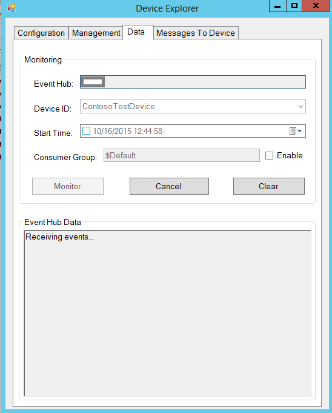

2.  现在，DeviceExplorer 正在监视从选定设备发送到 IoT 中心的数据。DeviceExplorer is now monitoring data sent from the selected device to the IoT Hub.

3.  导航到包含发送事件示例 JAR 可执行文件的文件夹。Navigate to the folder containing the executable JAR file for send event sample.

        cd /azure-iot-sdk-java/device/samples/send-event/target

4.  发出以下命令运行该示例。Run the sample by issuing following command.

    **如果使用 AMQP 协议：****If using AMQP protocol:**

        java -jar ./send-event-{version}-with-deps.jar "{connection string}" "{number of requests to send}" "amqps"
    
    **如果使用 HTTP 协议：****If using HTTP protocol:**

        java -jar ./send-event-{version}-with-deps.jar "{connection string}" "{number of requests to send}" "https"

    **如果使用 MQTT 协议：****If using MQTT protocol:**

        java -jar ./send-event-{version}-with-deps.jar "{connection string}" "{number of requests to send}" "mqtt"
    
    **如果使用 AMQP-WebSocket 协议：****If using AMQP-WebSocket protocol:**

        java -jar ./send-event-{version}-with-deps.jar "{connection string}" "{number of requests to send}" "amqps_ws"  

    替换上述命令中的以下内容：Replace the following in above command:
    
    -   `{version}`：生成的二进制文件的版本`{version}`: Version of binaries you have build
    -   `{connection string}`：设备连接字符串`{connection string}`: Your device connection string
    -   `{number of requests to send}`：要发送到 IoT 中心的消息数`{number of requests to send}`: Number of messages you want to send to IoT Hub

5.  检查确认消息中是否显示了“OK”。Verify that the confirmation messages show an OK. 如果没有，则可能表示未正确复制设备中心连接信息。If not, then you may have incorrectly copied the device hub connection information.

    **如果使用 AMQP 协议：****If using AMQP protocol:**  
    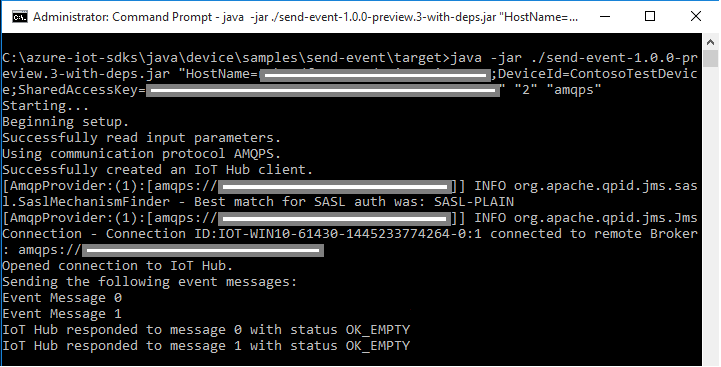

    **如果使用 HTTP 协议：****If using HTTP protocol:**  
    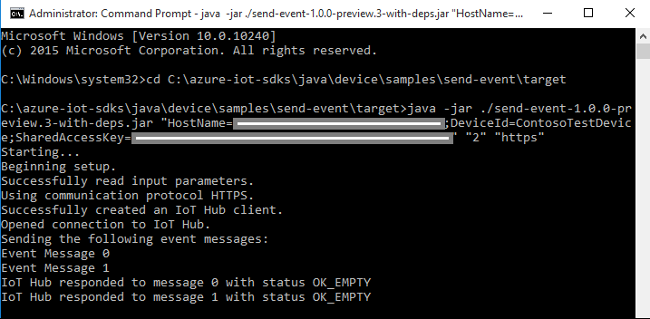

    **如果使用 MQTT 协议：****If using MQTT protocol:**  
    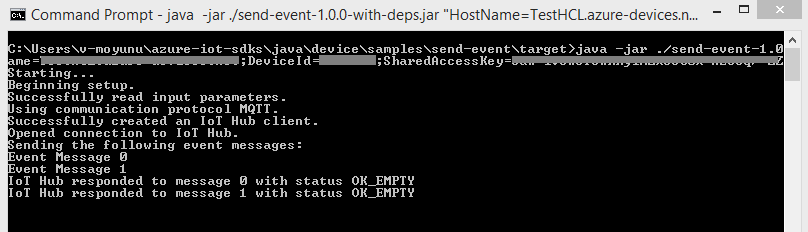

    **如果使用 AMQP WebSocket 协议：****If using AMQP WebSocket protocol:**  
    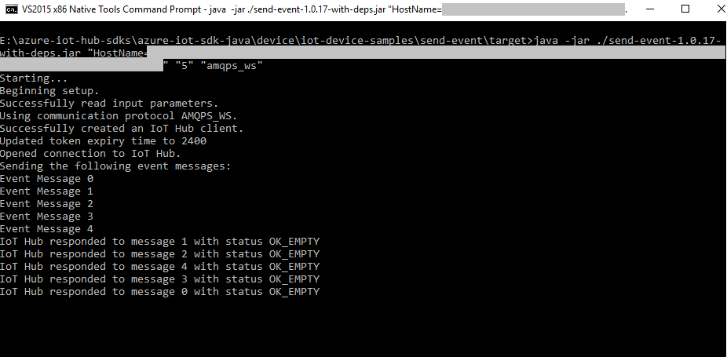

6.  DeviceExplorer 应显示 IoT 中心已成功接收示例测试发送的数据。DeviceExplorer should show that IoT Hub has successfully received data sent by sample test.

    **如果使用 AMQP 协议：****If using AMQP protocol:**  
    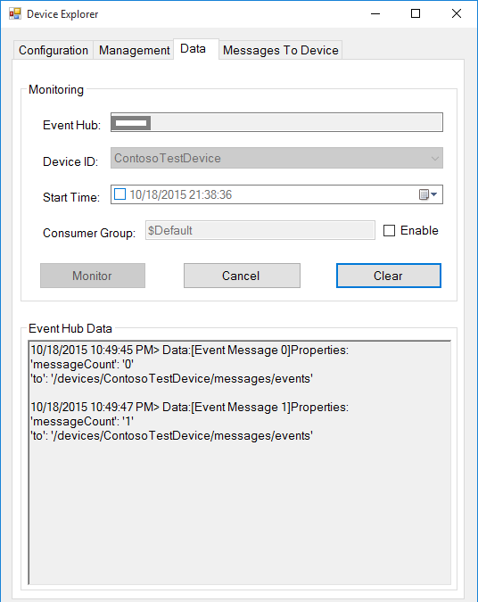

    **如果使用 HTTP 协议：****If using HTTP protocol:**  
    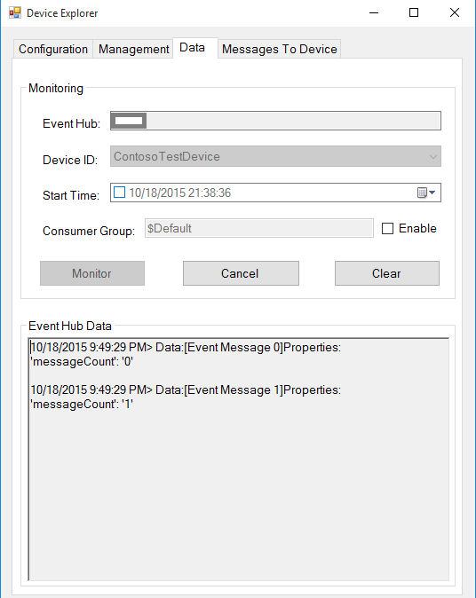

    **如果使用 MQTT 协议：****If using MQTT protocol:**  
    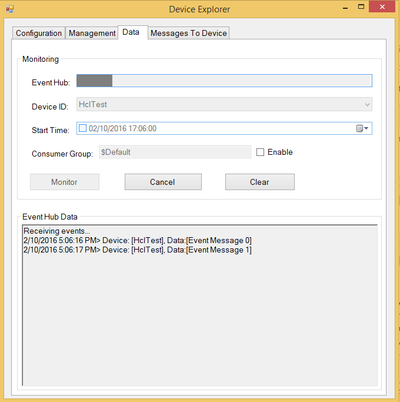

    **如果使用 AMQP WebSocket 协议：****If using AMQP WebSocket protocol:**  
    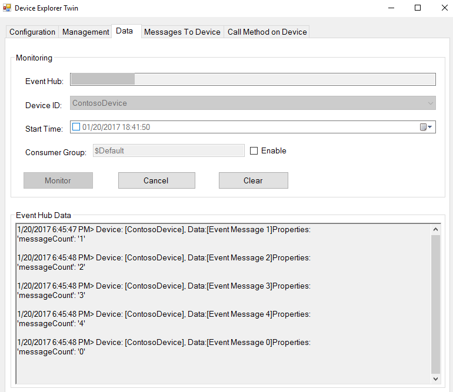

### 3.2.2 从 IoT 中心接收消息3.2.2 Receive messages from IoT Hub

1.  若要验证是否可从 IoT 中心向设备发送消息，请转到 DeviceExplorer 中的“发送到设备的消息”选项卡。To verify that you can send messages from the IoT Hub to your device, go to the **Messages To Device** tab in DeviceExplorer.

2.  使用设备 ID 下拉列表选择创建的设备。Select the device you created using Device ID drop down.

3.  在“消息”字段中添加一些文本，然后单击“发送”。Add some text to the Message field, then click Send.

    

4.  导航到包含接收消息示例 JAR 可执行文件的文件夹。Navigate to the folder containing the executable JAR file for the receive message sample.

        cd /azure-iot-sdk-java/device/samples/handle-messages/target
     
5.  发出以下命令运行该示例。Run the sample by issuing following command.

    **如果使用 AMQP 协议：****If using AMQP protocol:**
   
        java -jar ./handle-messages-{version}-with-deps.jar "{connection string}" "amqps"
    
    **如果使用 HTTP 协议：****If using HTTP protocol:**
   
        java -jar ./handle-messages-{version}-with-deps.jar "{connection string}" "https"

    **如果使用 MQTT 协议：****If using MQTT protocol:**
   
        java -jar ./handle-messages-{version}-with-deps.jar "{connection string}" "mqtt"

    **如果使用 AMQP-WebSocket 协议：****If using AMQP-WebSocket protocol:**
   
        java -jar ./handle-messages-{version}-with-deps.jar "{connection string}" "amqps_ws"

    替换上述命令中的以下内容：Replace the following in above command:
    
    -   `{version}`：生成的二进制文件的版本`{version}`: Version of binaries you have build
    -   `{connection string}`：设备连接字符串`{connection string}`: Your device connection string
    -   `{number of requests to send}`：要发送到 IoT 中心的消息数`{number of requests to send}`: Number of messages you want to send to IoT Hub

6.  应会看到客户端示例控制台窗口中收到的命令。You should be able to see the command received in the console window for the client sample.

    **如果使用 AMQP 协议：****If using AMQP protocol:**  
    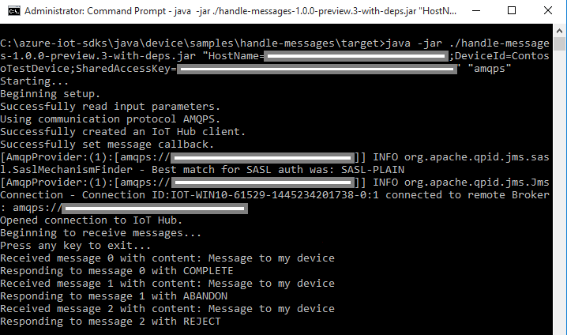

    **如果使用 HTTP 协议：****If using HTTP protocol:**  
    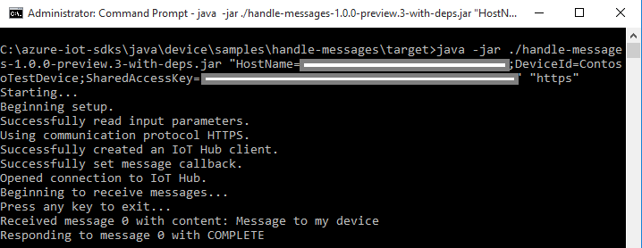

    **如果使用 MQTT 协议：****If using MQTT protocol:**  
    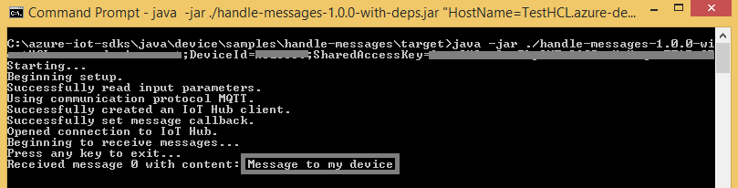

    **如果使用 AMQP WebSocket 协议：****If using AMQP WebSocket protocol:**  
    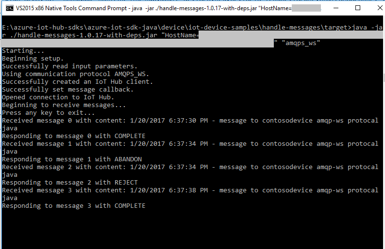

### 3.3 验证设备配置3.3 Verify Device configuration

-  在设备上以管理员身份打开 PowerShell 命令提示符，然后运行以下命令Open PowerShell command prompt as an Administrator on your device and run the below commands

-   首先使用以下命令检查 PowerShell 版本。First check your PowerShell version by using the following command.

        $PSversionTable

-  如果你的当前 PowerShell 版本低于 5.0，请从[此处](https://aka.ms/wmf5download)下载 PowerShell 最新版本If your current PowerShell version is less than 5.0 then download the PowerShell latest version from [here](https://aka.ms/wmf5download)

    安装后，请验证新安装的版本，它应为版本 5.1 或更高版本。After installation please verify the newly installed version, it should be version 5.1 or greater. 

-   运行以下命令来获取设备配置信息。Run the commands below to get device configuration information.

        Get-ComputerInfo -property BiosBIOSVersion, BiosManufacturer, BiosSeralNumber, CsManufacturer, CsModel, CsName, CsNumberOfProcessors, CsProcessors, CsSystemSKUNumber, CsSystemType, OsOperatingSystemSKU | Format-List
          
        Get-NetAdapter
    
    **如果设备已与以太网连接****If Device connected with Ethernet**

        $uri = 'http://macvendors.co/api/{0}' -f (Get-NetAdapter | Where-Object -Property Name -eq -Value "Ethernet" | Select-Object -property macaddress | foreach { $_.MacAddress })

        (Invoke-WebRequest -uri $uri).content | ConvertFrom-Json | Select-Object -Expand result

    **如果设备已与 Wi-Fi 连接****If Device connected with Wi-fi**

        $uri = 'http://macvendors.co/api/{0}' -f (Get-NetAdapter | Where-Object -Property Name -eq -Value "Wi-fi" | Select-Object -property macaddress | foreach { $_.MacAddress })

        (Invoke-WebRequest -uri $uri).content | ConvertFrom-Json | Select-Object -Expand result

- 请查看下面的输出屏幕截图Please find the output screenshot below

    

-   请保存设备配置屏幕截图，然后按[步骤 4](#Package) 所述上传该屏幕截图。Please save the device configuration screenshot and upload it as mentioned in [Step 4](#Package).

# 步骤 4：打包并共享Step 4: Package and Share

## 4.1：打包生成日志和示例测试结果4.1 Package build logs and sample test results

从设备打包以下项目：Package the following artifacts from your device:

1.  执行步骤 3.1.4 和 3.1.5 过程中在日志文件记录的生成日志和测试结果。Build logs and test results that were logged in the log files during steps 3.1.4 and 3.1.5.

2.  前面“**向 IoT 中心发送设备事件**”部分中显示的所有屏幕截图。All the screenshots that are shown above in "**Send Device Events to IoT Hub**" section.

3.  前面“从 IoT 中心接收消息”部分中显示的所有屏幕截图。All the screenshots that are above in "**Receive messages from IoT Hub**" section.

4.  请向我们发送明确的说明，描述如何使用你的硬件运行此示例（明确强调客户要执行的新步骤）。Send us clear instructions of how to run this sample with your hardware (explicitly highlighting the new steps for customers). 请使用[此处](<https://github.com/Azure/azure-iot-device-ecosystem/blob/master/iotcertification/templates/template-windows-java.md>)提供的模板创建设备特定的说明。Please use the template available [here](<https://github.com/Azure/azure-iot-device-ecosystem/blob/master/iotcertification/templates/template-windows-java.md>) to create your device-specific instructions.
    
    有关说明形式的指导，请参考[此处](<https://github.com/Azure/azure-iot-device-ecosystem/tree/master/get_started>) GitHub 存储库中发布的示例。As a guideline on how the instructions should look please refer the examples published on GitHub repository [here](<https://github.com/Azure/azure-iot-device-ecosystem/tree/master/get_started>).

## 4.2 与 Azure IoT 认证团队共享4.2 Share with the Azure IoT Certification team

1.  转到[合作伙伴仪表板](<https://catalog.azureiotsuite.com/devices>)。Go to [Partner Dashboard](<https://catalog.azureiotsuite.com/devices>).
2.  单击设备右上角的“上传”图标。Click on Upload icon at top-right corner of your device.

    

3.  此时会打开上传对话框。This will open an upload dialog. 单击“上传”按钮浏览文件。Browse your file(s) by clicking **Upload** button.

    

    可以上传同一设备的多个文件。You can upload multiple files for same device.

4.  上传所有文件后，单击“提交审查”按钮。Once you have uploaded all the files, click on **Submit for Review** button.

    \*\**注意：\*\*\*\*提交文件供审查后，若要更改/删除文件，请联系 iotcert 团队。****Note:*** *Please contact iotcert team to change/remove the files once you submit them for review.*
 

## 4.3：后续步骤4.3 Next steps

与我们共享文档后，我们将在接下来的 48 到 72 个工作小时内与你取得联系，以提供后续步骤。Once you shared the documents with us, we will contact you in the following 48 to 72 business hours with next steps.

# 步骤 5：故障排除Step 5: Troubleshooting

如需故障排除的帮助，请通过 <iotcert@microsoft.com> 联系工程支持人员。Please contact engineering support on <iotcert@microsoft.com> for help with troubleshooting.
