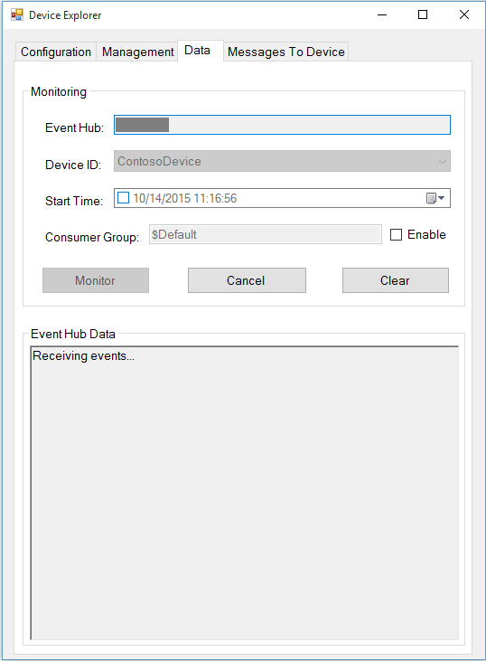
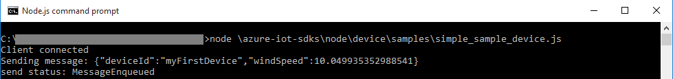
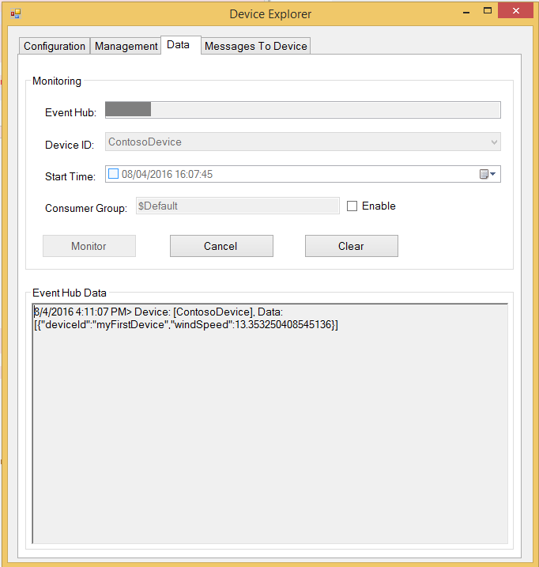
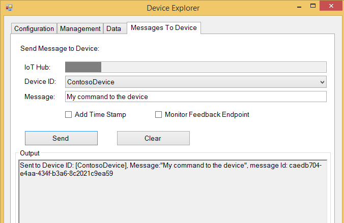
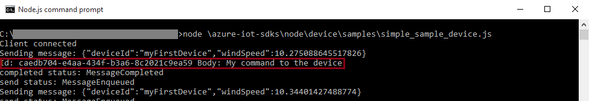

如何使用 Azure IoT SDK 认证运行 Windows 10 的 IoT 设备How to certify IoT devices running Windows 10 with Azure IoT SDK
===
---

# 目录Table of Contents

-   [介绍Introduction](#Introduction)
-   [步骤 1：配置 Azure IoT 中心Step 1: Configure Azure IoT Hub](#Configure)
-   [步骤 2：注册设备Step 2: Register Device](#Register)
-   [步骤 3：使用 Node JS 客户端库生成并验证示例Step 3: Build and validate the sample using Node JS client libraries](#Build)
    -   [3.1 在设备上加载 Azure IoT 代码和必备组件3.1 Load the Azure IoT bits and prerequisites on device](#Load)
    -   [3.2 生成示例3.2 Build the samples](#BuildSamples)
    -   [3.3 运行并验证示例3.3 Run and Validate the Samples](#Run)
-   [步骤 4：打包并共享Step 4: Package and Share](#PackageShare)
    -   [4.1 打包生成日志和示例测试结果4.1 Package build logs and sample test results](#Package)
    -   [4.2 与工程支持人员共享包4.2 Share package with Engineering Support](#Share)
    -   [4.3 后续步骤4.3 Next steps](#Next)
-   [步骤 5：故障排除Step 5: Troubleshooting](#Troubleshooting)

# 介绍Introduction

**关于本文档****About this document**

本文档向 IoT 硬件发布人员提供有关如何使用 Azure IoT SDK 认证已启用 IoT 的硬件的分步指南。This document provides step-by-step guidance to IoT hardware publishers on how to certify an IoT enabled hardware with Azure IoT SDK. 此过程由多个步骤组成，其中包括：This multi-step process includes:

-   配置 Azure IoT 中心Configuring Azure IoT Hub
-   注册 IoT 设备Registering your IoT device
-   在设备上生成并部署 Azure IoT SDKBuild and deploy Azure IoT SDK on device
-   打包并共享日志Packaging and sharing the logs

**准备****Prepare**

在执行以下任一步骤之前，请仔细阅读每个过程的每个步骤，确保全盘了解整个过程。Before executing any of the steps below, read through each process, step by step to ensure end to end understanding.

在开始过程前，应已准备好以下项目：You should have the following items ready before beginning the process:

-   用于认证的所需硬件。Required hardware to certify.
-   在 **C:\OpenSSL** 位置安装 OpenSSL 并执行以下操作：Install OpenSSL at **C:\OpenSSL** location and perform following actions:
    -   将 `C:\OpenSSL\` 添加到 **PATH** 环境变量Add `C:\OpenSSL\` to the **PATH** environment variable
    -   在 OpenSSL 目录中搜索“openssl.cnf”文件的位置。Search for the location of file 'openssl.cnf' inside the OpenSSL directory.
    -   创建新环境变量 **OPENSSL_CONF** 并将其值设置为 `openssl.cnf` 文件的绝对路径。Create a new environment variable **OPENSSL_CONF** and set its value as absolute path of the file `openssl.cnf`.

-   安装 [NodeJS](https://nodejs.org/)。Install [NodeJS](https://nodejs.org/). 确保 NodeJS 的版本高于 4.0。Make sure that version of NodeJS is greater than 4.0.
-   安装 [GIT](https://git-scm.com/download/win)。Install [GIT](https://git-scm.com/download/win).

***注意：****如果你尚未咨询 Microsoft 如何成为 Azure 认证的 IoT 合作伙伴，请先提交此[表单](<https://iotcert.cloudapp.net/>)来提出请求，然后遵照本文中的说明。****Note:*** *If you haven’t contacted Microsoft about being an Azure Certified for IoT partner, please submit this [form](<https://iotcert.cloudapp.net/>) first to request it and then follow these instructions.*

# 步骤 1：注册 Azure IoT 中心Step 1: Sign Up To Azure IoT Hub

遵照[此处](https://account.windowsazure.com/signup?offer=ms-azr-0044p)所述的说明了解如何注册 Azure IoT 中心服务。Follow the instructions [here](https://account.windowsazure.com/signup?offer=ms-azr-0044p) on how to sign up to the Azure IoT Hub service.

在注册过程中，你将收到连接字符串。As part of the sign up process, you will receive the connection string.

-   **IoT 中心连接字符串**：IoT 中心的连接字符串示例如下：**IoT Hub Connection String**: An example of IoT Hub Connection String is as below:

          HostName=[YourIoTHubName];CredentialType=SharedAccessSignature;CredentialScope=[ContosoIotHub];SharedAccessKeyName=[YourAccessKeyName];SharedAccessKey=[YourAccessKey]

# 步骤 2：注册设备Step 2: Register Device

在本部分，将要使用 DeviceExplorer 注册设备。In this section, you will register your device using DeviceExplorer. DeviceExplorer 是与 Azure IoT 中心对接的 Windows 应用程序，可执行以下操作：The DeviceExplorer is a Windows application that interfaces with Azure IoT Hub and can perform the following operations:

-   设备管理Device management
    -   创建新设备Create new devices
    -   列出现有设备，公开设备中心内存储的设备属性List existing devices and expose device properties stored on Device Hub
    -   可更新设备密钥Provides ability to update device keys
    -   可删除设备Provides ability to delete a device
-   监视设备的事件。Monitoring events from your device.
-   向设备发送消息。Sending messages to your device.

若要运行 DeviceExplorer 工具，请根据[步骤 1](#Configure) 中所述使用配置字符串：To run DeviceExplorer tool, follow the configuration strings as described in  [Step1](#Configure):

-   IoT 中心连接字符串IoT Hub Connection String

**步骤：****Steps:**

1.   单击[此处](<https://github.com/Azure/azure-iot-sdk-csharp/blob/master/tools/DeviceExplorer/doc/how_to_use_device_explorer.md>)下载并安装 DeviceExplorer。Click [here](<https://github.com/Azure/azure-iot-sdk-csharp/blob/master/tools/DeviceExplorer/doc/how_to_use_device_explorer.md>) to download and install DeviceExplorer.

2.  添加“配置”选项卡下面的连接信息，然后单击“更新”按钮。Add connection information under the Configuration tab and click the **Update** button.

3.  根据以下说明创建设备并将其注册到 IoT 中心。Create and register the device with your IoT Hub using instructions as below.

    a.在“解决方案资源管理器”中，右键单击项目文件夹下的“引用”文件夹，然后单击“添加引用”。a. 单击“管理”选项卡。Click the **Management** tab.

    b.保留“数据库类型”设置，即设置为“共享”。b. 注册的设备将显示在列表中。Your registered devices will be visible in the list. 如果你的设备未显示在列表中，请单击“刷新”按钮。In case your device is not there in the list, click **Refresh** button. 如果这是第一次注册设备，请不要检索任何信息。If this is your first time, then you shouldn't retrieve anything.

    c.c. 单击“创建”按钮创建设备 ID 和密钥。Click **Create** button to create a device ID and key.

    d.单击“下一步”。d. 成功创建设备后，该设备将列在 DeviceExplorer 中。Once created successfully, device will be listed in DeviceExplorer.

    e.在“新建 MySQL 数据库”边栏选项卡中，接受法律条款，然后单击“确定”。e. 右键单击该设备，然后从上下文菜单中选择“复制所选设备的连接字符串”。Right click the device and from context menu select "**Copy connection string for selected device**".

    f.f. 在记事本中保存此信息。Save this information in Notepad. 后面的步骤需要用到此信息。You will need this information in later steps.

***不是在电脑上运行 Windows？******Not running Windows on your PC?*** - 请遵照[此处](<https://github.com/Azure/azure-iot-sdk-node/blob/master/doc/manage_iot_hub.md>)的说明预配设备并获取其凭据。- Please follow the instructions [here](<https://github.com/Azure/azure-iot-sdk-node/blob/master/doc/manage_iot_hub.md>) to provision your device and get its credentials.

# 步骤 3：使用 Node JS 客户端库生成并验证示例Step 3: Build and validate the sample using Node JS client libraries

本部分逐步讲解如何在运行 Windows 操作系统的设备上生成、部署和验证 IoT 客户端 SDK。This section walks you through building, deploying and validating the IoT Client SDK on your device running a Windows operating system. 我们将在设备上安装必备组件。You will install necessary prerequisites on your device.  完成后，将生成并部署 IoT 客户端 SDK，然后验证使用 Azure IoT SDK 进行 IoT 认证所需的示例测试。Once done,  you will build and deploy the IoT Client SDK and validate the sample tests required for IoT certification with the Azure IoT SDK.

## 3.1 在设备上加载 Azure IoT 代码和必备组件3.1 Load the Azure IoT bits and prerequisites on device

-   创建环境变量 `IOTHUB_CONNECTION_STRING`，并将其值设置为在[步骤 1](#Configure) 中获取的 **IoT 中心连接字符串**。Create environment variable `IOTHUB_CONNECTION_STRING` and set its value as your **IoTHub connection string** which you got in [Step 1](#Configure).

-   打开 Node.js 命令提示符并运行以下命令Open the Node.js command prompt and run the following commands

        node -v

    确保 Node 版本高于 4.0。Make sure node version is greater than 4.0.
        
-   检查是否已正确设置所有环境变量。Check all environment variables are properly set.

        echo %PATH%
        echo %OPENSSL_CONF%
        echo %IOTHUB_CONNECTION_STRING%
    
-   下载该 SDKDownload the SDK 

        git clone --recursive https://github.com/Azure/azure-iot-sdk-node.git

## 3.2 生成示例3.2 Build the samples

-   若要验证源代码，请在设备上的 Node.js 命令提示符下运行以下命令。To validate the source code run the following commands on Node.js command prompt on Device.

        cd azure-iot-sdk-node
        build\dev-setup.cmd
        build\build.cmd > LogFile.txt

    ***注意：****应将上述命令中的 LogFile.txt 替换为要将生成输出写入到的文件名。****Note:*** *LogFile.txt in above command should be replaced with a file name where build output will be written.*

-   安装 npm 包以运行示例。Install npm package to run sample.

        cd \azure-iot-sdk-node\device\samples

    **对于 AMQP 协议：****For AMQP Protocol:**
    
        npm install azure-iot-device-amqp
    
    **对于 HTTP 协议：****For HTTP Protocol:**
    
        npm install azure-iot-device-http
    
    **对于 MQTT 协议：****For MQTT Protocol:**

        npm install azure-iot-device-mqtt    

    **对于将 Web Socket 与 AMQP 协议配合使用：****For Web Sockets with AMQP Protocol:**

        npm install azure-iot-device-amqp

    **对于将 Web Socket 与 MQTT 协议配合使用：****For Web Sockets with MQTT Protocol:**

        npm install azure-iot-device-mqtt

-   更新示例以设置协议。Update the sample to set the protocol.

        cd azure-iot-sdk-node\device\samples
        notepad simple_sample_device.js

-   这会启动文本编辑器。This launches a text editor. 向下滚动到协议信息，找到以下代码：Scroll down to the protocol information and find the below code:

        var Protocol = require('azure-iot-device-amqp').Amqp;
    
    使用的默认协议为 AMQP。The default protocol used is AMQP. 脚本中紧接在上述代码行的下面会提到其他协议 (HTTP/MQTT) 的代码。Code for other protocols(HTTP/MQTT) are mentioned just below the above line in the script. 
    请根据想要使用的协议取消注释相应的代码行。Uncomment the line as per the protocol you want to use.

-   向下滚动到连接信息，找到 IoT 连接字符串的以下占位符：Scroll down to the connection information and find following placeholder for IoT connection string:

        var connectionString = "[IoT Device Connection String]";

    将上述占位符替换为设备连接字符串。Replace the above placeholder with device connection string. 可根据[步骤 2](#Register) 中所述，从 DeviceExplorer 获取这个已复制到记事本的连接字符串。You can get this from DeviceExplorer as explained in [Step 2](#Register), that you copied into Notepad.

-   保存更改并关闭记事本。Save your changes and close the notepad.

-   退出 **azure-iot-sdk-node\device\samples** 目录之前，在 Node.js 命令提示符下运行以下命令Run the following command on Node.js command prompt before leaving the **azure-iot-sdk-node\device\samples** directory

        npm link azure-iot-device

## 3.3 运行并验证示例3.3 Run and Validate the Samples

在本部分，我们将运行 Azure IoT 客户端 SDK 示例来验证设备与 Azure IoT 中心服务之间的通信。In this section you will run the Azure IoT client SDK samples to validate communication between your device and Azure IoT Hub service. 我们要向 Azure IoT 中心服务发送消息，然后验证 IoT 中心是否成功接收数据。You will send messages to the Azure IoT Hub service and validate that IoT Hub has successfully receive the data. 此外，还要监视从 Azure IoT 中心发送到客户端的所有消息。You will also monitor any messages send from the Azure IoT Hub to client.

**注意：**请针对以下部分中执行的所有操作创建屏幕截图，如示例屏幕截图。**Note:** Take screen shots of all operations, like sample screen shots, performed in below sections. [步骤 4](#Share) 中需要用到这些屏幕截图These will be needed in [Step 4](#Share)

### 3.3.1 向 IoT 中心发送设备事件：3.3.1 Send Device Events to IOT Hub:

1.  如[步骤 2](#Register) 中所述启动 DeviceExplorer，然后导航到“数据”选项卡。Launch the DeviceExplorer as explained in [Step 2](#Register) and navigate to **Data** tab. 从设备 ID 下拉列表中选择创建的设备名称，然后单击“监视”按钮。Select the device name you created from the drop-down list of device IDs, click **Monitor** button.

    

2.  现在，DeviceExplorer 正在监视从选定设备发送到 IoT 中心的数据。DeviceExplorer is now monitoring data sent from the selected device to the IoT Hub.

3.  在 Node.js 命令提示符下发出以下命令来运行示例Run the sample by issuing following command on Node.js command prompt

        node azure-iot-sdk-node\device\samples\simple_sample_device.js
    
4.  检查是否已成功发送数据。Verify that data has been successfully sent. 如果没有，则可能表示未正确复制设备连接信息。If not, then you may have incorrectly copied the device connection information.

    

5.  DeviceExplorer 应显示 IoT 中心已成功接收示例发送的数据。DeviceExplorer should show that IoT Hub has successfully received data sent by sample.

     

### 3.3.2 从 IoT 中心接收消息3.3.2 Receive messages from IoT Hub

1.  若要验证是否可从 IoT 中心向设备发送消息，请转到 DeviceExplorer 中的“发送到设备的消息”选项卡。To verify that you can send messages from the IoT Hub to your device, go to the **Message To Device** tab in DeviceExplorer.

2.  使用设备 ID 下拉列表选择创建的设备。Select the device you created using Device ID drop down.

3.  在“消息”字段中添加一些文本，然后单击“发送”按钮。Add some text to the Message field, then click Send button.

    

4.  应会在控制台窗口中看到收到的命令。You should be able to see the command received in the console window.

    

# 步骤 4：打包并共享Step 4: Package and Share

## 4.1 打包生成日志和示例测试结果4.1 Package build logs and sample test results

从设备打包以下项目：Package following artifacts from your device:

1.  生成运行过程中在日志文件记录的生成日志和 E2E 测试结果。Build logs and E2E test results that were logged in the log file during build run.

2.  前面“**向 IoT 中心发送设备事件**”部分中显示的所有屏幕截图。All the screenshots that are shown above in "**Send Device Events to IoT Hub**" section.

3.  前面“**从 IoT 中心接收消息**”部分中的所有屏幕截图。All the screenshots that are above in "**Receive messages from IoT Hub**" section.

4.  向我们发送明确的说明，告知如何在硬件上运行此示例（具体强调客户所要执行的新步骤）。Send us clear instructions of how to run this sample with your hardware (explicitly highlighting the new steps for customers). 请使用[此处](<https://github.com/Azure/azure-iot-device-ecosystem/blob/master/iotcertification/templates/template-windows-nodejs.md>)提供的模板创建特定于设备的说明。Please use the template available [here](<https://github.com/Azure/azure-iot-device-ecosystem/blob/master/iotcertification/templates/template-windows-nodejs.md>) to create your device-specific instructions.

    有关说明形式的指导，请参考[此处](<https://github.com/Azure/azure-iot-device-ecosystem/tree/master/get_started>) GitHub 存储库中发布的示例。As a guideline on how the instructions should look please refer the examples published on GitHub repository [here](<https://github.com/Azure/azure-iot-device-ecosystem/tree/master/get_started>).

## 4.2 与工程支持人员共享包4.2 Share package with Engineering Support

1.  转到“合作伙伴仪表板”。Go to [Partner Dashboard](<https://catalog.azureiotsuite.com/devices>).
2.  单击设备右上角的“上载”图标。Click on Upload icon at top-right corner of your device.

    

3.  此时将打开上载对话框。This will open an upload dialog. 单击“上载”按钮浏览文件。Browse your file(s) by clicking **Upload** button.

    

    可以上载同一个设备的多个文件。You can upload multiple files for same device.

4.  上载所有文件后，单击“提交审查”按钮。Once you have uploaded all the files, click on **Submit for Review** button.

    ***注意：****提交文件供审查后，若要更改/删除文件，请与 iotcert 团队联系。****Note:*** *Please contact iotcert team to change/remove the files once you submit them for review.*
 

## 4.3 后续步骤4.3 Next steps

与我们共享文档后，我们将在 48 到 72 个小时（营业时间）内与你取得联系，到时会告知后续步骤。Once you shared the documents with us, we will contact you in the following 48 to 72 business hours with next steps.

# 步骤 5：故障排除Step 5: Troubleshooting

如需故障排除的帮助，请通过 <iotcert@microsoft.com> 联系工程支持部门。Please contact engineering support on <iotcert@microsoft.com> for help with troubleshooting.
