<a name="how-to-certify-iot-devices-running-windows-10-with-azure-iot-sdk"></a>如何使用 Azure IoT SDK 认证运行 Windows 10 的 IoT 设备 
===
---


# <a name="table-of-contents"></a>目录

-   [介绍](#Introduction)
-   [步骤 1：注册 Azure IoT 中心](#Step_1_Sign_Up)
-   [步骤 2：注册设备](#Step_2
-   Register)
-   [步骤 3：使用 Python 客户端库生成并验证示例](#Step_3_Build_and_Validate)
    -   [3.1 连接设备](#Step_3_1_Connect)
    -   [3.2 设置开发环境](#Step_3_2_Setup)
    -   [3.3 使用 Nuget 包在 Windows 上生成 Python iothub_client 模块（建议）](#Step_3_3_Build)
    -   [3.4 运行并验证示例](#Step_3_4_Run)
-   [步骤 4：打包并共享](#Step_4_Package_Share)
    -   [4.1 打包生成日志和示例测试结果](#Step_4_1_Package)
    -   [4.2 与工程支持人员共享包](#Step_4_2_Share)
    -   [4.3 后续步骤](#Step_4_3_Next)
-   [步骤 5：故障排除](#Step_5_Troubleshooting)

<a name="Introduction"></a>
# <a name="introduction"></a>介绍

**关于本文档**

本文档向 IoT 硬件发布人员提供有关如何使用 Azure IoT SDK 认证已启用 IoT 的硬件的分步指南。 此过程由多个步骤组成，其中包括：
-   配置 Azure IoT 中心 
-   注册 IoT 设备
-   在设备上生成并部署 Azure IoT SDK
-   打包并共享日志  

**准备**

在执行以下任一步骤之前，请仔细阅读每个过程的每个步骤，确保全盘了解整个过程。

在开始过程前，应已准备好以下项目：

-   准备好一台装有 GitHub 并且可以访问 [azure-iot-sdks](https://github.com/Azure/azure-iot-sdks) GitHub 公共存储库的计算机。
-   安装 Visual Studio 2015 和工具。 可以安装任意版本的 Visual Studio，包括免费的 Community 版。

<a name="Step_1_Sign_Up"></a>
# <a name="step-1-sign-up-to-azure-iot-hub"></a>步骤 1：注册 Azure IoT 中心

遵照[此处](https://account.windowsazure.com/signup?offer=ms-azr-0044p)所述的说明了解如何注册 Azure IoT 中心服务。

在注册过程中，你将收到连接字符串。

-   **IoT 中心连接字符串**：IoT 中心的连接字符串示例如下：

        HostName=[YourIoTHubName];SharedAccessKeyName=[YourAccessKeyName];SharedAccessKey=[YourAccessKey]

<a name="Step_2_Register"></a>
# <a name="step-2-register-device"></a>步骤 2：注册设备

- [预配设备并获取其凭据](<https://github.com/Azure/azure-iot-sdks/blob/master/doc/manage_iot_hub.md>)

<a name="Step_3_Build_and_Validate"></a>
# <a name="step-3-build-and-validate-the-sample-using-python-client-libraries"></a>步骤 3：使用 Python 客户端库生成并验证示例 

本部分逐步讲解如何在运行 Windows 10 操作系统的设备上生成、部署和验证 IoT 客户端 SDK。 我们将在设备上安装必备组件。 完成后，将生成并部署 IoT 客户端 SDK，然后验证使用 Azure IoT SDK 进行 IoT 认证所需的示例测试。

<a name="Step_3_1_Connect"></a>
## <a name="31-connect-the-device"></a>3.1 连接设备

1.  使用以太网电缆将开发板连接到网络。 由于示例依赖于 Internet 访问，因此必须执行此步骤。

2.  使用 micro-USB 电缆将设备插入计算机。

<a name="Step_3_2_Setup"></a>
## <a name="32--setup-your-development-environment"></a>3.2 设置开发环境

完成以下步骤以设置开发环境：

1. 使用以下命令下载最新的 SDK：
  
  ```
  git clone --recursive https://github.com/Azure/azure-iot-sdks.git
  ```

2. 安装最新的 x86 或 x64 Python 2.7 客户端。 生成过程需要在路径中包含有效的 Python.exe。 生成脚本会根据正在使用的 Python 版本（例如 Python 2.7.11 x86 32 位）选择编译器。

> 可以通过 [python-2.7](https://www.python.org/downloads/) 安装最新的 x86 或 x64 Python 2.7 客户端。

<a name="Step_3_2_Build"></a>
## <a name="33--build-the-python-iothubclient-module-on-windows-using-nuget-packages-recommended"></a>3.3 使用 Nuget 包在 Windows 上生成 Python iothub_client 模块（建议）

以下说明介绍如何在 Windows 中生成库：

1. 打开 Visual Studio 2015 x86 本机工具命令提示，然后导航到存储库本地副本中的 python/build_all/windows 文件夹。

    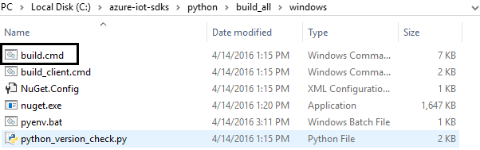        
    
2. 在 python\build_all\windows 目录中运行脚本 build.cmd。

3. 这样就会将 **iothub_client.pyd** Python 扩展模块复制到 python/device/samples 文件夹

    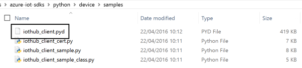    

<a name="Step_3_3_Run"></a>
## <a name="33-run-and-validate-the-samples"></a>3.3 运行并验证示例
    
在本部分，我们将运行 Azure IoT 客户端 SDK 示例来验证设备与 Azure IoT 中心之间的通信。 我们要向 Azure IoT 中心服务发送消息，然后验证 IoT 中心是否成功接收数据。 此外，还要监视从 Azure IoT 中心发送到客户端的所有消息。

***注意：****请为本部分中执行的所有操作创建屏幕截图。[步骤 4](#Step_4_2_Share) 中需要用到这些屏幕截图。*

### <a name="331-send-device-events-to-iot-hub"></a>3.3.1 向 IoT 中心发送设备事件

1.  如[步骤 2](#Step_2_Register) 中所述启动 DeviceExplorer，然后导航到“数据”选项卡。 从设备 ID 下拉列表中选择创建的设备名称，然后单击“监视”按钮。

    

2.  现在，DeviceExplorer 正在监视从选定设备发送到 IoT 中心的数据。
     
3. 导航到存储库本地副本中的 python/device/samples 文件夹。 

4. 在文本编辑器中打开 **iothub_client_sample.py** 或 **iothub_client_sample_class.py** 文件。

5. 在该文件中找到以下代码：

        connectionString = "[device connection string]"

6. 将 [device connection string] 替换为设备的连接字符串。 保存更改。

7.  通过 Visual Studio 2015 x86 本地工具命令提示使用以下命令运行示例应用程序，然后导航到存储库本地副本中的 python/build_all/windows 文件夹：
    
    **如果使用 HTTP 协议：**

        python iothub_client_sample.py -p http

    **如果使用 MQTT 协议：**

        python iothub_client_sample.py -p mqtt

    **如果使用 AMQP 协议：**

        python iothub_client_sample.py -p amqp

8. 检查确认消息中是否显示“正常”。 如果没有，则可能表示未正确复制设备中心连接信息。
  
  **如果使用 HTTP 协议：** 
  
  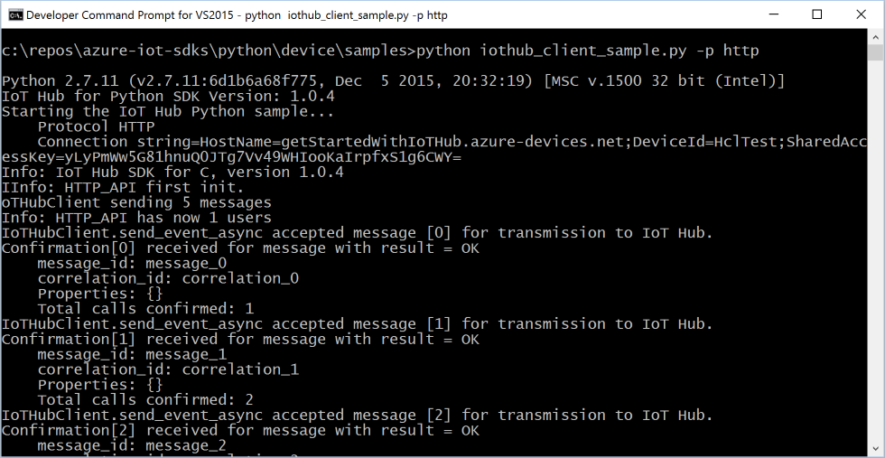
  
  **如果使用 MQTT 协议：**
  
  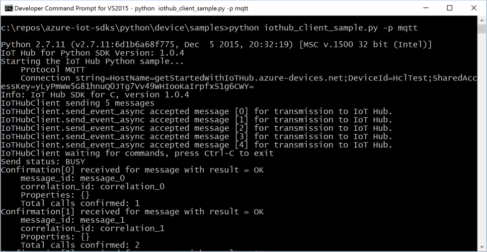
  
  **如果使用 AMQP 协议：**
  
  
  
9. DeviceExplorer 的数据选项卡中应会显示收到的事件。

    **如果使用 HTTP 协议：**   

     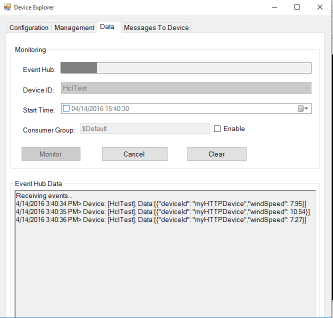

    **如果使用 MQTT 协议：**

     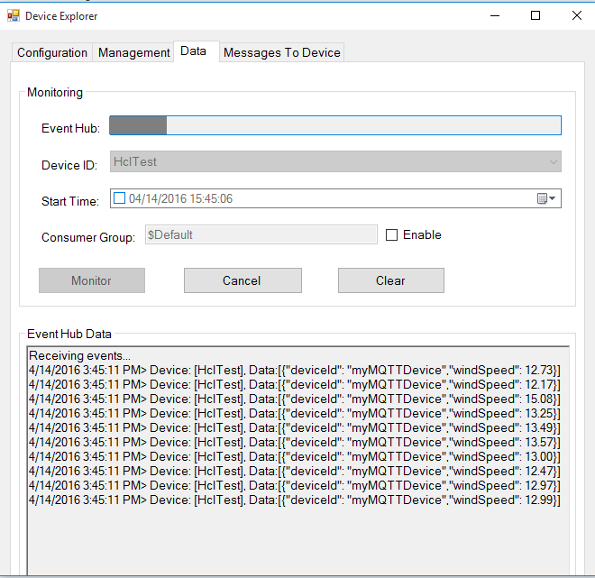

    **如果使用 AMQP 协议：**
    
     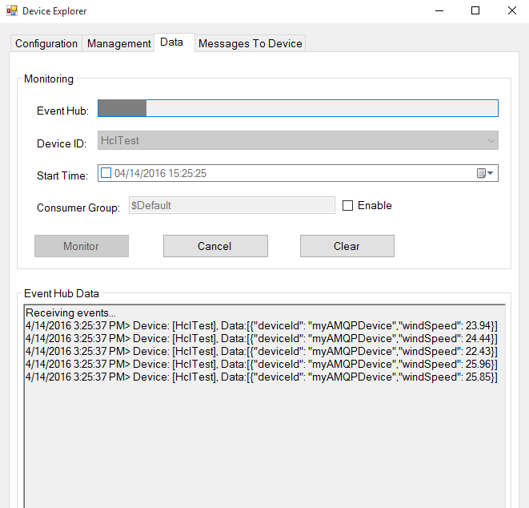

### <a name="332-receive-messages-from-iot-hub"></a>3.3.2 从 IoT 中心接收消息

1.  若要验证是否可从 IoT 中心向设备发送消息，请转到 DeviceExplorer 中的“发送到设备的消息”选项卡。

2.  使用设备 ID 下拉列表选择创建的设备。

3.  在“消息”字段中添加一些文本，然后单击“发送”。

    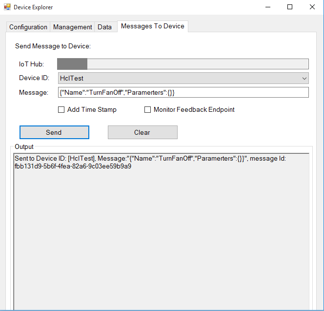

4. 设备控制台窗口中应会显示收到的消息。
    
    **如果使用 HTTP 协议：**

    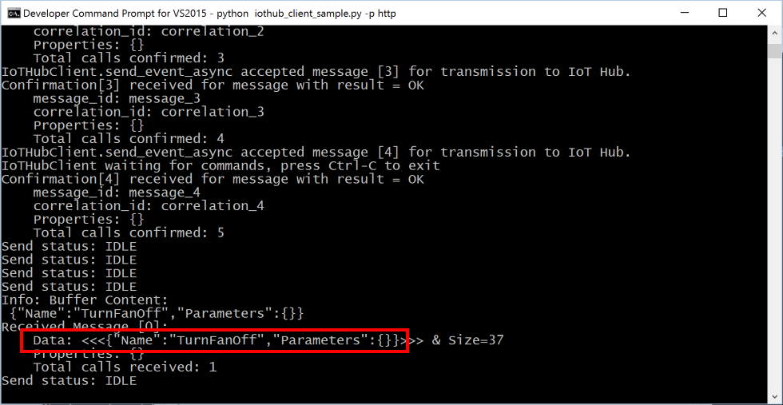

    **如果使用 MQTT 协议：**

    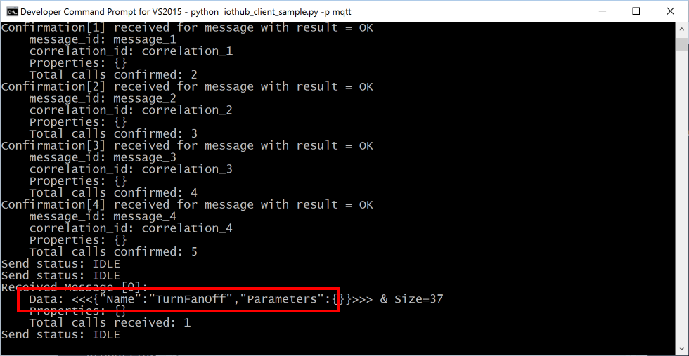

    **如果使用 AMQP 协议：**

    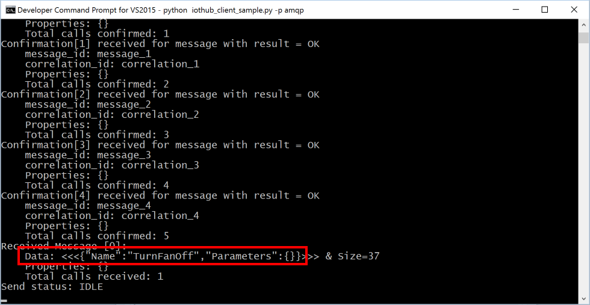
    
<a name="Step_4_Package_Share"></a>
# <a name="step-4-package-and-share"></a>步骤 4：打包并共享

<a name="Step_4_1_Package"></a>
## <a name="41-package-build-logs-and-sample-test-results"></a>4.1 打包生成日志和示例测试结果
  
从设备打包以下项目：

1. 第 3.2 部分中所述的生成日志。

2. 前面“**向 IoT 中心发送设备事件**”部分中显示的所有屏幕截图。

3. 前面“**从 IoT 中心接收消息**”部分中显示的所有屏幕截图。

4. 向我们发送明确的说明，告知如何在硬件上运行此示例（具体强调客户所要执行的新步骤）。

> 请使用[此处](<https://github.com/Azure/azure-iot-sdks/blob/master/doc/iotcertification/templates/template-windows-python.md>)提供的模板创建特定于设备的说明。
    
> 有关说明形式的指导，请参考[此处](<https://github.com/Azure/azure-iot-sdks/tree/master/doc/get_started>) GitHub 存储库中发布的示例。

<a name="Step_4_2_Share"></a>
## <a name="42-share-package-with-the-azure-iot-certification-team"></a>4.2 与 Azure IoT 认证团队共享包

1.  转到“合作伙伴仪表板”。[](<https://catalog.azureiotsuite.com/devices>)
2.  单击设备右上角的“上载”图标。

    

3.  此时将打开上载对话框。 单击“上载”按钮浏览文件。

    

    可以上载同一个设备的多个文件。

4.  上载所有文件后，单击“提交审查”按钮。

    ***注意：****提交文件供审查后，若要更改/删除文件，请与 iotcert 团队联系。*
 

<a name="Step_4_3_Next"></a>
## <a name="43-next-steps"></a>4.3 后续步骤

与我们共享文档后，我们将在 48 到 72 个小时（营业时间）内与你取得联系，到时会告知后续步骤。

<a name="Step_5_Troubleshooting"></a>
# <a name="step-5-troubleshooting"></a>步骤 5：故障排除

如需故障排除的帮助，请通过 <iotcert@microsoft.com> 联系工程支持部门。

